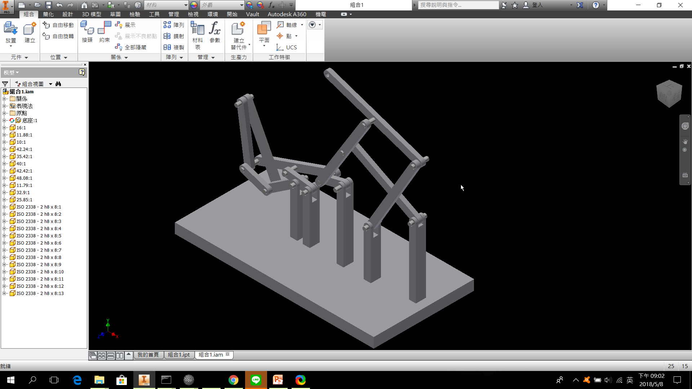
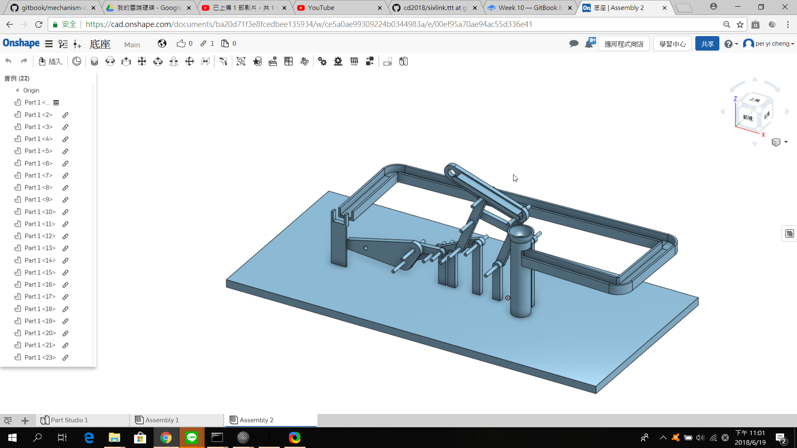

> # Week 10  2018/05/01

##### 使用pyslvs裡面的六連桿機構，調整製所需的位置，之後將檔案變成2D的 solvespace 就可以在 solvespace 看到六連趕機構的尺

##### 寸，即可以在 solvespace , onshape  ,inventor 和 solidwork 畫出零件

##### 我們是使用 inventor 畫出零件然後組起來 , 之後再轉成 V-rep 和 stl 檔

* ## [連桿機構.stl](https://github.com/s40523107/cd2018/blob/gh-pages/%E9%84%AD%E4%BD%A9%E5%AE%9C/w10/%E7%B5%84%E5%90%881%28new%29.stl)
* ## [連桿機構.pyslvs](https://github.com/s40523107/cd2018/blob/gh-pages/%E9%84%AD%E4%BD%A9%E5%AE%9C/w10/Ball%20lifter%20.pyslvs)
* ## [連桿機構.slvs](https://github.com/s40523107/cd2018/blob/gh-pages/%E9%84%AD%E4%BD%A9%E5%AE%9C/w10/Ball%20lifter%20.slvs)
* ## [連桿機構.ttt](https://github.com/s40523107/cd2018/blob/gh-pages/%E9%84%AD%E4%BD%A9%E5%AE%9C/w10/Ball%20lifter(4).ttt)
* ## [連桿機構\(影片\)](https://www.youtube.com/watch?v=TrOpN5cqAXM&feature=youtu.be)

> ## 頂球模擬:

## 

* # [頂球模擬.stl](https://github.com/s40523107/cd2018/blob/gh-pages/%E9%84%AD%E4%BD%A9%E5%AE%9C/w10/Assembly%202.stl)
* # [頂球模擬.ttt](https://github.com/s40523107/cd2018/blob/gh-pages/%E9%84%AD%E4%BD%A9%E5%AE%9C/w10/sixlink.ttt)
* ## [頂球模擬影片](https://www.youtube.com/watch?v=imADWrx81wM&feature=youtu.be)

> ## 問題:

### 一開始在v-rep模擬，只能夠正轉不能夠反轉，一開始以為機構上有問題，後來發現只要調慢轉速即可反轉。

> ## 心得:

* #### 40523105:

##### **這週使用一個新的軟體pyslvs，在上面先決定好連桿的尺寸後，**

##### **再用ONSHAPE畫出自己想要的外型，之後放到VREP進行模擬，**

##### **在VREP的模擬上還是不太會，所以利用上課時間多詢問同學來學習了!**

* #### 40523106:

##### 這星期的進度是在pyslvs決定好尺寸，

##### 再用solvesspace繪製出之後使用V-rep模擬，

##### 在V-rep的模擬時遇到了比較多困難來不及及時完成，

##### 之後在用網路上查到的相關資料還有找同學討論可以讓整個機構動起來 !

* #### 40523107:

##### 這一次讓我們自己回家研究pyslvs裡面的機構

##### 調成自己想要的位置 , 然後在把圖畫上去 , 在這裡都做得很順

##### 但是在 V-rep 裡面模擬還是不太會

##### 並邊看影片\(相關資料\)邊研究如何把所有的零件串一起讓他們動起來順利地動起來

