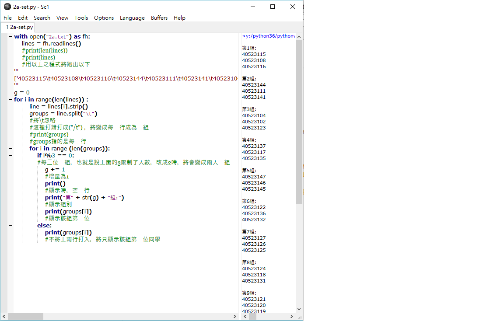

# 第一周

## 內容:

### 編寫分組程式

[程式碼](https://github.com/s40523139/cd2018/blob/gh-pages/week1/2a-set.py)

程式碼及其執行影片

### 照片

##### 心得:組員編寫時，是以編寫並註解的方式進行，因為無法創新或改寫，所以我們決定以深入瞭解的方法來寫這次的程式，每一行均做了註解，以便其他人或者自己日後觀看可以稍微了解。

##### 在編寫時，組員曾程式編寫錯誤，出現了另一種結果:只出現該組第一位成員，這對他來說是一意外的收穫，所以也把此結果附在註解上了。

## 第三周

### 內容:

#### 建立GitBook，並加入組員

#### 照片

