# cd - 期末專案

---

##### [影片](https://www.youtube.com/watch?v=tFlUddDz2V0)

##### [檔案](https://github.com/s40523141/cd2018/blob/gh-pages/協同產品設計實習/期末專案/協同產品設計實習-期末專案.ttt)

##### [onshape](https://cad.onshape.com/documents/0e70731b4ce2560b9aff5414/w/18647b63e0792b6094b97f0d/e/728b0f3d7d6af2a405929811)

---

* [W10 兩段式六連桿提球機構設計與模擬](https://legacy.gitbook.com/book/s40523141/g2-gitbook/edit#/edit/master/w10.md?_k=88d626)-[影片](https://www.youtube.com/watch?v=pcwqpDsdXRc)

* [W11 三段式六連桿提球機構設計與模擬](https://legacy.gitbook.com/book/s40523141/g2-gitbook/edit#/edit/master/san-duan-liu-lian-gan.md?_k=6xa6m9)-[影片](https://www.youtube.com/watch?v=9BAcVLfqy4s)

* [W11 - 12 週減速齒輪組設計](https://legacy.gitbook.com/book/s40523141/g2-gitbook/edit#/edit/master/jian-su-chi-lun-zu.md?_k=8g4zla)-[影片](https://www.youtube.com/watch?v=oX3yblZkxwA)

* [W14 搬運車](https://github.com/scrum-1/gitbook/blob/master/ag2/期末專案/搬運車.ttt)

---

接下來介紹這次的鋼球循環系統

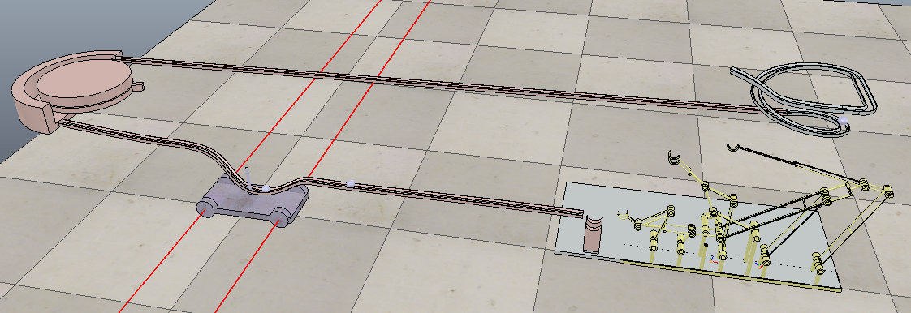

以三段式提球機構為底，設計一個軌道

和另一個循環系統  
，再用搬運車將鋼球將剛球運送至另一個循環系統。

**這循環系統  
可以完成多次的循環沒問題。**

---

分為三個部份為一循環:      **段式抬球機構**----軌道--**-循環機構**---軌道----**搬運車**----三段式抬球機構

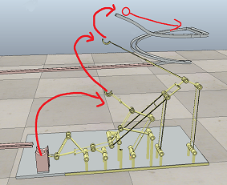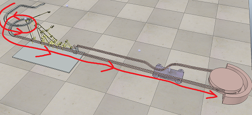

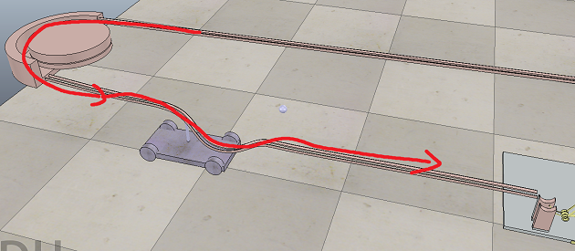

### 

### 左邊的循環機構使用簡單的環形軌道配推球

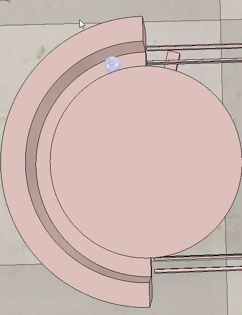

---

運用軌道與頂球車，間接做成一個檔球機構，如下圖 : 在頂球車還沒回到應對位置的時候，剛球不會自己繼續往前跑，待在軌道下凹處，接著頂球車在繼續往回開，把鋼球頂到右側去，進而繼續機構的循環。

這個檔球機構可以說是意外的收穫。

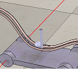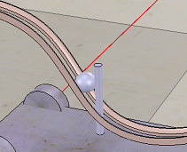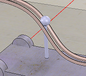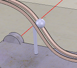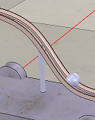

---

為了可以模擬順暢:碰撞設定成只對鋼球或沒在同一個樹狀圖目錄下的零組件。

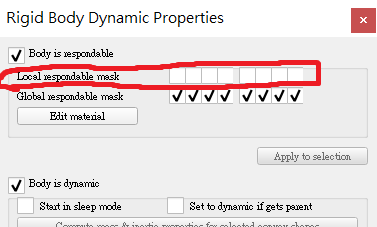

把 Local responable mask關閉即可\(如果關閉下列的Global 那麼連鋼球都會碰不到\)

---

問題與討論:

首先這台搬運車，並沒有達到理想的目標**，只能稱上是頂球車，**這台車是靠上面這根桿子在軌道中的放縫隙來回移動，進而頂著球在軌道上移動。

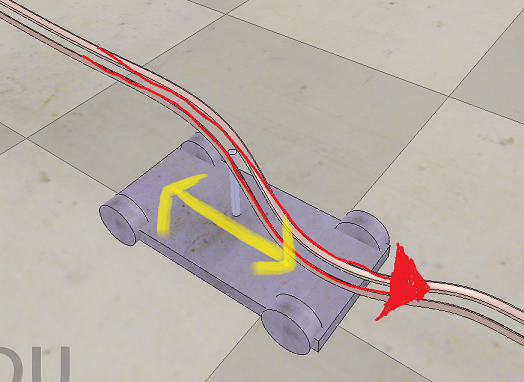

另外這台搬運車走直線的時候並不會很直 還是會走一走自己偏掉，所以用這種方式把它限制在軌道的直線中。

再來是鋼球的部分

球在圖中上坡路段，球是靠桿子推動的，但如果車子一開始的加速度太快，球會直接照上坡段的切線飛走，另外這台車的家減速也不好控制，需要多加注意。

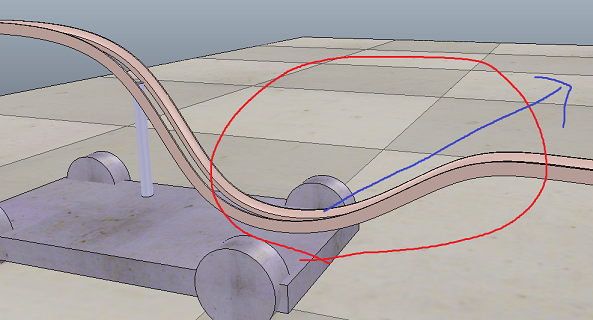

再來是三段提球機構:

再來是眼前上面這兩段，在這個部分球會有一點點小跳動，但不影響循環。

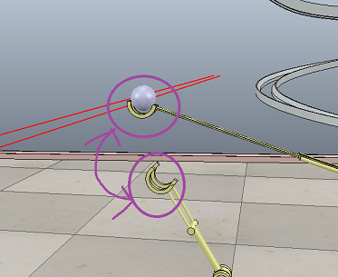

---

心得:本次課程藉由鋼球循環系統，熟悉操作一些相關程式，和了解設計的流程中會遇到的種種問題。另外重點就如同課程名稱""協同""產品設計實習，讓學生熟悉小組協同的工作模式。

組長:40523141蔡兵常

  40523111 何偉豪

  40523144 錢毅軒

組員的分工與貢獻

  40523141：全部

   40523111：無

   40523144：無

