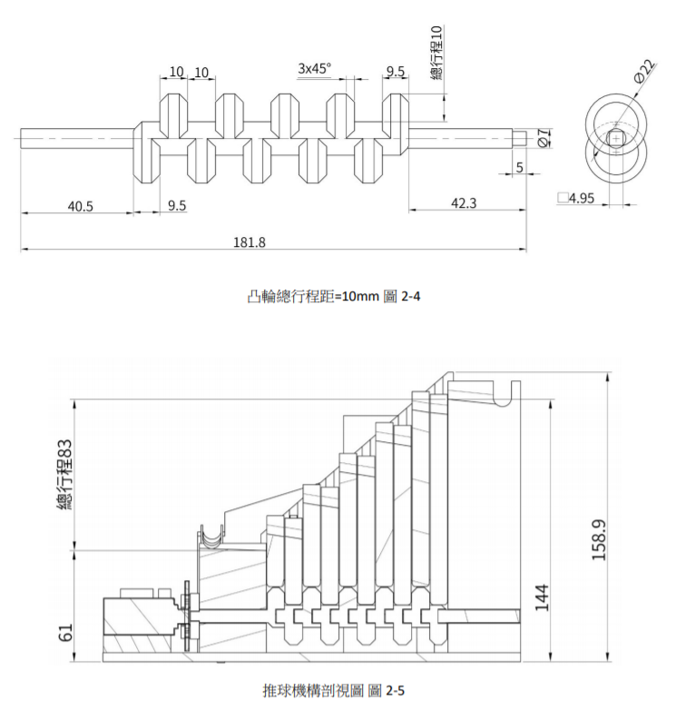
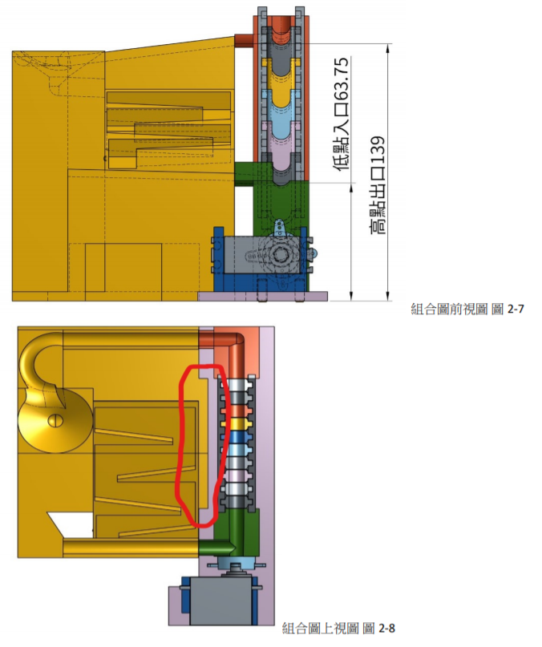
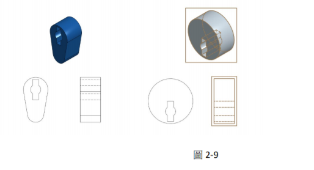
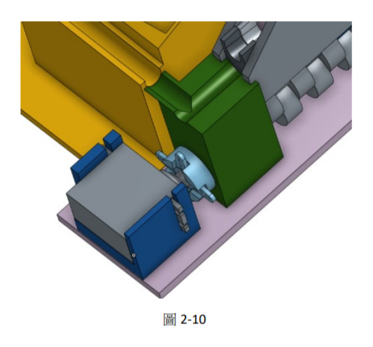
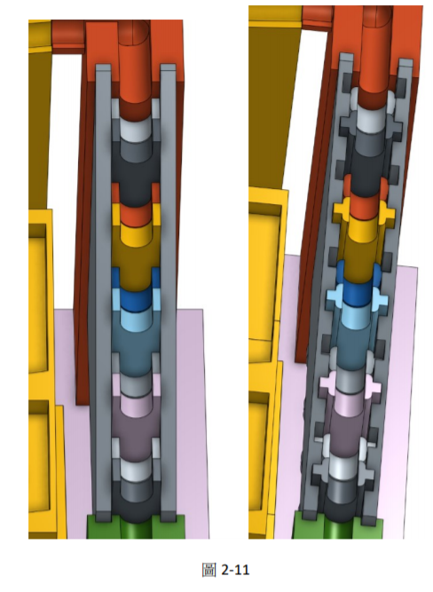
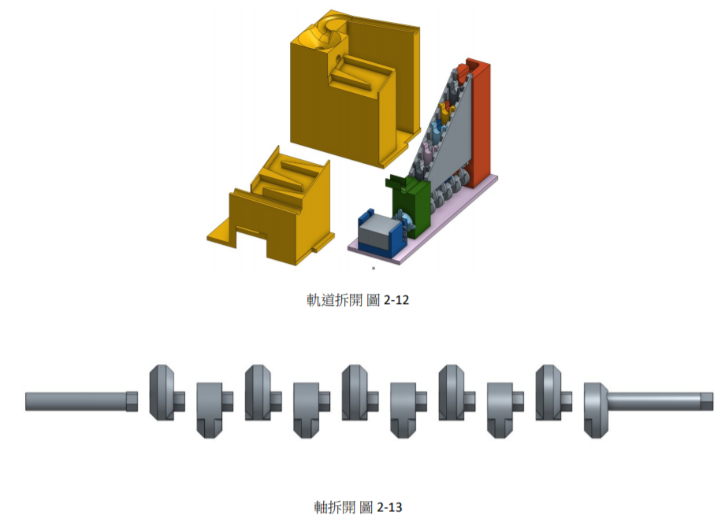
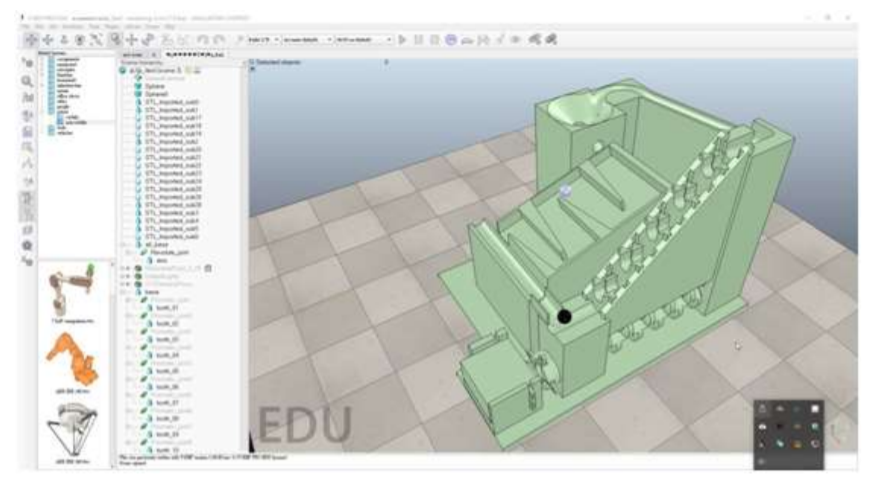

# 第二組協同產品設計實習課程報告

本課程乃延續[2017 Fall電腦輔助設計實習課程](http://lab.kmol.info/2017fall)內容, 並加入同步與非同步協同機制, 在多元協同模式下完成機械、電子與資訊科技相關內容的產品開發, 電腦輔助設計實習課程以鋼球循環運動系統之開發為主，而本課程則在鋼球運動系統間再納入鋼球搬運行走機構。

本課程在規劃階段所建立的 issues, 請參見[CD 課程規劃議題](https://github.com/mdecourse/cd2018/issues?q=is%3Aissue+is%3Aclosed)

本組組員: 

* 40523111何偉豪
* 40523144錢毅軒
* 40523141蔡兵常

> [第二組倉儲](https://github.com/s40523141/cd2018)

---

# 目錄

### 第一章 前言

### 第二章 機構設計

### 2.1 機構設計原理

### 2.2 機構設計參數

### 2.3 機構改版

### a.機構設計改版

### b.電控改版

### c.v-rep 模擬改版

### d.3D 列印改版

### 第三章 V-REP 模擬

### 3.1 模擬步驟過程

### 第四章 電控系統

### 4.1 arduino 模擬

### 4.2 arduino 實作

### 第五章 實體组立

### 第六章 總結

---

# 前言

電腦輔助設計實習課程目的，希望學生要有想像力、自學力、創造力為出發。

並且期末成果以鋼球軌道運動系統來完成機電資整合概念，運用課程中既定的程式，又或是自己想出來的其他方法來進行機構設計， 使用 v-rep 來模擬實體機構運作模式，放入 arduino 進行電控。

---

# 第二章:

## 2.1

機構設計原理 本提球機構是運用凸輪提動凸輪上方滑槽內的滑塊做上下的運動， 凸輪使用的是偏心凸輪，偏心凸輪運動若以等速進行，從動件會做出 簡諧運動，優點是運動滑順不容易發生急跳的反應，而滑塊與凸輪的 接觸是以相切，線接觸的方式減少摩擦力。

---

# 2.2

機構設計參數 提球機構最重要的設計就是滑塊的上升距離，是否能精準地吃到 球並且很順利的將球往上提升，滑塊上也必須設置斜面滑槽使球容易 滾入下一階的滑塊上，而凸輪的設計就想當簡單每一次的運動都只能 提升 10 公分，所以基於兩個部分上得到了 1 個函式:

每一個滑塊尺寸 =滑塊初始距離 X=39mm 凸輪上升 y=10mm             X+\\\(y\\\*第 n 個滑塊\\\)

模組化設計 由於軌道可以拆卸換另一組員的軌道，而推球機構不變，軌道系統設 計時要配合推球機構的最低點入口與最高點出口，底板以凹凸設計來 約束 X、Y 方向。

---

# 2.3 機構改版

## a.機構設計改版

此版的機構還在設計初期並未有大波幅的改版，但凸輪從普通凸輪換到了偏心凸輪。

## b.電控系統元件改版

## c.v-rep 改版

做動態模擬發現機構設計上出問題，因為滑塊沒有前後約束加上 本身滑塊又長很容易干涉到凸輪的運作與前後滑塊的碰撞。本版本的 改版是滑塊兩側增加小滑塊，與兩側側板開槽，讓滑塊在限制的範圍內滑動。

## d.3D 列印改版

由於列印機台能打印的範圍受限或因加工方式的方法無法直接做 出成品，所以必須跟改原先設計。 因為軌道太大切成兩半，而軸列印完軸可能會有缺陷或有嚴重的 偏轉度，所以要分解列印再把它組裝起來。

---

# 第三章 v-rep 模擬

設計好的組合零件檔轉 模擬，在這過程中會發現機構是否與設計相同或進行改版 降低不必要的實驗實體零件並可以減少設計時間 進行機構模擬的初期 時造成不必要的運算。

---

# 第四章 電控系統

機電資整合鋼球運動系統設計要求， 其中電子系統可以採用 TinkerCAD 模擬， 利用 TinkerCAD 模擬 Arduino Uno 控制板連線操作

選用Arudino Uno 控制板與 Servo Motor, Uno 控制板與 Servo Motor, 然後接上電源與地線 的 PWM pin 9, 利用 Code Editor 後上傳到虛擬的 Arduino Uno 控制 度. 操作畫面如下圖所示: 實體 Arduino Servo Motor Control 15 Servo Motor, 然後接上電源與地線, 並將控制訊 然後接上電源與地線, 並將控制訊 號接到 Code Editor 納入下列 Arduino 程式, 再利用 upload and run 控制板上執行, 就可以模擬 Servo Motor Arduino Servo Motor Control 並將控制訊 選擇 Arudino 號接到 Auduino Uno 控制板 upload and run 將程式編譯 Servo Motor 持續左右各旋轉 180度。

完成上述以模擬之後, 接著操作實體 Arduin 控制板與 Servo Motor 的控制, 首先利用電腦 驅動 Arduino 控制板, 然後再利用板子上的脈衝寬度調變訊號控制 伺服馬達, 之後再利用 傳動機構與資訊控制介面, 製作所需的機電資整合系統. 控制台 - 硬體與音效 - 裝置管理員 利用解開的 arduino driver 程式驅動 Arduino Uno 控 制板, 並取得 COM 對應號碼, 例如: COM7, 之後的 Arduino 編譯後可以透過此 COM 埠號 將程式上傳到控制板上執行.

---

# 第六章:總結

這項課程整合了 機、電、資三，者 另外也藉著小組分工，實地運用版次和改版的小組合作模式，運用課程規劃中給予既定的程式，

又或者是另尋他法來完成這樣計畫，學生我們自己發揮出自學力、執行力、創造力。

