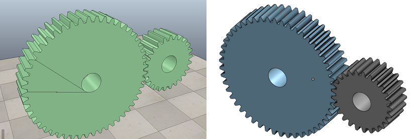
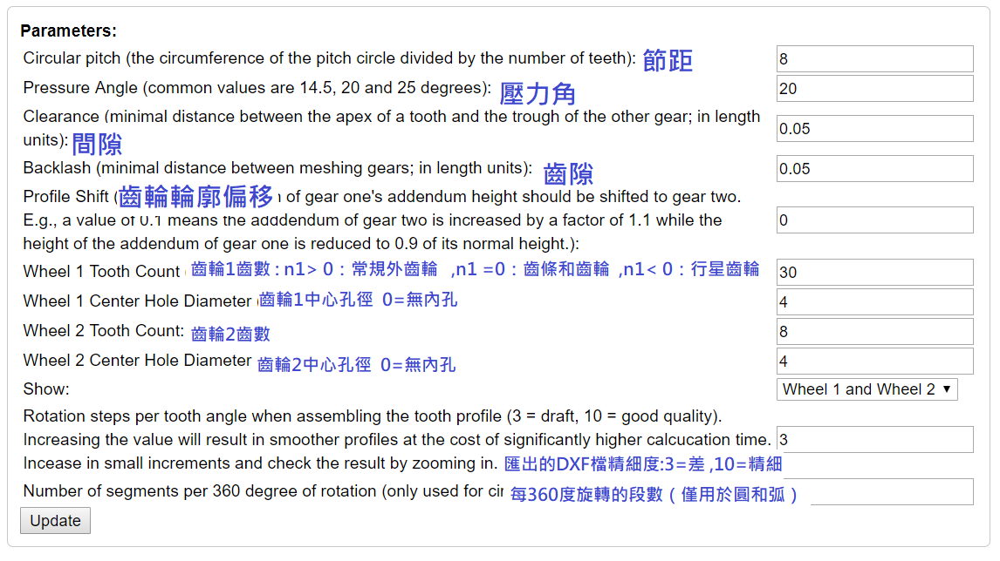
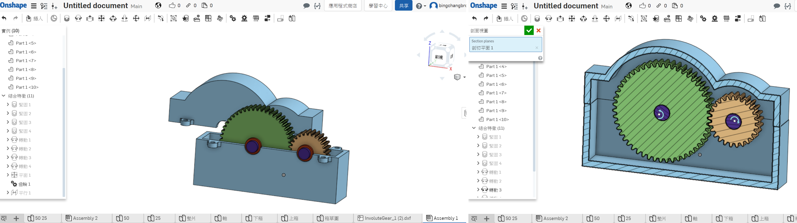
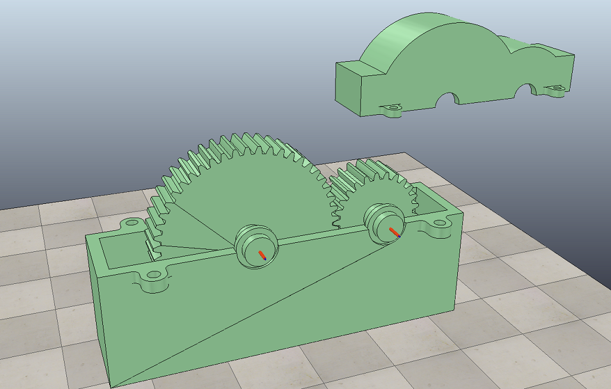
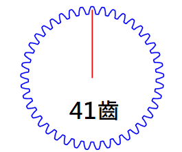
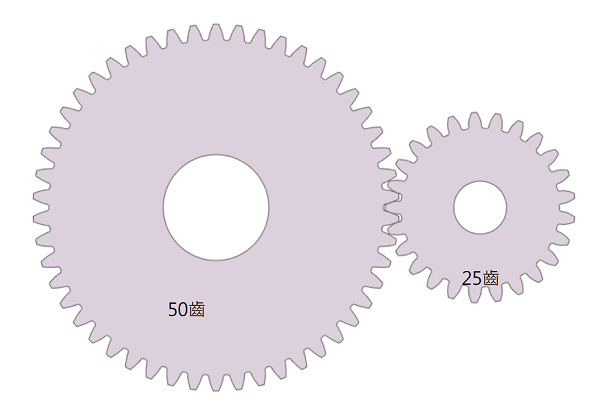
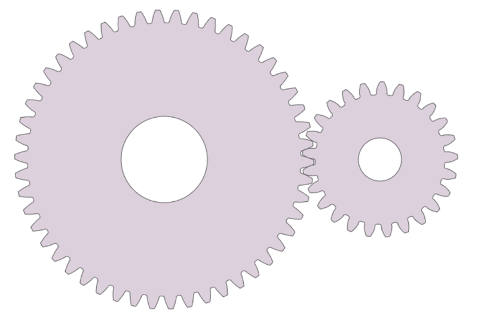

# W12 週減速齒輪組設計

[影片](https://www.youtube.com/watch?v=oX3yblZkxwA)

[檔案](https://github.com/s40523141/cd2018/blob/gh-pages/協同產品設計實習/減速齒輪組/協同產品設計實習-減速齒輪組.ttt)

[ONSHAPE](https://cad.onshape.com/documents/345f1a801a2318531bf9a96f/w/7f9bd65bc39dbf14e072bdfa/e/2bd9b0798f29b66e73f35cfb)



* ##### 利用[Doug Roger's port to C++](http://dougrogers.blogspot.com/2016/08/gear-bakery-10-port-of-dr-rainer.html) 裡的漸開線正齒輪產生器，繪製出齒輪輪廓
* ##### 繪出的的dxf檔，接著用匯入onshape做出立體模型，並組合起來，匯出成STL檔
* ##### 將STL檔匯入到V-rep裡做模擬。

---

下圖是[Doug Roger's port to C++](http://dougrogers.blogspot.com/2016/08/gear-bakery-10-port-of-dr-rainer.html) 中齒輪產生器裡的參數設定欄:



---

#### ONSHAPE:齒輪箱製作



#### V-REP:齒輪箱模擬



---

# 利用網際程式設計模擬所完成的減速齒輪組

---

使用 canvas 畫出一個可自選齒數之靜態正齒輪



使用事先建立好的 cango 程式庫畫出一個可自選齒數之靜態正齒輪


---

使用事先建立好的 cango 程式庫畫出兩個可自選齒數並組合之靜態正齒輪



---

完成兩齒嚙合靜態繪圖後,繪製組合轉動正齒輪



---

canvas

```
<!-- 導入 Brython 標準程式庫 -->
```

```
<script src="../data/Brython-3.3.1/brython.js"></script>
<script src="../data/Brython-3.3.1/brython_stdlib.js"></script><p></p>
<!-- 啟動 Brython -->

<script>
window.onload=function(){
// 設定 data/py 為共用程式路徑
brython({debug:1, pythonpath:['./../data/py']});
}
</script>

<canvas id="onegear" width="800" height="600"></canvas>

<!-- 以下製作 button-->

<div id="onegear_div" width="800" height="20"></div>

<p><input id="n" value="19"><br>
<button id="button">Set Number of Gears</button></p>
<!-- 以下實際利用  Brython 繪圖-->

<script type="text/python3">
from browser import document as doc
import math
# deg 為角度轉為徑度的轉換因子
deg = math.pi/180.
# 定義 Spur 類別
class Spur(object):
    def __init__(self, ctx):
        self.ctx = ctx

    def create_line(self, x1, y1, x2, y2, width=3, fill="red"):
        self.ctx.beginPath()
        self.ctx.lineWidth = width
        self.ctx.moveTo(x1, y1)
        self.ctx.lineTo(x2, y2)
        self.ctx.strokeStyle = fill
        self.ctx.stroke()

    # 定義一個繪正齒輪的繪圖函式
    # midx 為齒輪圓心 x 座標
    # midy 為齒輪圓心 y 座標
    # rp 為節圓半徑, n 為齒數
    # pa 為壓力角 (deg)
    # rot 為旋轉角 (deg)
    # 已經針對 n 大於等於 52 齒時的繪圖錯誤修正, 因為 base circle 與齒根圓大小必須進行判斷
    def Gear(self, midx, midy, rp, n=20, pa=20, color="black"):
        # 齒輪漸開線分成 15 線段繪製
        imax = 15
        # 在輸入的畫布上繪製直線, 由圓心到節圓 y 軸頂點畫一直線
        self.create_line(midx, midy, midx, midy-rp)
        # a 為模數 (代表公制中齒的大小), 模數為節圓直徑(稱為節徑)除以齒數
        # 模數也就是齒冠大小
        a=2*rp/n
        # d 為齒根大小, 為模數的 1.157 或 1.25倍, 這裡採 1.25 倍
        d=2.5*rp/n
        # ra 為齒輪的外圍半徑
        ra=rp+a
        # rb 則為齒輪的基圓半徑
        # 基圓為漸開線長齒之基準圓
        rb=rp*math.cos(pa*deg)
        # rd 為齒根圓半徑
        rd=rp-d
        # 當 rd 大於 rb 時, 漸開線並非畫至 rb, 而是 rd
        # dr 則為基圓到齒頂圓半徑分成 imax 段後的每段半徑增量大小
        # 將圓弧分成 imax 段來繪製漸開線
        # 當 rd 大於 rb 時, 漸開線並非畫至 rb, 而是 rd
        if rd>rb:
            dr = (ra-rd)/imax
        else:
            dr=(ra-rb)/imax
        # tan(pa*deg)-pa*deg 為漸開線函數
        sigma=math.pi/(2*n)+math.tan(pa*deg)-pa*deg
        for j in range(n):
            ang=-2.*j*math.pi/n+sigma
            ang2=2.*j*math.pi/n+sigma
            lxd=midx+rd*math.sin(ang2-2.*math.pi/n)
            lyd=midy-rd*math.cos(ang2-2.*math.pi/n)
            for i in range(imax+1):
                # 當 rd 大於 rb 時, 漸開線並非畫至 rb, 而是 rd
                if rd>rb:
                    r=rd+i*dr
                else:
                    r=rb+i*dr
                theta=math.sqrt((r*r)/(rb*rb)-1.)
                alpha=theta-math.atan(theta)
                xpt=r*math.sin(alpha-ang)
                ypt=r*math.cos(alpha-ang)
                xd=rd*math.sin(-ang)
                yd=rd*math.cos(-ang)
                # i=0 時, 繪線起點由齒根圓上的點, 作為起點
                if(i==0):
                    last_x = midx+xd
                    last_y = midy-yd
                # 由左側齒根圓作為起點, 除第一點 (xd,yd) 齒根圓上的起點外, 其餘的 (xpt,ypt)則為漸開線上的分段點
                self.create_line((midx+xpt),(midy-ypt),(last_x),(last_y),fill=color)
                # 最後一點, 則為齒頂圓
                if(i==imax):
                    lfx=midx+xpt
                    lfy=midy-ypt
                last_x = midx+xpt
                last_y = midy-ypt
            # the line from last end of dedendum point to the recent
            # end of dedendum point
            # lxd 為齒根圓上的左側 x 座標, lyd 則為 y 座標
            # 下列為齒根圓上用來近似圓弧的直線
            self.create_line((lxd),(lyd),(midx+xd),(midy-yd),fill=color)
            for i in range(imax+1):
                # 當 rd 大於 rb 時, 漸開線並非畫至 rb, 而是 rd
                if rd>rb:
                    r=rd+i*dr
                else:
                    r=rb+i*dr
                theta=math.sqrt((r*r)/(rb*rb)-1.)
                alpha=theta-math.atan(theta)
                xpt=r*math.sin(ang2-alpha)
                ypt=r*math.cos(ang2-alpha)
                xd=rd*math.sin(ang2)
                yd=rd*math.cos(ang2)
                # i=0 時, 繪線起點由齒根圓上的點, 作為起點
                if(i==0):
                    last_x = midx+xd
                    last_y = midy-yd
                # 由右側齒根圓作為起點, 除第一點 (xd,yd) 齒根圓上的起點外, 其餘的 (xpt,ypt)則為漸開線上的分段點
                self.create_line((midx+xpt),(midy-ypt),(last_x),(last_y),fill=color)
                # 最後一點, 則為齒頂圓
                if(i==imax):
                    rfx=midx+xpt
                    rfy=midy-ypt
                last_x = midx+xpt
                last_y = midy-ypt
            # lfx 為齒頂圓上的左側 x 座標, lfy 則為 y 座標
            # 下列為齒頂圓上用來近似圓弧的直線
            self.create_line(lfx,lfy,rfx,rfy,fill=color)
canvas = doc['onegear']
ctx = canvas.getContext("2d")

# 以 button 驅動的事件函式
def setgearnumber(e):
    ctx.clearRect(0, 0, canvas.width, canvas.height)
    x = (canvas.width)/2
    y = (canvas.height)/2
    if doc["n"].value.isdigit():
        n1 = int(doc["n"].value)
    else:
        n1= 19
    # 設定齒輪參數
    x = (canvas.width)/2
    y = (canvas.height)/2
    r = 0.6*(canvas.height/2)
    pa = 20
    # 繪出齒輪
    Spur(ctx).Gear(x, y, r, n1, pa, "blue")
#判定 button
setgearnumber(True)
doc['button'].bind('click',setgearnumber)
</script>
```

cango

```
<!-- 導入 Brython 標準程式庫 -->
```

```
<script src="../data/Brython-3.3.1/brython.js"></script>
<script src="../data/Brython-3.3.1/brython_stdlib.js"></script><p></p>
<!-- 啟動 Brython -->

<script>
window.onload=function(){
// 設定 data/py 為共用程式路徑
brython({debug:1, pythonpath:['./../data/py']});
}
</script>

<!-- Cango 程式庫 -->

<script type="text/javascript" src="../data/cango/Cango-8v03.js"></script>

<script type="text/javascript" src="../data/cango/Cango2D-7v01-min.js"></script>

<script type="text/javascript" src="../data/cango/CangoAxes-1v33.js"></script>

<script type="text/javascript" src="../data/cango/CangoAnimation-4v01.js"></script>

<script type="text/javascript" src="../data/cango/gearUtils-05.js"></script>

<canvas id="cango_gear" width="800" height="750"></canvas>

<!-- 以下製作 button-->

<div id="cango_gear_div" width="800" height="20"></div>

<p><input id="cn" value="19"><br>
<button id="button_a">Set Number of Gears</button></p>
<script type="text/python">
# 將 導入的 document 設為 doc 主要原因在於與舊程式碼相容
from browser import document as doc
# 由於 Python3 與 Javascript 程式碼已經不再混用, 因此來自 Javascript 的變數, 必須居中透過 window 物件轉換
from browser import window
import math

# 主要用來取得畫布大小
canvas = doc["cango_gear"]
# 此程式採用 Cango Javascript 程式庫繪圖, 因此無需 ctx
#ctx = canvas.getContext("2d")
cango = window.Cango.new
# 針對變數的轉換, shapeDefs 在 Cango 中資料型別為變數, 可以透過 window 轉換
shapedefs = window.shapeDefs
# 目前 Cango 結合 Animation 在 Brython 尚無法運作, 此刻只能繪製靜態圖形
# in CangoAnimation.js
#interpolate1 = window.interpolate
# Cobi 與 createGearTooth 都是 Cango Javascript 程式庫中的物件
cobj = window.Cobj.new
creategeartooth = window.createGearTooth.new
# 經由 Cango 轉換成 Brython 的 cango, 指定將圖畫在 id="cango_gear" 的 canvas 上
cgo = cango("cango_gear")

######################################
# 畫正齒輪輪廓
#####################################

# 以 button 驅動的事件函式
def draw(e):
    cgo.clearCanvas()
    cx = (canvas.width)/2
    cy = (canvas.height)/2
    if doc["cn"].value.isdigit():
        cn1 = int(doc["cn"].value)
    else:
        cn1= 19
# pa 為壓力角
    pa = 25
# m 為模數, 根據畫布的寬度, 計算適合的模數大小
# Module = mm of pitch diameter per tooth
    m = 0.5*canvas.width/cn1
# pr 為節圓半徑
    pr = cn1*m/2 # gear Pitch radius
# generate gear
    data = creategeartooth(m, cn1, pa)
# Brython 程式中的 print 會將資料印在 Browser 的 console 區
#print(data)
    gearTooth = cobj(data, "SHAPE", {
            "fillColor":"#ddd0dd",
                    "border": True,
           "strokeColor": "#606060" })
    gearTooth.rotate(180/cn1) # rotate gear 1/2 tooth to mesh
# 單齒的齒形資料經過旋轉後, 將資料複製到 gear 物件中
    gear = gearTooth.dup()
# gear 為單一齒的輪廓資料
#cgo.render(gearTooth)

# 利用單齒輪廓旋轉, 產生整個正齒輪外形
    for i in range(1, cn1):
    # 將 gearTooth 中的資料複製到 newTooth
        newTooth = gearTooth.dup()
    # 配合迴圈, newTooth 的齒形資料進行旋轉, 然後利用 appendPath 方法, 將資料併入 gear
        newTooth.rotate(360*i/cn1)
    # appendPath 為 Cango 程式庫中的方法, 第二個變數為 True, 表示要刪除最前頭的 Move to SVG Path 標註符號
        gear.appendPath(newTooth, True) # trim move command = True

# 建立軸孔
# add axle hole, hr 為 hole radius
    hr = 0.6*pr # diameter of gear shaft
    shaft = cobj(shapedefs.circle(hr), "PATH")
    shaft.revWinding()
    gear.appendPath(shaft) # retain the 'moveTo' command for shaft sub path

# render 繪出靜態正齒輪輪廓
    gear.translate(cx, cy)
    cgo.render(gear)
    r = 0.6*(canvas.height/2)
draw(True)
doc['button_a'].bind('click',draw)
</script>
```

正齒輪轉動

```
<!-- 導入 Brython 標準程式庫 -->
```

```
<script src="../data/Brython-3.3.1/brython.js"></script>
<script src="../data/Brython-3.3.1/brython_stdlib.js"></script><p></p>
<!-- 啟動 Brython -->

<script>
window.onload=function()
{
brython({debug:1, pythonpath:['./../data/py']});
}
</script>

<!-- Cango 程式庫 -->

<script type="text/javascript" src="./../data/cango/Cango-9v05-min.js"></script>

<script type="text/javascript" src="./../data/cango/CangoAxes-2v09.js"></script>

<script type="text/javascript" src="./../data/cango/CangoAnimation-5v00.js"></script>

<script type="text/javascript" src="./../data/cango/gearUtils-05.js"></script>

<canvas id="cango_gear" width="800" height="700"></canvas>

<!-- 以下製作 button-->

<div id="cango_gear_div" width="800" height="20"></div>

<p><input id="na" value="50"><br>
<input id="nb" value="25"><br>
<button id="button_d">Set Number of Gears</button></p>
<script type="text/python">
# 將 導入的 document 設為 doc 主要原因在於與舊程式碼相容
from browser import document as doc
# 由於 Python3 與 Javascript 程式碼已經不再混用, 因此來自 Javascript 的變數, 必須居中透過 window 物件轉換
from browser import window
import math

# 主要用來取得畫布大小
canvas = doc["cango_gear"]
# 此程式採用 Cango Javascript 程式庫繪圖, 因此無需 ctx
ctx = canvas.getContext("2d")
cango = window.Cango.new
# 針對變數的轉換, shapeDefs 在 Cango 中資料型別為變數, 可以透過 window 轉換
shapedefs = window.shapeDefs
# 目前 Cango 結合 Animation 在 Brython 尚無法運作, 此刻只能繪製靜態圖形
# in CangoAnimation.js
#interpolate1 = window.interpolate
# Cobi 與 createGearTooth 都是 Cango Javascript 程式庫中的物件
#cobj = window.Cobj.new
shape = window.Shape.new
path = window.Path.new
creategeartooth = window.createGearTooth.new

tweener = window.Tweener.new
# 經由 Cango 轉換成 Brython 的 cango, 指定將圖畫在 id="cango_gear" 的 canvas 上
cgo = cango("cango_gear")

######################################
# 畫正齒輪輪廓
#####################################
# 以 button 驅動的事件函式
def setgearnumber(e):

    x = 800/2
    y = 700/2
    if doc["na"].value.isdigit():
        n = int(doc["na"].value)
    else:
        n = 50

    if doc["nb"].value.isdigit():
        n2 = int(doc["nb"].value)
    else:
        n2 = 25
    def cangoGear(n, m, pa):
        # n 為齒數
        # m 為模數, 根據畫布的寬度, 計算適合的模數大小
        # pa 為壓力角
        # Module = mm of pitch diameter per tooth
        # m = 0.8*canvas.width/n
        # pr 為節圓半徑
        pr = n*m/2 # gear Pitch radius
        # generate gear
        data = creategeartooth(m, n, pa)
        # Brython 程式中的 print 會將資料印在 Browser 的 console 區
        #print(data)
        gearTooth = shape(data, {
        "fillColor":"#ddd0dd",
        "border": True,
        "strokeColor": "#606060" })
        gearTooth.rotate(180/n) # rotate gear 1/2 tooth to mesh
        # 單齒的齒形資料經過旋轉後, 將資料複製到 gear 物件中
        gear = gearTooth.dup()
        # gear 為單一齒的輪廓資料
        #cgo.render(gearTooth)

        # 利用單齒輪廓旋轉, 產生整個正齒輪外形
        for i in range(1, n):
            # 將 gearTooth 中的資料複製到 newTooth
            newTooth = gearTooth.dup()
            # 配合迴圈, newTooth 的齒形資料進行旋轉, 然後利用 appendPath 方法, 將資料併入 gear
            newTooth.rotate(360*i/n)
            # appendPath 為 Cango 程式庫中的方法, 第二個變數為 True, 表示要刪除最前頭的 Move to SVG Path 標註符號
            gear.appendPath(newTooth, True) # trim move command = True

        # 建立軸孔
        # add axle hole, hr 為 hole radius
        hr = 0.6*pr # diameter of gear shaft
        shaft = path(shapedefs.circle(hr))
        shaft.revWinding()
        gear.appendPath(shaft) # retain the 'moveTo' command for shaft sub path

        # setup the animation
        # backlash (mm)
        bklsh = 0.04*m
        # centre shift to make backlash
        dC = bklsh/(2*math.tan(math.pi*pa/180))
        # np 為小齒輪齒數
        np = 25
        # gear ratio
        gr = n/np              
        gearConfig = {'cx':-pr, 'cy':0, 'degs':[0, 360]}
        # gr*0.666 rpm
        #pinionConfig = {'cx':pr+dC, 'cy':0, 'degs':[0, -gr*360]}
        # 0.666 rpm
        return gear

    # 設定兩齒齒數
    reduced_ratio = 0.5
    # 使用 80% 的畫布寬度
    m = 0.8*canvas.width/((n+n2)*reduced_ratio)
    # 設定共同的壓力角
    pa = 20
    # n 齒輪的節圓半徑
    pr = n*m/2
    # n2 齒輪的節圓半徑
    pr2 = n2*m/2

    from time import time
    from browser.timer import request_animation_frame as raf
    from browser.timer import set_interval

    deg = math.pi/180

    def draw():
        cgo.clearCanvas()
        gear.rotate(2*deg)
        # 在特定位置, 以特定 scale, 特定 degs 執行 render
        # 設定囓合點在畫布正中央
        # 囓合點往左偏 pr/2 即為 n 齒輪的圓心 x 座標
        #cgo.render(gear, {'x':cx-pr*reduced_ratio, 'y':cy, 'scl':reduced_ratio, 'degs':0})
        cgo.render(gear, {'x':cx-(pr+pr2)*reduced_ratio, 'y':cy, 'scl':0.5, 'degs':0})
        # 根據兩齒輪齒數比決定 n2 齒輪轉速
        gear1.rotate(-2*deg*n/n2)

        # 囓合點往右偏 pr2/2 即為 n2 齒輪的圓心 x 座標, 且 n2 齒轉 180 加一齒角度後囓合
        cgo.render(gear1, {'x':cx, 'y':cy, 'scl':reduced_ratio, 'degs':180+(360/n2/2)})
    set_interval(draw, 2)

    # 只使用畫布高度的 40%
    canvas_size = canvas.height*0.4
    r17 = canvas_size*n2/(n+n2)
    r11 = r17*n2/n
    # 計算各齒輪中心座標
    x17 = x -r17
    y17 = y

    x11 = x +r11
    y11 = y
    pa = 20

    # 開始繪製齒輪
    # 儲存原有的座標系統
    ctx.save()
    # 平移到齒輪圓心
    ctx.translate(x17, y17)
    # 以齒輪圓心旋轉 90 度, 讓紅色標線在齒輪右側保持水平
    ctx.rotate(90*deg)
    # 平移回原來的座標原點
    ctx.translate(-x17, -y17)
    gear = cangoGear(n, m, pa)
    cx = canvas.width/2 + 4 * n
    cy = canvas.height/2
    # 回復原有的座標系統
    ctx.restore()
    ctx.save()
    ctx.translate(x11, y11)
    # 中間齒輪轉動 -90 度加上一齒, 可以與左側齒輪囓合
    ctx.rotate(-90*deg-math.pi/n2)
    ctx.translate(-x11, -y11)
    gear1 = cangoGear(n2, m, pa)
    ctx.restore()

setgearnumber(True)
doc['button_d'].bind('click',setgearnumber)
</script>
```


