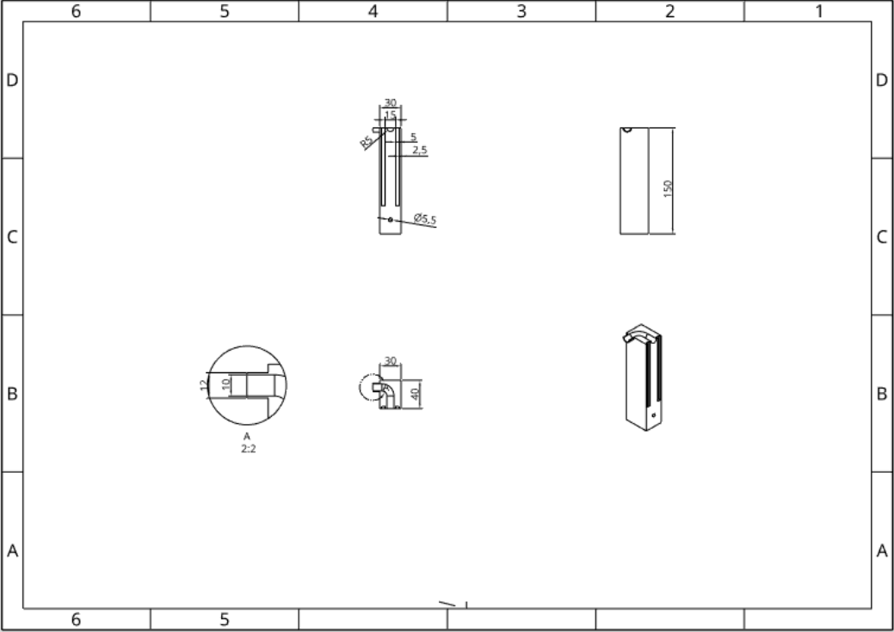
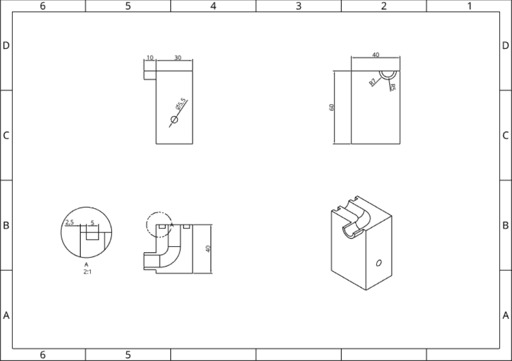
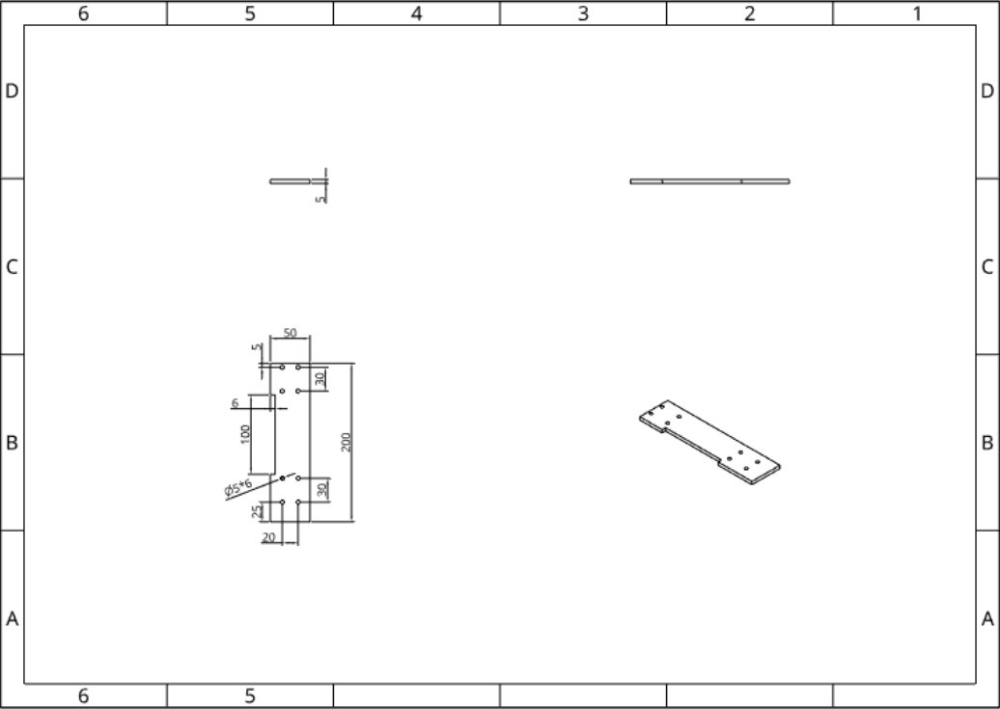
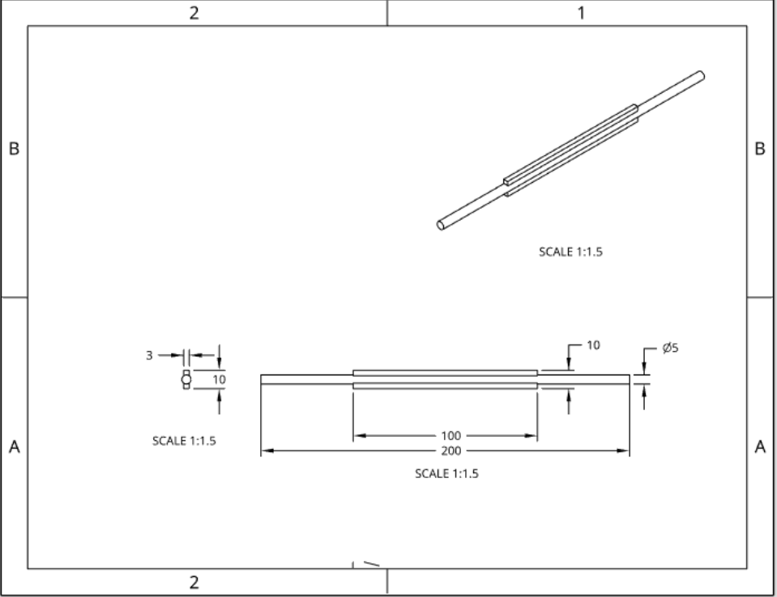
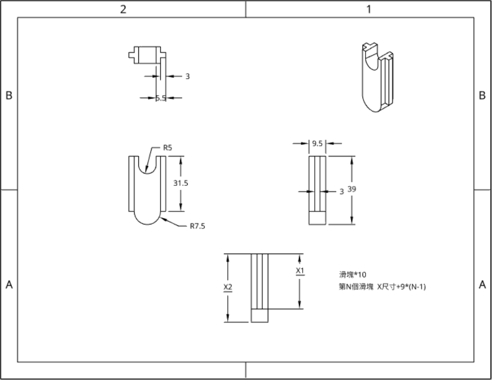
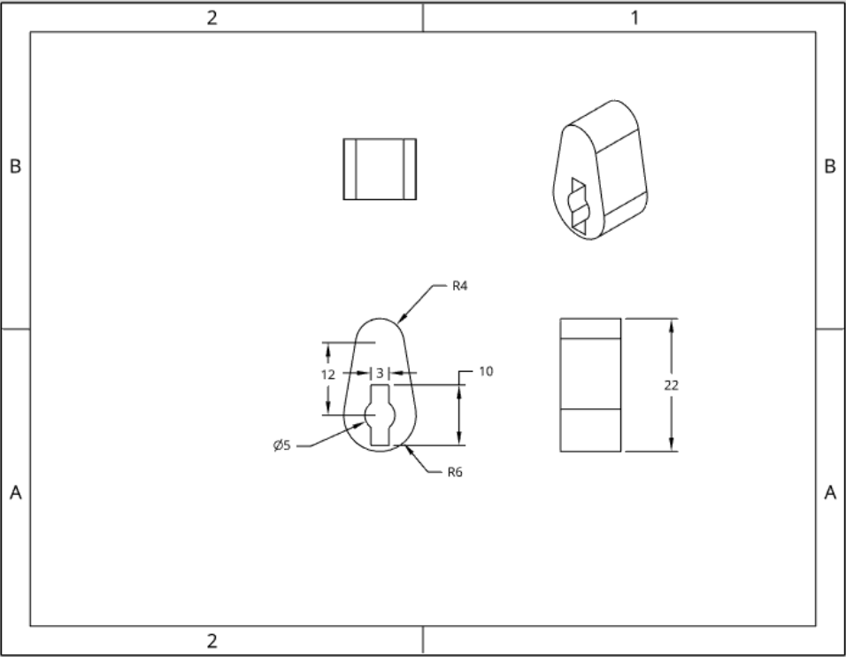
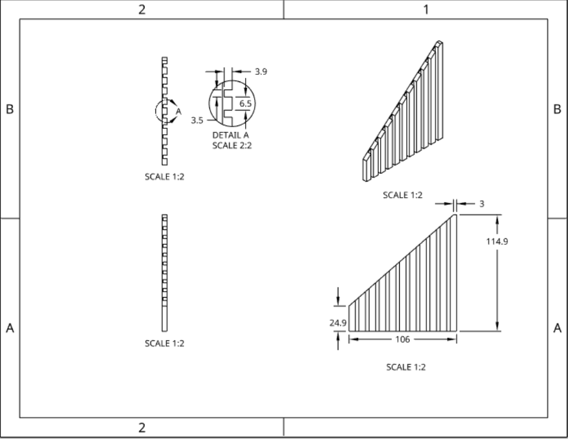
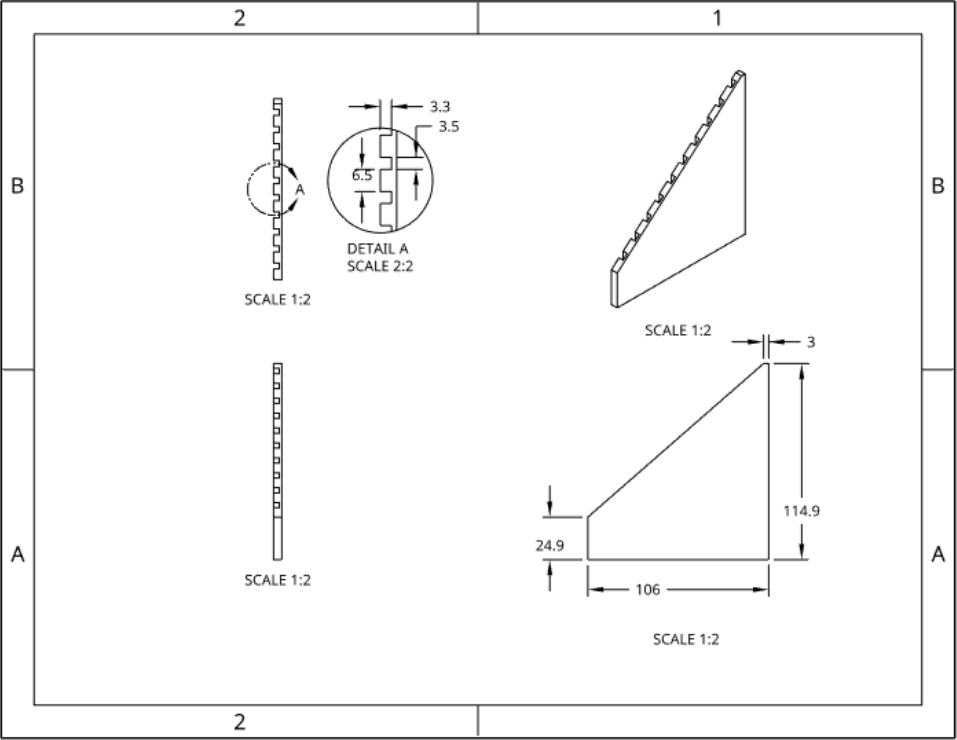

# **                                                 高塊**

# **                                                     低塊**

# **                                                     基底**

# **                                                       軸**

# **                                                     滑塊**

# **                                                     凸輪**

# **                                                   左背板**

# **                                                   右背板**

