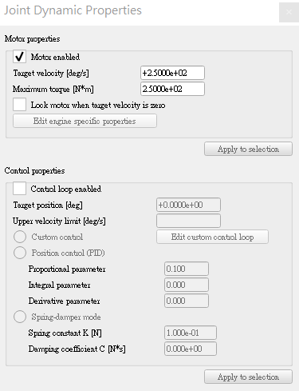

# 期中報告

### 1.在 V-rep 模擬平台中, 展示各組所選定的鋼球運動系統, 是否可以完成至少兩個週期的循環運動? {#1在-v-rep-模擬平台中-展示各組所選定的鋼球運動系統-是否可以完成至少兩個週期的循環運動}

[V-rep模擬影片](https://www.youtube.com/watch?v=PKRDGNYo1MM)

### 2.各組頂球機構的位移、速度與加速度分析, 手動運算是否與程式驗算或 V-rep 模擬相符?

角速度設定為250deg/s，主軸轉一圈需要1.44S，滑塊總共10，計算最高點到最低點須花費14.4S，實際測量卻只需要大約11.4S。

和預計的相差了**3**秒

但因為V-REP和現實中鋼球的重量和鋼球與機構本體材質的碰撞、回彈率等等，與實際操作會有很大的不同。

### 3.詳細說明各組如何進行協同設計, 如何利用 Gitbook、Github 與近端或雲端主機增加設計流程效益? {#3詳細說明各組如何進行協同設計-如何利用-gitbook、github-與近端或雲端主機增加設計流程效益}

* 本次利用以前學習到的協同設計，將GITHUB協同倉儲，將各自上課進度、成果等等，統一集中在此
* 小組使用GITBOOK

### 4.提供各組鋼球運動系統的細部零件材料表、各零件工程圖與組立檔 {#4提供各組鋼球運動系統的細部零件材料表、各零件工程圖與組立檔-若使用-solidworks-inventor-或-creo-請提供相關檔案-若使用-onshape-請提供個別零組件與工程圖的網路連結}

[V-rep模擬檔](https://github.com/s40523141/cd2018/tree/gh-pages/鋼球模擬機構/mech_design/v-rep_models)

| 名稱 | 數量 | 備註 |
| :---: | :---: | :---: |
| 高塊 | 1 |  |
| 低塊 | 1 |  |
| 基底 | 1 |  |
| 左背板 | 1 |  |
| 右背板 | 1 |  |
| 軸 | 1 |  |
| 凸輪 | 10 |  |
| 滑塊 | 10 | 第N個滑塊  X尺寸+9\*\(N-1\) |
| 軌道 | 1 |  |

| 工程圖 |
| :---: |
| [高塊](https://cad.onshape.com/documents/79f317acc95c962057761503/w/4b95593cdbc358d945bb24f6/e/f02df79b7e09eff5b5e400f6) |
| [低塊](https://cad.onshape.com/documents/79f317acc95c962057761503/w/4b95593cdbc358d945bb24f6/e/d91bcbffb8151919849a0db3) |
| [基底](https://cad.onshape.com/documents/79f317acc95c962057761503/w/4b95593cdbc358d945bb24f6/e/36d4fada1c28e918a728859c) |
| [左背板](https://cad.onshape.com/documents/79f317acc95c962057761503/w/4b95593cdbc358d945bb24f6/e/3486c73008ea40a484913b84) |
| [右背板](https://cad.onshape.com/documents/79f317acc95c962057761503/w/4b95593cdbc358d945bb24f6/e/72aac73d7b83af14deeb2eaa) |
| [軸](https://cad.onshape.com/documents/79f317acc95c962057761503/w/4b95593cdbc358d945bb24f6/e/bd48a7077d0baa16b18246bc) |
| [凸輪](https://cad.onshape.com/documents/79f317acc95c962057761503/w/4b95593cdbc358d945bb24f6/e/05320edfe8327ba87bddbc48) |
| [滑塊](https://cad.onshape.com/documents/79f317acc95c962057761503/w/4b95593cdbc358d945bb24f6/e/fa28cdbe6cdcaf2e3cb560e5) |
| [軌道](https://cad.onshape.com/documents/79f317acc95c962057761503/w/4b95593cdbc358d945bb24f6/e/dc84ae8986b6920d452c0ffe) |

### [零件檔](https://github.com/s40523141/cd2018/tree/gh-pages/鋼球模擬機構/mech_design/STL檔)

### 自評成績

### 40523111:70

### 40523141:80

### 40523144:60

