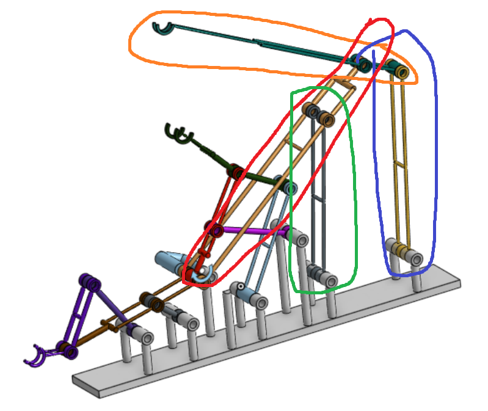
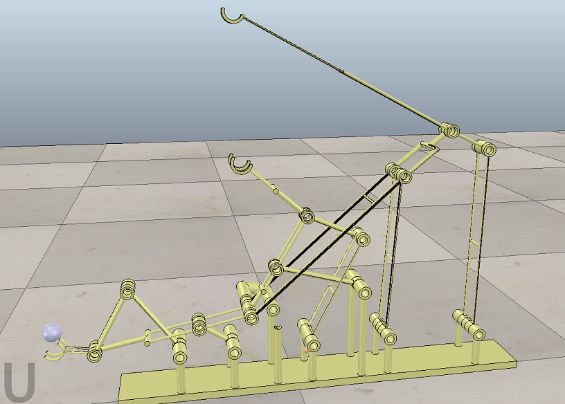

# 三段式六連桿提球機構

[onshape](https://cad.onshape.com/documents/0e70731b4ce2560b9aff5414/w/18647b63e0792b6094b97f0d/e/3bdec502ed91560e13157fde)

[影片](https://www.youtube.com/watch?v=9BAcVLfqy4s&feature=youtu.be)

[檔案](https://github.com/s40523141/cd2018/blob/gh-pages/%E5%8D%94%E5%90%8C%E7%94%A2%E5%93%81%E8%A8%AD%E8%A8%88%E5%AF%A6%E7%BF%92/%E4%B8%89%E6%AE%B5%E5%BC%8F%E6%8A%AC%E7%90%83/%E5%8D%94%E5%90%8C%E7%94%A2%E5%93%81%E8%A8%AD%E8%A8%88%E5%AF%A6%E7%BF%92-%E4%B8%89%E6%AE%B5%E5%BC%8F%E6%8A%AC%E7%90%83.ttt)

利用 Pyslvs, 在此一兩組六連桿機構, 再疊加一組六連桿機構, 成為三段式提球機構設計

和兩段式台由機構一樣的方法，但變為六連桿，作法幾乎一樣重點在於測試學生**會不會設置V-REP中的DUMMY**

**一樣的作法就不再贅述。**

---

先在Pyslvs 做出三段式的初步模型   &gt;&gt;  接著轉到SLVS   &gt;&gt;  匯入ONSHAPE   &gt;&gt;  做完模型在丟到V-REP中模擬

---

總共新增4跟連桿，但原先的兩段式連桿機構與舊版的連桿位置 ,運動軌  _**跡皆不相同  **_

---

V-REP模擬結果:

---

總結:三個撈球的部分，圓弧的大小與寬度要依照鋼球的尺寸下去設計，三個圓弧之間也需要互相配合，在設計中後期會發現，若要以_**最佳的設計為出發點**_，總有一些小誤差造成整個機構運作不順，前前後後花了相當多的時間才達到標準

