# 三段式六連桿機構模擬練習

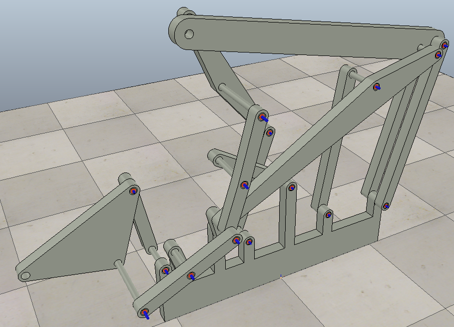此作業在繪製出一個三段式六連桿機構後，進入V-rep練習轉軸及Dummy的用法。

模擬影片：​[https://www.youtube.com/watch?v=h8XLkBz27NU](https://www.youtube.com/watch?v=h8XLkBz27NU)​

ttt檔案：[https://github.com/s40523123/cd2018/blob/gh-pages/ttt/TripleLifter\_group3.ttt](https://github.com/s40523123/cd2018/blob/gh-pages/ttt/TripleLifter_group3.ttt)

---

# 介紹模擬過程

將V-rep開啟，匯入連桿，並將其分解，獲得許多零件檔。

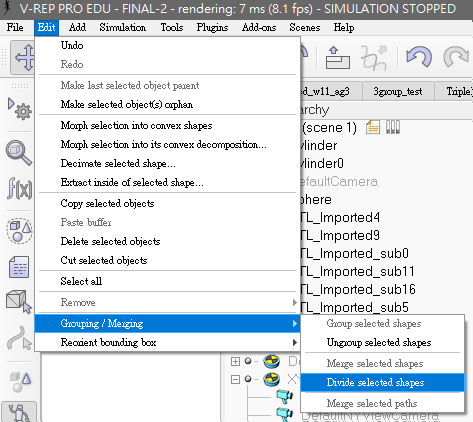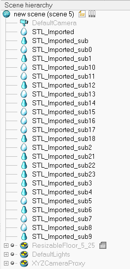

接著開始對每個轉軸加工，點選空白處右鍵來新增模擬轉軸。

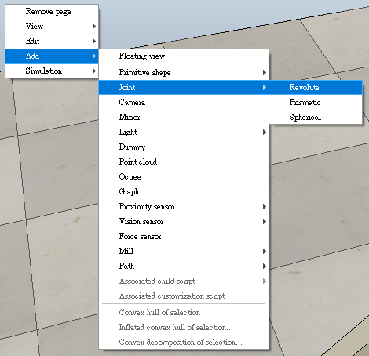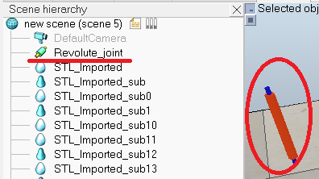

對每個轉軸的處理程序大致為：

1.將轉軸定位至需要位置

2.由左方零件列將轉軸拖曳至連接的桿件下方

3.視情況設定轉軸轉速及最大扭力

其中第一個步驟的定位方法：

點一下需移動的轉軸，接著按住Shift不放，再點要移動至的位置\(銷\)，則轉軸會呈現黃色立方體框框，再按下互相定位即可。

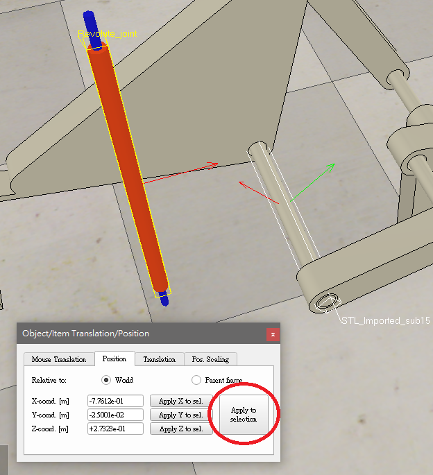

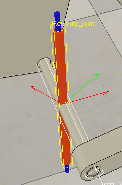

定位好後視情況再將角度也進行互相配合，如下圖。

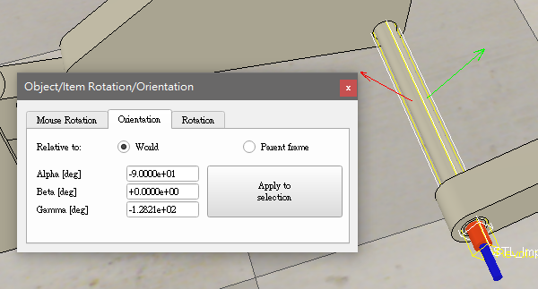

接著依照個人要求，也可以將轉軸的直徑及長度進行更改，就這樣把所有轉軸都定位。

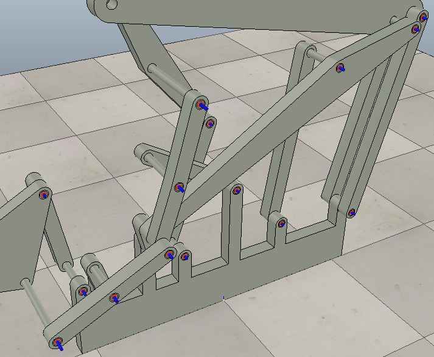

---

接著針對模擬部分進行調整，對轉軸及桿件的模擬重點，大致為以下幾點：

1.由底座開始向上逐一設定桿件及轉軸

2.經過觀察放置好左方的零件列

3.有重複連接的部分需利用Dummy來處理

4.基本上只需要一個轉軸設定轉速及扭力

對於轉軸及桿件的連接，以下圖兩段式六連桿的一部分為例子，由底座開始往上延1～5的順序接出。

圖片表達若不夠清楚，可以直接下載ttt檔案來仔細觀看\(連結在最上方\)。

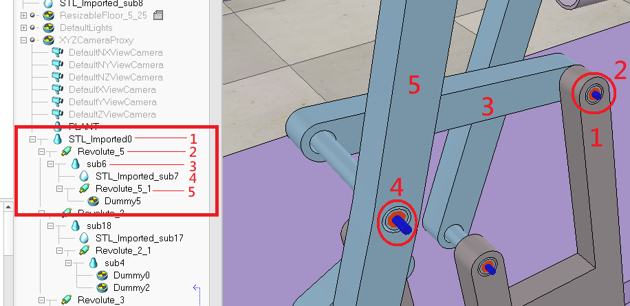而在上圖第5個桿件之後，就必須利用Dummy來完成與其他從底座接上來的桿的連接，同樣必須由操作者觀察，將兩個Dummy連接正確，模擬才會成功。

右鍵空白處，與轉軸相同，即可叫出Dummy出來，注意一組連接就需要兩個Dummy。

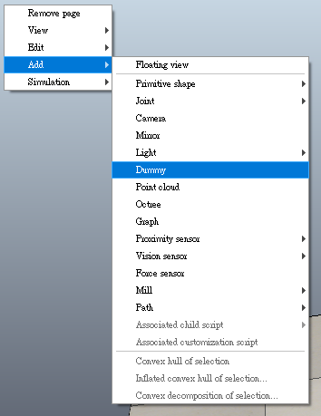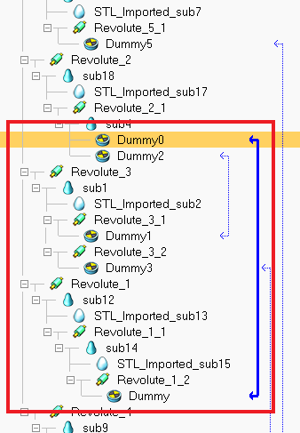

而在模擬中必定會有不只一組Dummy的連接，操作者須仔細觀察想要達成的旋轉模擬目標，來進行正確的Dummy連接。

詳細連接可以下載此模擬ttt檔案來觀察\(連結在最上方\)。

