# 詳細介紹內容

---

首先，必須從Onshape著手將此兩段式六連桿機構繪出，本組對Week11所製作的三段式六連桿機構進行改動，做出成品。

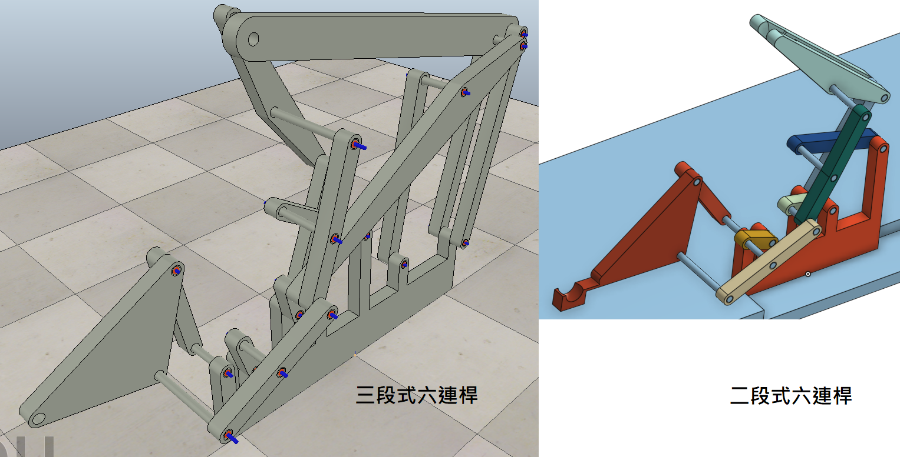

接下來，開始對負責抬起球的兩個桿\(最左及最上桿\)進行改動。

由左方的紅色三角型桿件開始：

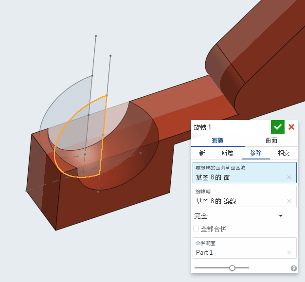

此切除面為接球面，為了不讓球從前後方向落出，把此面切成球型\(尺寸為9mm\)。

在此之前試過許多不同種接球方法，進行模擬後才得出必須利用球型來接球的結果。

接著進行最上方桿件的改動：

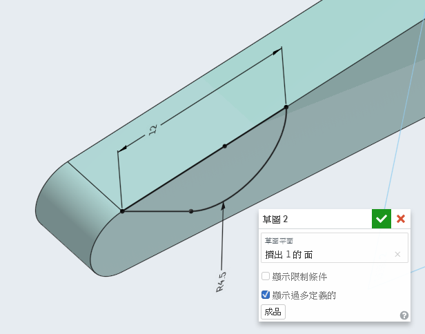

將其挖出一個單邊的凹槽，為了將紅色桿件的球接至此位置，挖出後再將整個桿件鏡射。

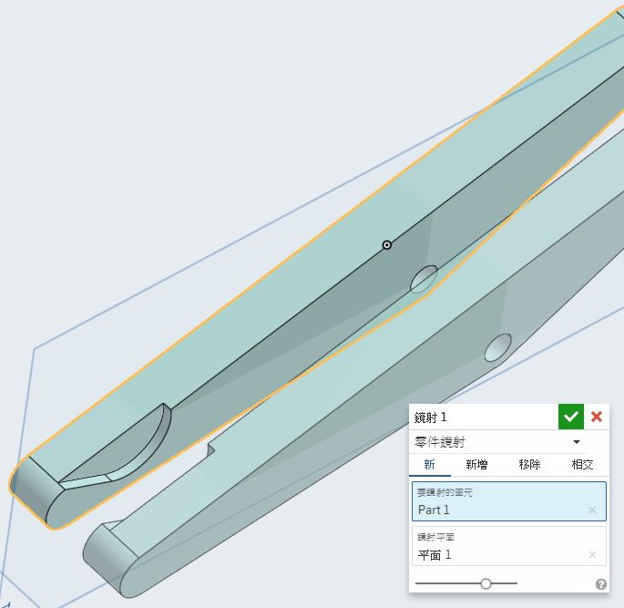

---

完成接球部分的改動後，開始構想接球處如何擋球，在一直不停運行的連桿機構下，必須讓球在左方定點固定進行等待，機構才能將球撈起，因此設計定點擋球是此機構的重點部位。

經過多次進入V-rep模擬後，繪製出一個極為簡單的擋球裝置。

在最後將把球以此種\(右圖\)方式固定在接球的位置。

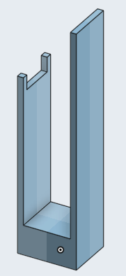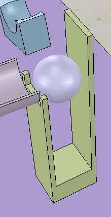

---

完成後將大致位置擺好及進行需要的約束後，對主動軸\(接馬達之軸\)進行動態模擬，若沒有出現干涉報告，則表示能進行下一步驟。

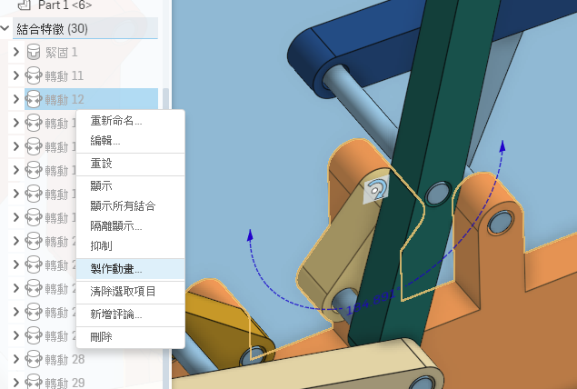

將V-rep開啟，匯入連桿，並將其分解，獲得許多零件檔。

接著開始對每個轉軸加工，點選空白處右鍵來新增模擬轉軸。

對每個轉軸的處理程序大致為：

1.將轉軸定位至需要位置

2.由左方零件列將轉軸拖曳至連接的桿件下方

3.視情況設定轉軸轉速及最大扭力

其中第一個步驟的定位方法：

點一下需移動的轉軸，接著按住Shift不放，再點要移動至的位置\(銷\)，則轉軸會呈現黃色立方體框框，再按下互相定位即可。

定位好後視情況再將角度也進行互相配合，如下圖。

接著依照個人要求，也可以將轉軸的直徑及長度進行更改，就這樣把所有轉軸都定位。

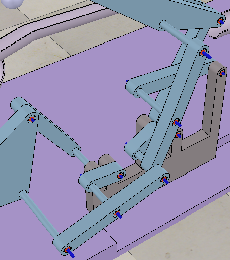

---

接著針對模擬部分進行調整，對轉軸及桿件的模擬重點，大致為以下幾點：

1.由底座開始向上逐一設定桿件及轉軸

2.經過觀察放置好左方的零件列

3.有重複連接的部分需利用Dummy來處理

4.基本上只需要一個轉軸設定轉速及扭力

對於轉軸及桿件的連接，以下圖為例子，由底座開始往上延1～5的順序接出。

圖片表達若不夠清楚，可以直接下載ttt檔案來仔細觀看。

而在上圖第5個桿件之後，就必須利用Dummy來完成與其他從底座接上來的桿的連接，同樣必須由操作者觀察，將兩個Dummy連接正確，模擬才會成功。

右鍵空白處，與轉軸相同，即可叫出Dummy出來，注意一組連接就需要兩個Dummy。

而在模擬中必定會有不只一組Dummy的連接，操作者須仔細觀察想要達成的旋轉模擬目標，來進行正確的Dummy連接。

詳細連接可以下載此模擬ttt檔案來觀察。

---

在模擬成功之後，開始繪製將球運回接球點的軌道。

需要用到3D草圖的地方，在Onshape中不好處理，因此開啟我們的好夥伴—Inventor。

此為最後完成的軌道。

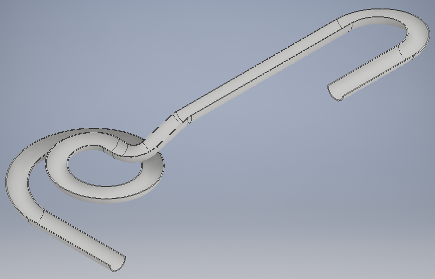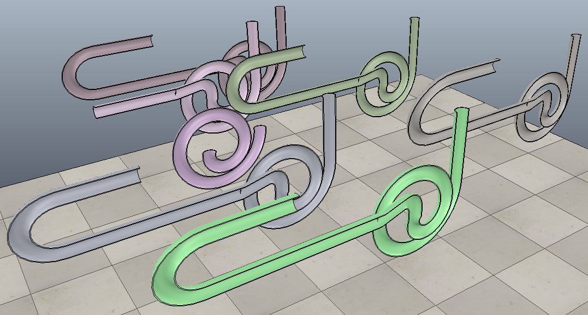做出完成品前經過多次細微的修改，也試過非常多種版本。

---

最後將軌道放進V-rep中模擬，成功做成鋼球循環系統。

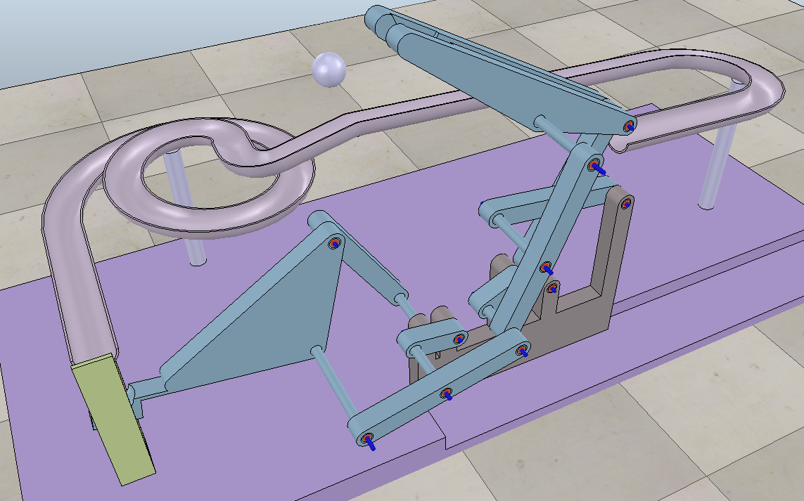模擬影片：[https://www.youtube.com/watch?v=dfAdKo0J35I&feature=youtu.be](https://www.youtube.com/watch?v=dfAdKo0J35I&feature=youtu.be)

