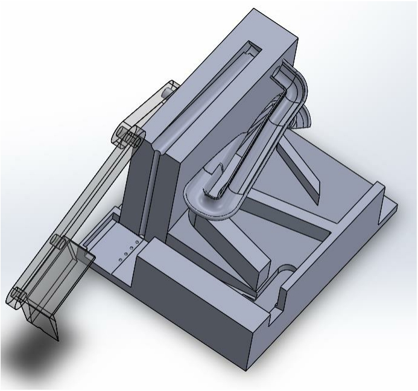
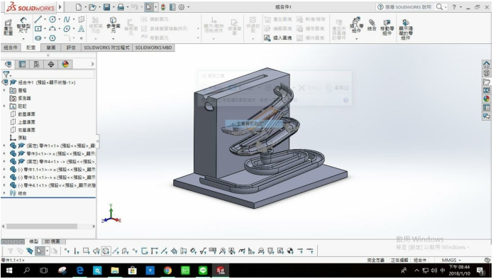
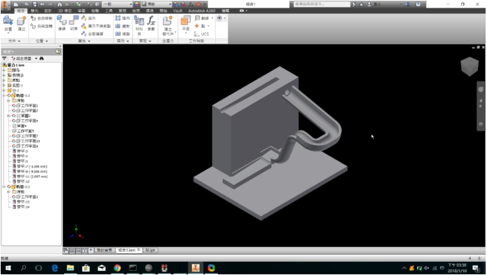

#目錄
 
1.目錄
 
2.摘要
 
3.前言
 
 3-1 :報告原因
  
 3-2 :報告內容
  
4.內文
 
 4-1 :研究靈感
  
 4-2 :使用的軟體
  
5.遇到的困難
 
6.結論
 
7.探討與建議
 
8.參考
 
 
# 摘要
 
上網參考或者是自己思考想出一個想要的鋼球運動系統，藉由這個運動系統斷練使用的程式，先利用 Solvespace 模擬出機構的運行方式，確認出可以使用後才開始繪製零件圖，使用 on-shape 繪製出各式零件後，由各組員設計的軌道系統，待各個組員將軌道放入運行後，選擇一個小組共同選擇的軌道使用3D列印影印出來。
 
 
# 前言
 
一、報告原因: 在這堂電腦輔助設計實習中我們要學習如何設計出一個鋼球軌道系統並且在半個學期中將其設計出來，我們必須自己找出自己的主題，找出自己想要的系統，自己在各種模擬中模擬出正確的機構，這篇報告的內容就是解釋我們如何由零開始到最後。
 
二、報告內容: 我們將會由靈感來源以及設計方式，以及會使用到的程式一一介紹完畢，以及在過程中所遇到的問題。
 
 
## 一、 研究靈感:
 
一開始有參考很多的鋼球系統，有螺紋.凸輪.齒輪.挖土機等等的機構，而我們選用的就是挖土機的機構，上網看了之後發現其實螺紋是一種很好的機構，我們只需要再思考如何讓球可以離開凹槽，順利滾出螺紋，如何讓他可以按照我們希望的軌道跑，所以我們將會使用一些模擬程式來輔助。
 
 
## 二、使用的軟體
 
### (一)SolveSpace
 
此軟體是讓我們確認螺旋機構有無干涉，並且有沒有辦法在現實中成功的模擬完成，所以我們需將我們希望的方式繪出，軟體中模擬確認可不可行，經由模擬過後我們確定這個方案是可行的所以我們之後將會依照這個方案下去執行。
 

 
### (二) Onshape
 
線上版的繪圖程式，只要有網路就可以使用，所以就不用到處下載 SOLIDWORKS，可以用來執行零件繪製以及零件配合，在這個軟體內就可以先預先測是零件間會不會有各種干涉，所以在這次的研究中，我們全程使用這個軟體繪製各式各樣的零件。
 
### (三) V-rep
 
我們將零件繪製好後，放入 V-rep 內進行模擬，並且將主軸以及馬達鋼球等必要用的零件放入一同進行模擬 ，看看有無卡住的地方再做調整。
 
 
## 遇到的困難
 
本來一開始設定的內容並不是這樣，我們是要使用螺桿檯球系統，但是由於無法繪製出正常的零件，無法將球運行道要求的地，所以我們從新繪製了許多的螺紋，希望可以將球向上提，如果運行過去就會產生干涉，所以因為這個問題我們又設定了許多方式，最後有成功的解決了這個問題。
 
 
## 結論
 

 
這是我們最後結果的主軸加軌道，雖然沒有 3D 列印出來，這個軌道是採用 18 號所繪製的軌道，還沒繪製完成的時候所拍的圖，所以只差一點就完成了。以下尚有其他組員之軌道繪製3D圖。
 

 
(17號繪製之軌道)
 

 
(16號繪製之軌道)
 

 
(8號繪製之軌道)
 
 
## 探討與建議
 
在製作這個過程中一定要提早設定好自己要做的題目，這次的題目有點晚才正式確定，可是已經有點晚了，接近期中考，所以大家都是邊準備段考邊畫這些圖，而且還有其他的作業要做所以大家都不知道到底該怎麼樣條配自己的時間。
 
 
## 參考
 
<a href="https://www.youtube.com/watch?v=8W3Vlq_sOf4">參考影片</a>
 
這個影片內容主要是我們參考的畫圖原理，利用他的方式 畫出一個比較不一樣的系統

