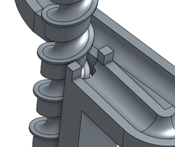
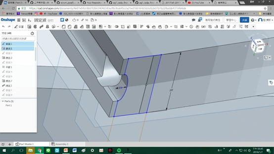
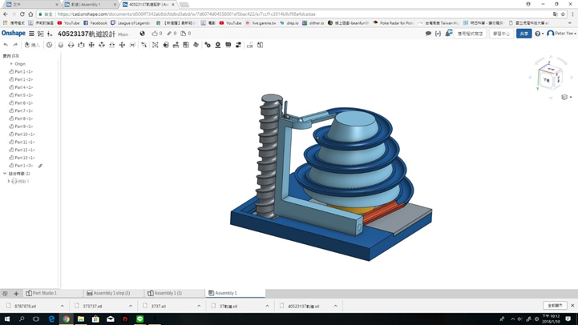

# 目錄
 
一、摘要...............................2
 
二、前言
 
  1.研究目的..........................3
   
  2.報告架構..........................3
   
三、系統介紹...........................4
 
四、遇到的問題.......................8~9
 
五、個人軌道
 
  1.40523137楊永慶.................11
   
六、結論..............................17
 
七、參考文獻..........................18
 
 
## 摘要
 
本研究的重點在於如何運用Onshape和Vrep模擬出可以實際運作的滾珠機構。首先我們從網路上尋找到了適合的參考機構，經過小組討論後我們在Solvespace初步設計出結構，再到Onshape畫出零件並且組裝。
 
最後用Vrep模擬出可以讓小球上升的機構.我們的機構叫做螺紋滾珠機構。
 
原理是運用螺紋斜面可以做功，把球貼著一個平面將小球向上運送。
 
 
## 前言
 
### 1.研究目的：
 
為因應工業4.0，並不是單單創造新的工業技術，有智慧型工廠。智慧型工廠就是講求全自動化、機電資整合。
 
今天做的提球機構的設計與組裝就好比一個具有上料、下料、裝卸和產品加工等全部工序都能自動控制、自動測量和自動連續的生產線。
 
現在遇到的一些問題及解決方法都是不可避免的。研究目的是作為提球機構應用。實際上我們已經坐上機電資整合這艘通往未來的郵輪上了。
 

 
### 2.報告架構:
 
本報告將按照目錄所示；第一章摘要；第二章前言；第三章說明設計會用到的軟硬體介紹如下
 

 
軟體亦將在此一併介紹；第四章為遇到的問題，分別對我們在模擬時遇到的問題配上文字及圖片加以解說。
 
第五章為V-rep的解說。
 
第六章為結論將做出來的結果，做個總結並延伸到日常生活中。
 
 
## 系統介紹
 
#### 1. solvespace
 

 
類似Inventor的程式可以完成簡單的繪圖，但跟一般繪圖軟體不同的是，他是很方便被攜帶的。
 
免費、自由的2D和3DCAD（計算機輔助設計）程序。這是一個基於約束的參數化建模器，具有簡單的機械仿真功能。
 
#### 2. V-rep
 

 
是一個模擬機構運行的程式，通用機器人模擬器與集成的開發環境。
 
傳感器，機構，機器人和整個系統都可以，以各種方式建模和模擬。
 
#### 3. onshpae
 

 
是一個計算機輔助設計（CAD）軟件系統，通過互聯網通過軟件即服務（SAAS）模式提供。
 
它廣泛使用雲計算，在基於Internet的服務器上執行計算密集型處理和渲染，用戶可以通過Web瀏覽器或iOS和Android應用程序與系統進行交互。
 
Onshape允許團隊在單個共享設計上進行協作，就像多個編寫者可以通過雲服務一起編輯共享文檔一樣。
 
 
## 遇到的問題
 
### 問題一
 
六連桿的尺寸依照比例縮小至2號箱子的大小23cmX18cmX19cm。至少要縮小2~3倍，提升高度太小，故不採用。
 

 
### 問題二
 

 
從原本的主軸改成新的主軸，由於在模擬時球會從主軸邊緣掉下來。所以我們加了類似支撐的薄片在主軸邊緣。
 

 
從原本的主軸改成新的主軸，由於在模擬時發現球會卡在凹槽，於是我們加了一顆小圓柱，以利小球可以進去凹槽。
 
### 問題四
 

 
由於在模擬時發現球會掉下去。為避免小球掉落，我們做了兩個1.5的凹槽。
 
 
## 個人軌道
 

 
心得：這學期使用的ONSHAPE不僅能有一定程度的繪圖功能,再版次管理上更能體會出它的好處,若有零件要更換也能知道其過程中發生了什麼事,雖說在一開始模擬時常無法順利完成,但透過團隊間的討論,最終還是順利使用VREP完成推球系統的運作。
 
 
## 結論
 
我們的結論是很遺憾的只能做到V-rep模擬，沒能做出實體。
 
但我們覺得做出來一定會很有成就感，人生就是要不斷突破自己的極限，而且學到的軟體有別於過往傳統的繪圖軟體，例如：Ｓoilworks、Inventor等…都是呼應現階段的工業4.0，Onshape就是個很好的例子。
 
就如同系統介紹說的，Onshape可以直接由網路，將工程師畫好的圖，利用Onshape的共用功能將立體圖或設計圖直接傳給離自己有千里遠的客戶。
 
 
## 參考文獻
 
https://www.youtube.com/watch?v=LV6QcZZtlFU
 
https://www.youtube.com/watch?v=rbBosppuSOk
 
https://www.youtube.com/watch?v=6HJwBHx-93Q
 
https://en.wikipedia.org/wiki/SolveSpace
 
https://en.wikipedia.org/wiki/Onshape
 
http://www.coppeliarobotics.com/assets/v-repoverviewpresentation.pdf

