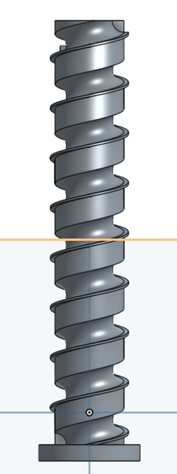
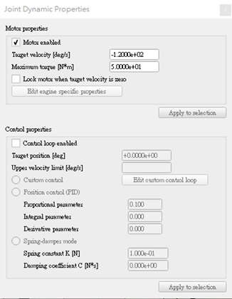

# 鋼球運動系統計算
 
各組頂球機構的位移、速度與加速度分析, 手動運算是否與程式驗算或 V-rep 模擬相符
 

 
轉動螺旋線主軸後,將直徑9mm的球往上抬升,主軸速度要求-120deg/s,由於為右螺旋,若要將球抬升則需要逆時針轉,其主軸120deg/s換算下來一轉平均3秒主軸旋轉一圈,而螺旋所前進的距離會等同於該螺紋的螺距,因此每三秒球就會上升20mm.而在距地面180mm處有一遮擋處,可將球從軌道上推出送入軌道。
 
主軸每3秒抬升20mm抬升總長  180mm180/20=9  9^3=27  總抬升時間約27秒其抬升速度應為 180/27=6.66mm/s  由於等速旋轉故其加速度為0可以持續運轉好幾周程式最後使用-120deg/s將球送入軌道需求約為22秒,與預期所相差五秒。
