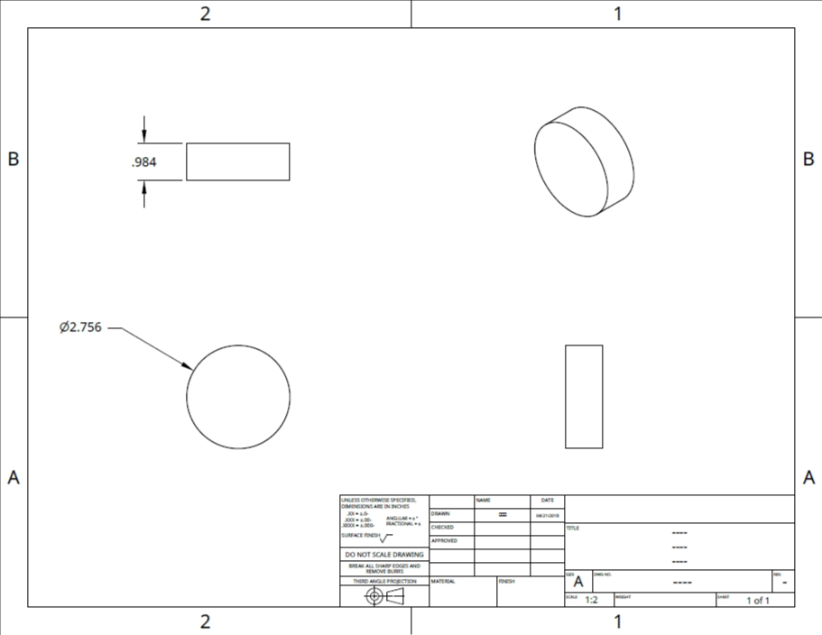
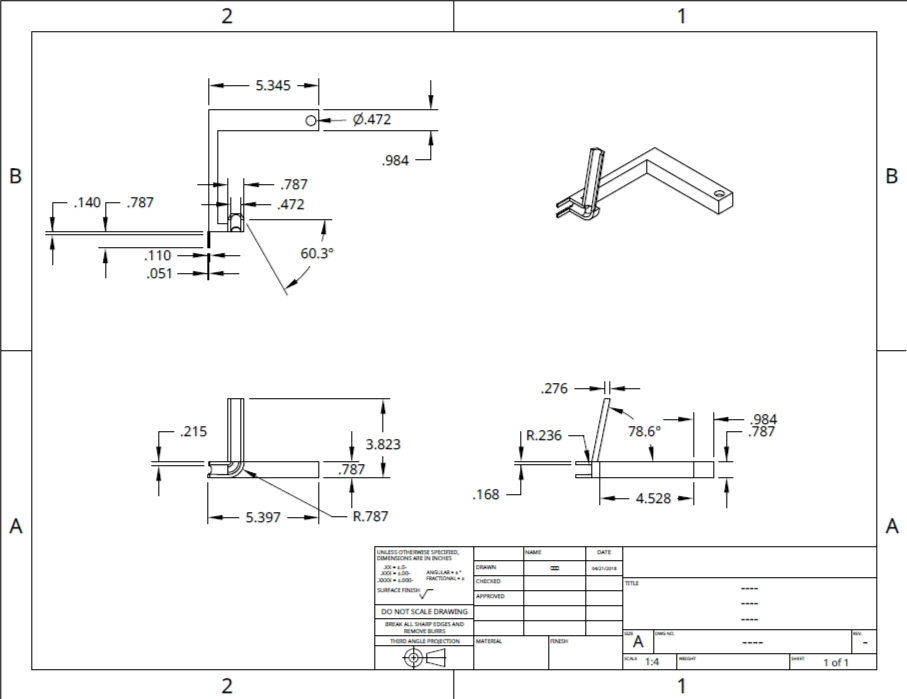
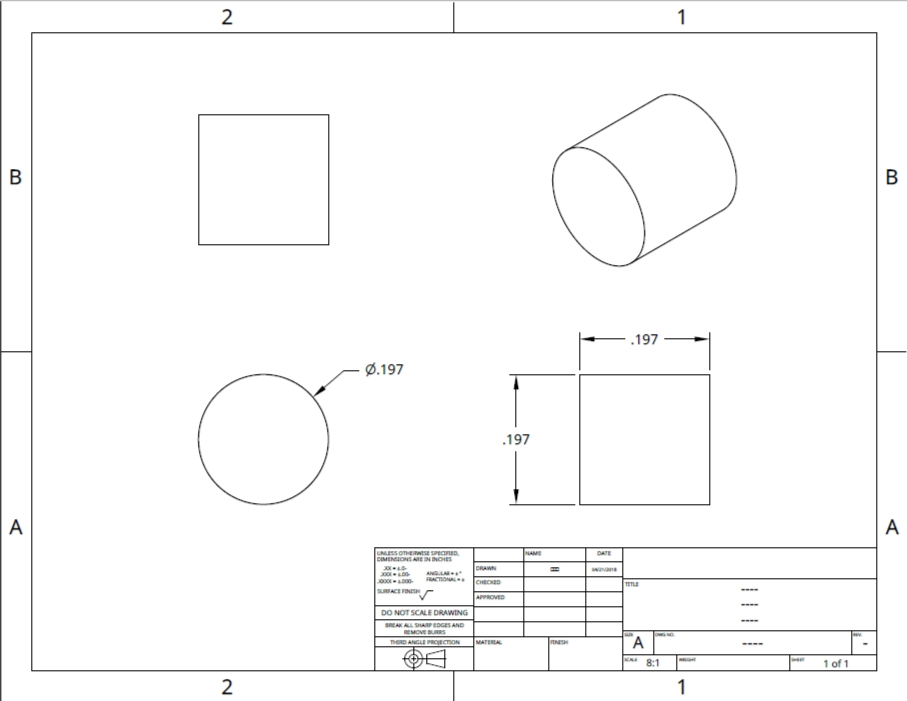
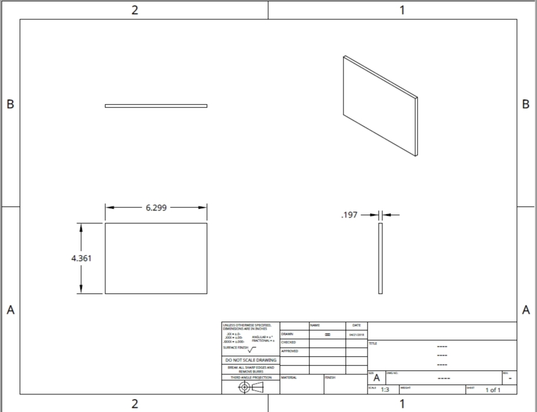
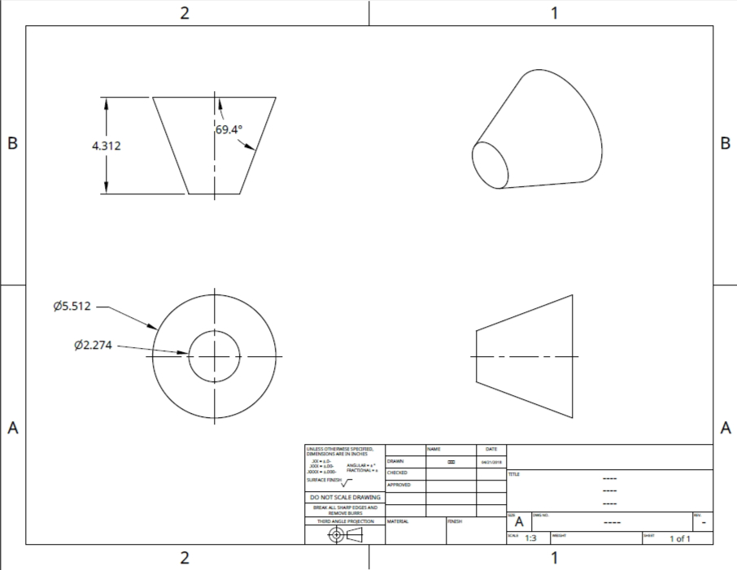
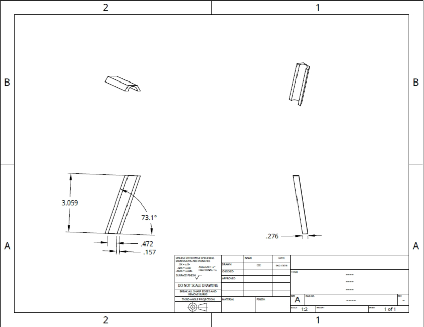
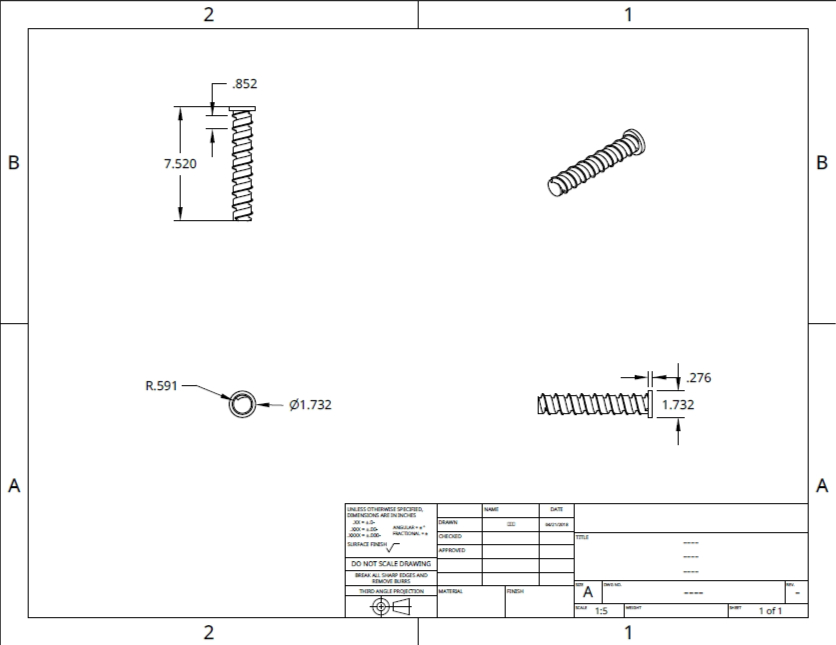
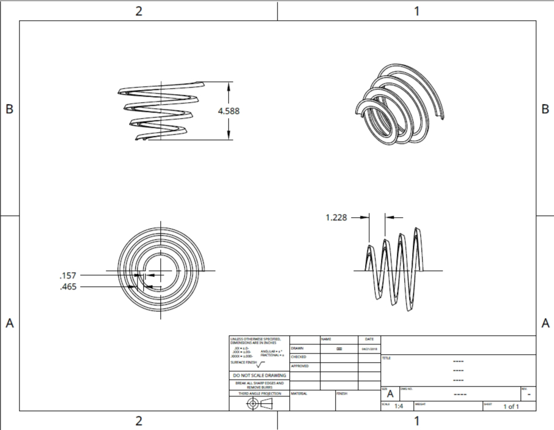
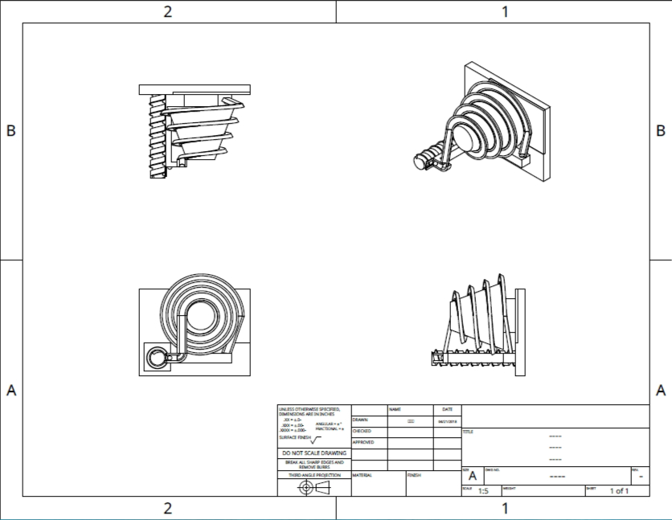

# 零件表
 
 

| 件號 | 數量 | 品名 | 
| :--- | :--- | :--- | 
| 1 | 1 | 軌道支撐柱 |
| 2 | 1 | 軌道&上升支架 |
| 3 | 1 | 底板 |
| 4 | 4 | 定位銷 |
| 5 | 1 | 軌道固定板 |
| 6 | 1 | 支撐架 |
| 7 | 1 | 導球軌道 |
| 8 | 1 | 螺旋上升軌道 |
| 9 | 1 | 螺旋軌道 |
| Extra | 1| 整體模型 |

 
 
*軌道支撐柱
 

 
*軌道&上升支撐柱
 

 
*底板
 

 
*定位銷
 

 
*軌道固定板
 

 
*支撐架
 

 
*導球軌道
 

 
*螺旋上升軌道
 

 
*螺旋軌道
 

 
*整體模型
 

 
 
<a href="https://github.com/s40523117/cd2018/issues/5">零件工程圖</a>
