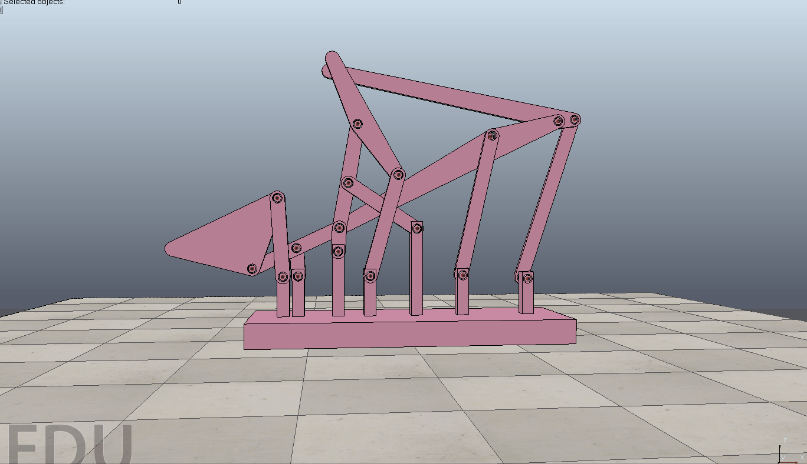

# 40523117課堂測驗
 

 
<iframe width="560" height="315" src="https://www.youtube.com/watch?v=xIBFC2YoCE8&feature=youtu.be" frameborder="0" allow="autoplay; encrypted-media" allowfullscreen></iframe>
 
 
<a href="https://github.com/s40523117/cd2018/blob/gh-pages/triple%20lifter/40523117/triple%20lifter.gif">Triple Lifter - GIF
 
 
<a href="https://cad.onshape.com/documents/4e96734830404741e1378ed8/w/3248fbc857f4106beddb316d/e/313c0b37360b01b6aff3984b
">Triple Lifter - Onshape</a>
 
 
<a href="https://github.com/s40523117/cd2018/blob/gh-pages/triple%20lifter/40523117/triple%20lifter.mp4">Triple Lifter - mp4
 
 
<a href="https://github.com/s40523117/cd2018/blob/gh-pages/triple%20lifter/40523117/triple%20lifter.stl">Triple Lifter - stl
 
 
<a href="https://github.com/s40523117/cd2018/blob/gh-pages/triple%20lifter/40523117/triple%20lifter.ttt">Triple Lifter - ttt
