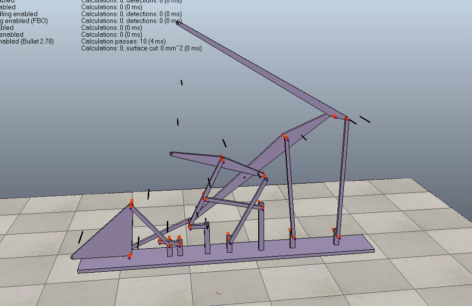

# 40523137課堂測驗
 

 
<iframe width="560" height="315" src="https://www.youtube.com/watch?v=nxqSU_jvw_0&feature=youtu.be" frameborder="0" allow="autoplay; encrypted-media" allowfullscreen></iframe>
 
 
<a href="https://github.com/s40523117/cd2018/blob/gh-pages/triple%20lifter/40523137/40523137.gif">Triple Lifter - GIF</a>
 
 
<a href="https://www.youtube.com/watch?v=nxqSU_jvw_0&feature=youtu.be">Triple Lifter - mp4</a>
 
 
<a href="https://cad.onshape.com/documents/a472fb4cb5603cf3f2f65d08/w/9f506090024475c21e4c3de1/e/c39d136b7fa811b962ea1ed3
">Triple Lifter - Onshape</a>
 
 
<a href="https://github.com/s40523117/cd2018/blob/gh-pages/triple%20lifter/40523137/40523137%E4%B8%89%E6%AE%B5%E5%BC%8F.stl
">Triple Lifter - stl</a>
 
 
<a href="https://github.com/s40523117/cd2018/blob/gh-pages/triple%20lifter/40523137/%E4%B8%89%E6%AE%B5%E5%BC%8F.ttt
">Triple Lifter - ttt</a>

