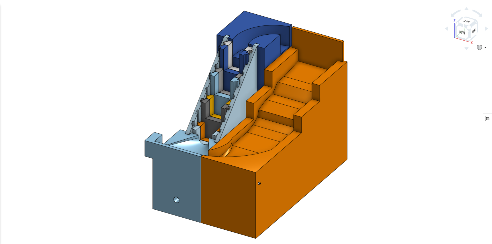
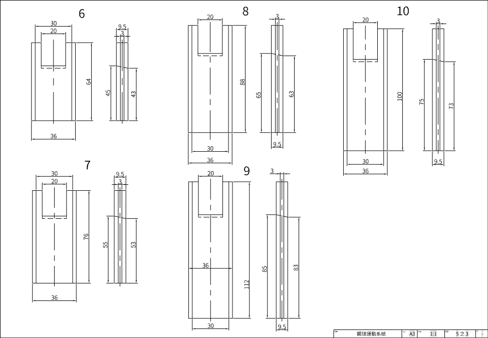
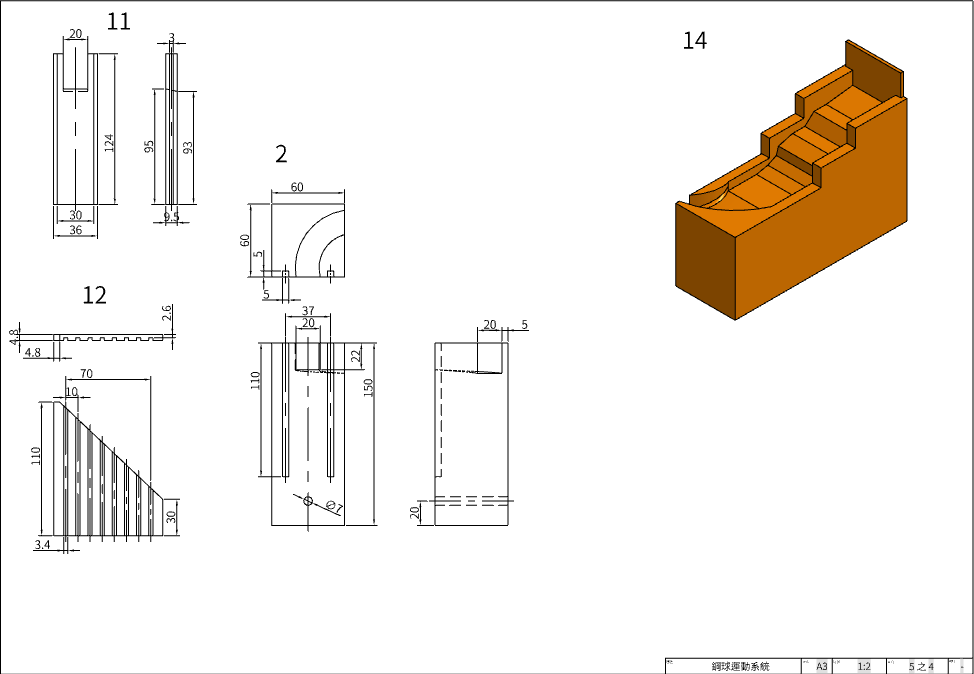
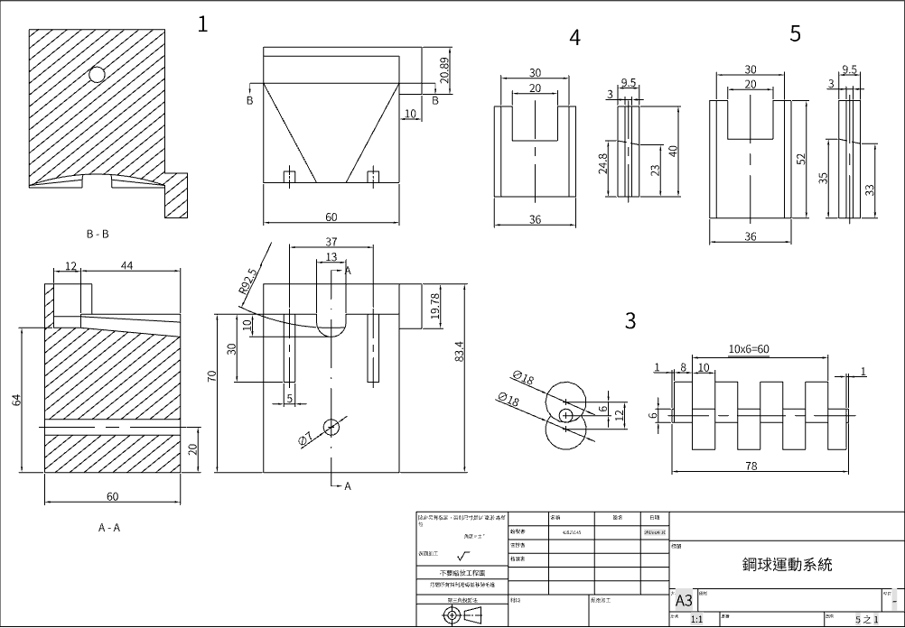
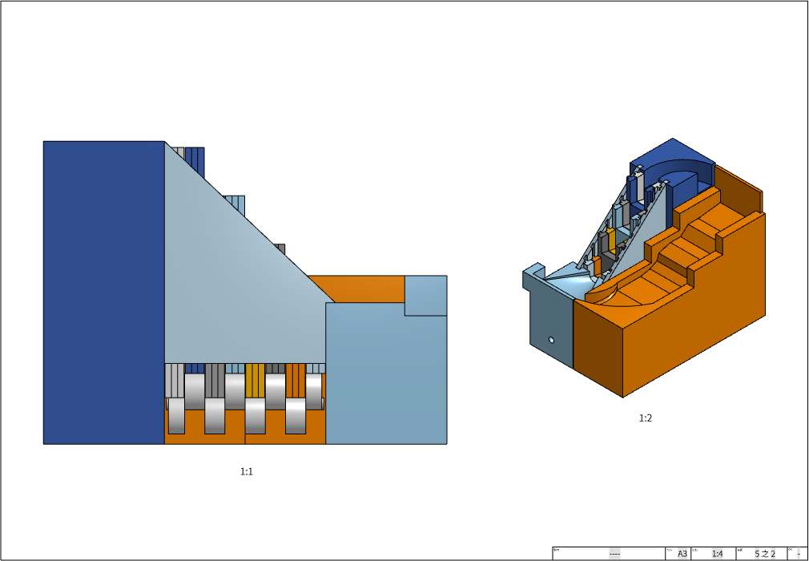
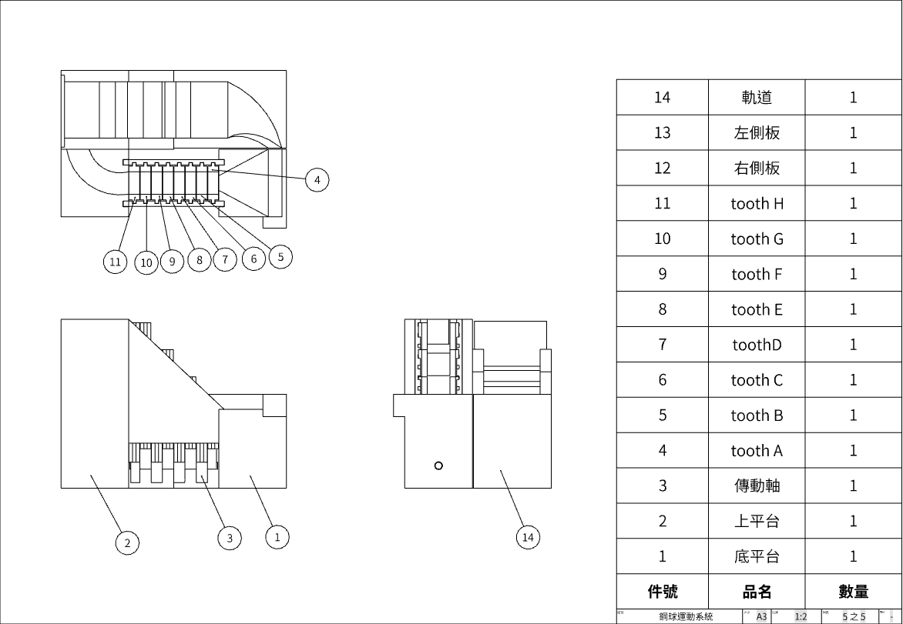

# _國立虎尾科技大學機械設計工程系協同產品設計實習期中報告_

* ### 組長 : 40523145
* ### 組員 : 40523146  40523147

# 一、球循環運動系統

### 本學期的球循環運動系統沿用上學期的凸輪推球機構，而這學期的所給的需求如下

#### 若每一座鋼球循環運動系統尺寸設為 20 cm \( 長\) x 15 cm \(寬\) x 15 cm \( 高\), 則本學期實習用的鋼球搬

#### 運場定義為長 100 公分, 寬 60 公分的平面, 四座鋼球循環運動系統分別位於四個角落, 且鋼球搬運球的

#### 上下球位置設於各角落內側

## V-REP模擬

### [steel ball running system.ttt](https://github.com/s40523145/cd2018/blob/gh-pages/ball%20system%201.0%2040523145.ttt)

### [video](https://www.youtube.com/watch?v=DsomBS7fDPY&t=5s)

### [教學步驟](https://www.youtube.com/watch?v=DDwLmsGTO_U)

#### 在onshape建立零件並組裝，將完成的組裝檔轉成.stl且下載，把stl轉入v-rep進行模擬。

## [Oshape 零件 組合 工程圖 零件表 ](https://cad.onshape.com/documents/9a4d52989b70904048bf4a75/w/0c84a05ac211c55f99756286/e/d8338a339ac78b48f570abd5)

### onshape的製作過程及工程圖和零件表

\(點入上方連結可以詳細閱讀工程圖和3D立體視圖\)

### 3D組合圖

### 工程圖1

### 工程圖2

### 工程圖3

### 2D裝配組+零件表圖

### 

#### 零件表

| 件號 | 品名 | 數量 |
| :--- | :--- | :--- |
| 1 | 底平台 | 1 |
| 2 | 上平台 | 1 |
| 3 | 驅動軸 | 1 |
| 4 | tooth A | 1 |
| 5 | tooth B | 1 |
| 6 | tooth C | 1 |
| 7 | tooth D | 1 |
| 8 | tooth E | 1 |
| 9 | tooth F | 1 |
| 10 | tooth G | 1 |
| 11 | tooth H | 1 |
| 12 | 右側板 | 1 |
| 13 | 左側板 | 1 |
| 14 | 軌道 | 1-4 |

# 二、各組頂球機構的位移、速度與加速度分析, 手動運算是否與程

# 式驗算或 V-rep 模擬相符

### 2.轉速

#### 主軸角速度為50deg/s，所以控制主軸轉一圈需要7.2秒的時間\(360/50=7.2\)，因為只取上死點跟下死點所

#### 以理論上球從最低點到最高點的時間是3.6秒，總花時間為28秒

#### 實際用50deg/s測量發現要把球運到最上面需花時間23秒，預期是28秒，差了5秒後來，我們角速度改

#### 25deg/s測試總共花50秒的時間，理論上控制主軸轉半圈需要7.2秒的時間，，和預期差了7秒

#### 所造成的誤差應該是減斜運動會有一個滯留區，導致實際跑起來會比預期的還久

### 3.高度設計

#### 這邊滑塊的高度設計是有一個斜度的，目的是用來讓球可以往前滾動，所以這邊我們用A0 A1 B0 B1 C0

#### C1來表示高度

#### A0=2.3 A1=2.5 R=1.2

#### B0=2.3+1.2=3.5

#### B1=3.5-0.2=3.3

#### C0=3.3+1.2=4.5

#### C1=4.5-0.5=4.3

#### D0=4.3+1.2=5.5

#### D1=5.5-0.2=5.3

#### E0=5.3+1.2=6.5

#### E1=6.5-0.2=6.3

#### F0=6.3+1.2=7.5

#### F1=7.5-0.2=7.3

#### G0=7.3+1.2=8.5

#### G1=8.5-0.2=8.3

#### H0=8.3+1.2=9.5

#### H1=9.5-0.2=9.3

### 如果要直接求出第幾根的長度

#### N0=2.5+N

#### N1=N0-0.2

# 三、詳細說明各組如何進行協同設計, 如何利用 Gitbook、Github

## [小組ISSUES](https://github.com/s40523145/cd2018/issues)

#### 我們利用小組倉儲裡的issues找了老師所派給我們的目標的資料，並且放在issues裡提供大家閱讀，方便做出老師的每周任務

## [小組OnShape作品](https://cad.onshape.com/documents/9a4d52989b70904048bf4a75/w/0c84a05ac211c55f99756286/e/d8338a339ac78b48f570abd5)

#### OnShape的部分設計都是由40523145負責，然後將我們設為協同，然後分工把零件的工程圖畫完

## [小組GITBOOK](https://legacy.gitbook.com/book/s40523145/-2018cd/edit#/edit/master/README.md?_k=2imryo)

#### 分配給每個人原先的工作項目，逐一寫在各個分支，然後再請一個人進行統整美編，增加做報告的效率

# 

# 五、期中自評

#### **40523145 75   **V-rep模擬兩個週期的循環運動,鋼球運動系統的細部零件材料表、各零件工程圖與組立檔

#### **40523146 70   **分析位移和速度分析，協同報告整理，鋼球的垂直高度位移量計算

#### **40523147 60   美化報告**

