# 第十四週

## 三段式六連桿提球機構

主要處理幾個部分

* 連桿與連桿之間的避障
* 堤球機構加上提球的勺子
* 加入手動擋球開關
* 加入感測器
* 模擬除錯

### [video](https://www.youtube.com/watch?v=0yglJ6NNSi0&t=2s)

# **目錄**

### _A.三段式六連桿提球機構設計流程說明_

### _B.流程_

### _C.問題解決_

### _D.尚未解決部分_

### _E.期末成果概念_

### _**F.檔案連結**_

### G_.心得_

# A.三段式六連桿提球機構設計流程說明

三段式六連桿提球機構主要先從2D機構軟件，模擬出所想要完成的做動機構，確定好匯出尺寸。再進行3D繪圖軟件零件繪製，第一次的零件設計無須非常精細，最主要是送入模擬軟件時可以確認原先設計的機構是可以確實能模擬執行的，確定可行後就是處理機構的避障及提球勺子的設計，提球勺子在原先2D機構設計時就需先想好勺子要如何編排及如何提球，當勺子跟避障處理完再次丟入v-rep進行模擬，在模擬的過程中找出bug並解決。解決完成加入擋球機構使球有順序的進入提球機構不至於有球脫軌的情況發生，接下來加入感測器，當提球機構行進到某個角度時會使擋球機構關閉，離開擋球機構開啟，完成純自動化的循環系統。

# B.流程

## b-1.pyslvs進行平面機構設計

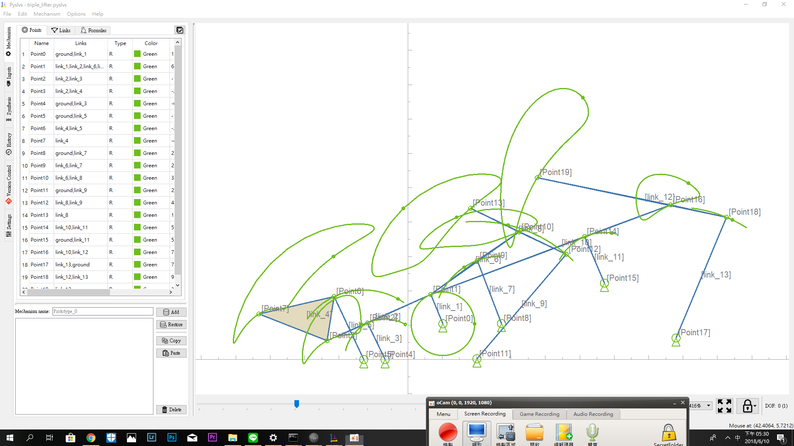

* ## [.pyslvs](https://github.com/s40523145/cd2018/blob/gh-pages/w12/triple_lifter.pyslvs)

## b-2.匯出尺寸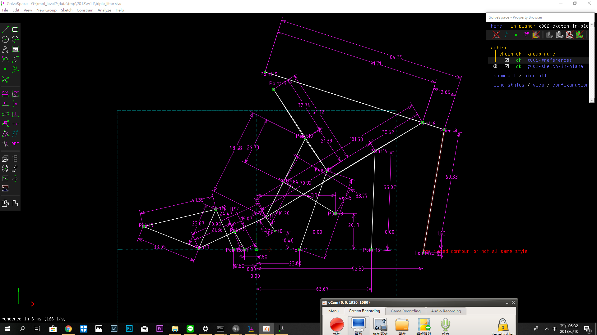

* ## [.slvs](https://github.com/s40523145/cd2018/blob/gh-pages/w12/triple_lifter.slvs)

## b-3.onshape進行零件繪製主裝

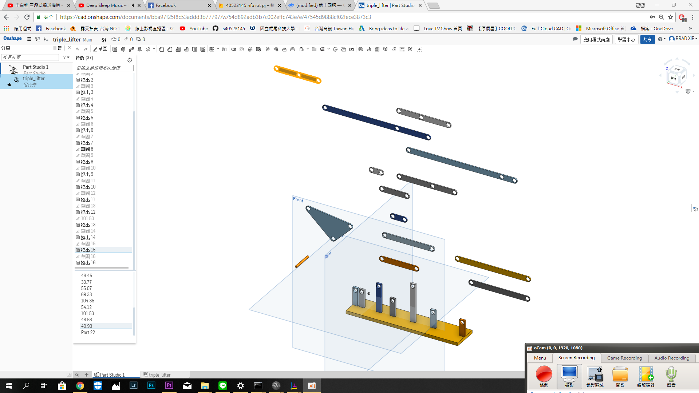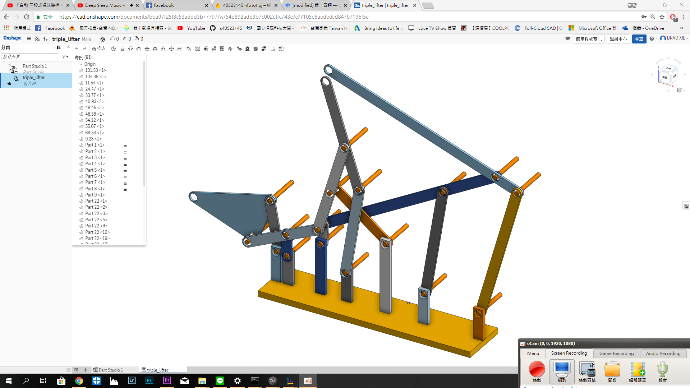

* ## [onshape 1.0](https://cad.onshape.com/documents/bba97f25f8c53addd3b77797/w/54d892adb3b7c002effc743e/e/7105e5aededcd84707196f5e)

## b-4.v-rep進行機構模擬

## 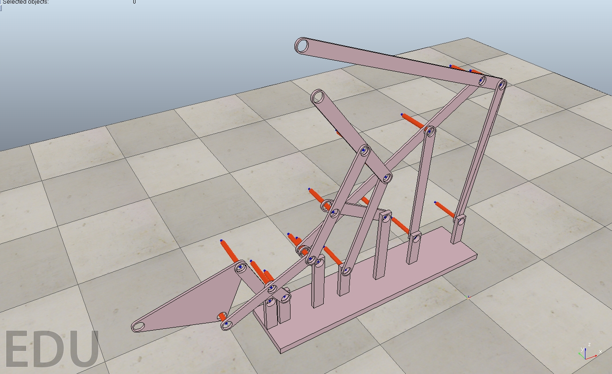

* ## [.stl](https://github.com/s40523145/cd2018/blob/gh-pages/w11/triple_lifter.stl)
* ## [.ttt](https://github.com/s40523145/cd2018/blob/gh-pages/w11/triple_lifter.ttt)

## b-5.onshape進行機構避障/勺子設計/擋球機構設計

## 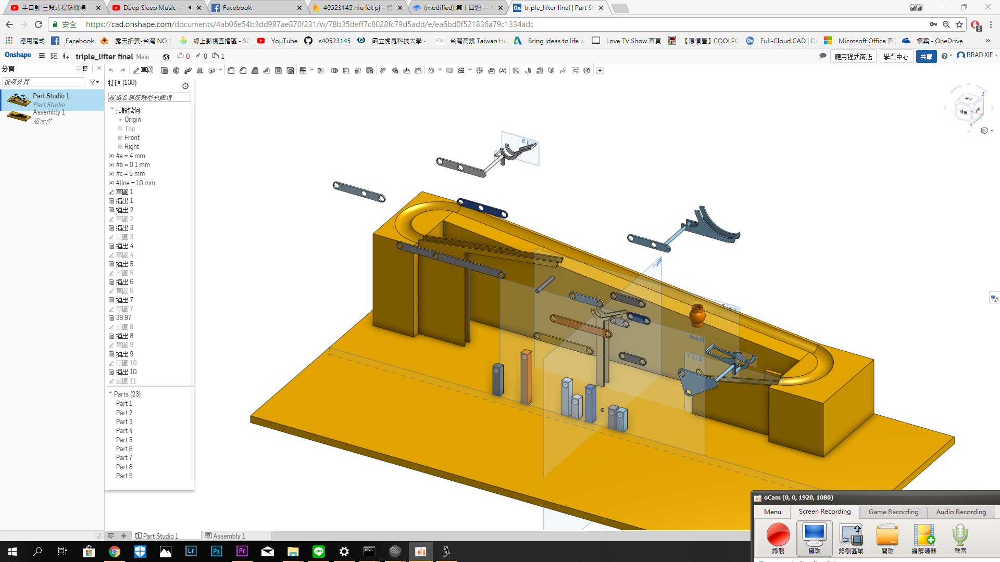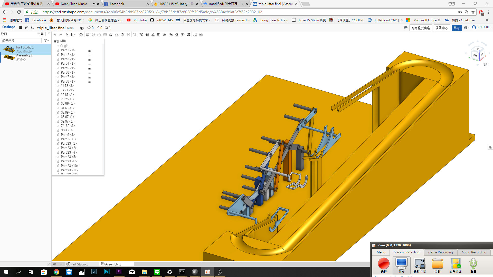

* ## [onshape 2.0](https://cad.onshape.com/documents/4ab06e54b3dd987ae870f231/w/78b35deff7c8028fc79d5add/e/45384e89af2c7f62a2982102)

## b6.v-rep進行機構模擬

## 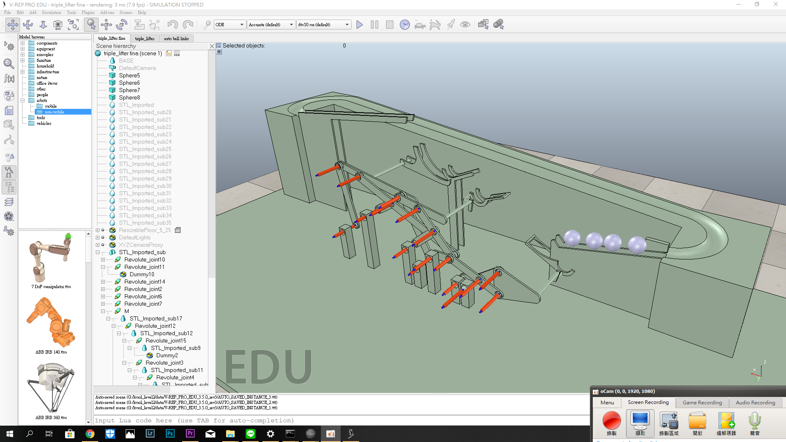

* ## [.ttt](https://github.com/s40523145/cd2018/blob/gh-pages/w15/auto%20ball%20links.ttt)

## b-7.除bug

#### 問題解決處說明

## b-8.加入擋球機構模擬/感測器模擬

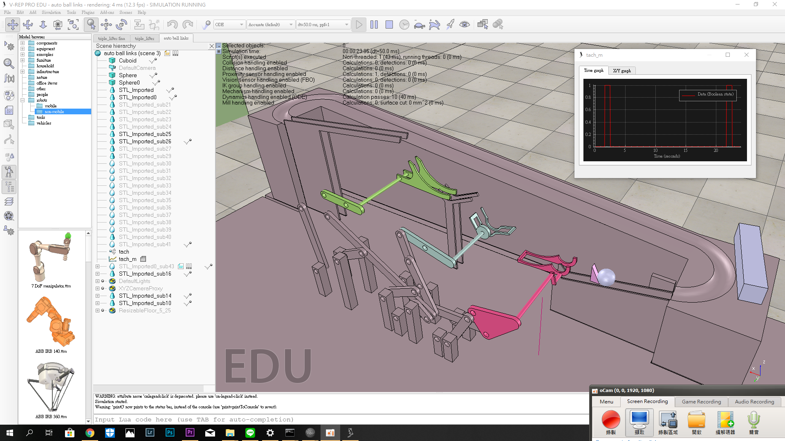

* ## [.ttt](https://github.com/s40523145/cd2018/blob/gh-pages/w15/auto%20ball%20links.ttt)

## b-9.自動控制

#### 尚未完成

# C.問題解決

### c-1.計算干涉

##### 在模擬的過程中提球勺會與軌道在計算時有問題。

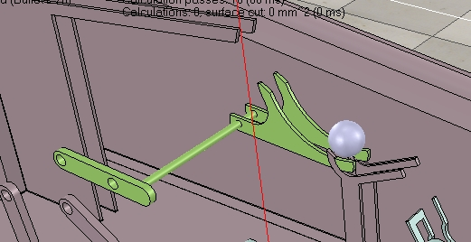

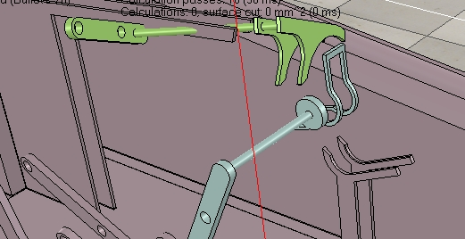

##### 解決方法如下

* ##### 將提球勺和軌道自身的碰撞模式關掉

##### 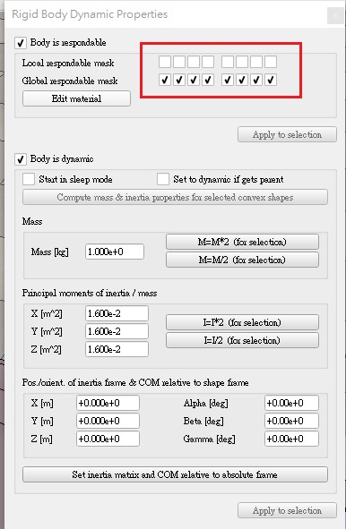

* ##### 將運算方式從Bullet 2.78 改成ODE 進行運算，但使用ODE時會造程球的運行不太穩定

##### 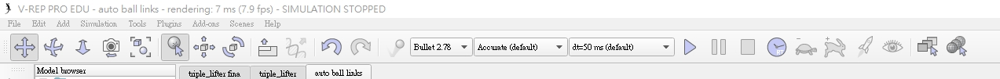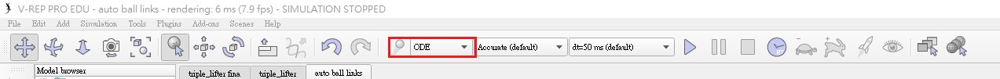

### c-2.機構模擬除錯地方

主要是在於提球勺撈球時容易失誤掉球的地方進行修改或是補強

# D.尚未解決部分

現在已經完成大部分，現在在對於從半自動到全自動的部分還在努力解決中，主要概念是希望當提球機構觸發到感測器，使擋球機構能將擋板收起讓球順利滾落，從手動變成一個能自動循環的系統。

# E.期末成果概念

這學期最終目標是設計提球機構與傳球機構，主要動作是從A處提球機構運作完的球放入傳球機構，送往至B處的提球機構，並且變成一個互相循環的迴路。

我們這主的目標是將現有的兩組提球機構\(三段式六連桿提球機構/期中凸輪滑塊提球機構\)分別成為A-B兩處的提球機構，中間則用小車子運球又或者運用輸送帶進行傳球。

# F.檔案連結

* ## [.pyslvs](https://github.com/s40523145/cd2018/blob/gh-pages/w12/triple_lifter.pyslvs)
* ## [.slvs](https://github.com/s40523145/cd2018/blob/gh-pages/w12/triple_lifter.slvs)
* ## [.STL](https://github.com/s40523145/cd2018/blob/gh-pages/w15/auto%20ball%20links.stl)
* ## [.ttt](https://github.com/s40523145/cd2018/blob/gh-pages/w15/auto%20ball%20links.ttt)
* ## [onshape 1.0](https://cad.onshape.com/documents/bba97f25f8c53addd3b77797/w/54d892adb3b7c002effc743e/e/7105e5aededcd84707196f5e)
* ## [onshape 2.0](https://cad.onshape.com/documents/4ab06e54b3dd987ae870f231/w/78b35deff7c8028fc79d5add/e/45384e89af2c7f62a2982102)

# G.心得

#### _**40523145**_

從學期初到現在慢慢可以體會到有好的設計方法，可以加快並且有效率的完成設計。

高中時的機械設計透過CAD軟體進行零件繪製與設計毫無設計方法可言，製作完工程圖進行實務加工，做出來的成品並不是一次成功，而須更改設計至2-3次才完成，大大增加了設計成本及時間。

