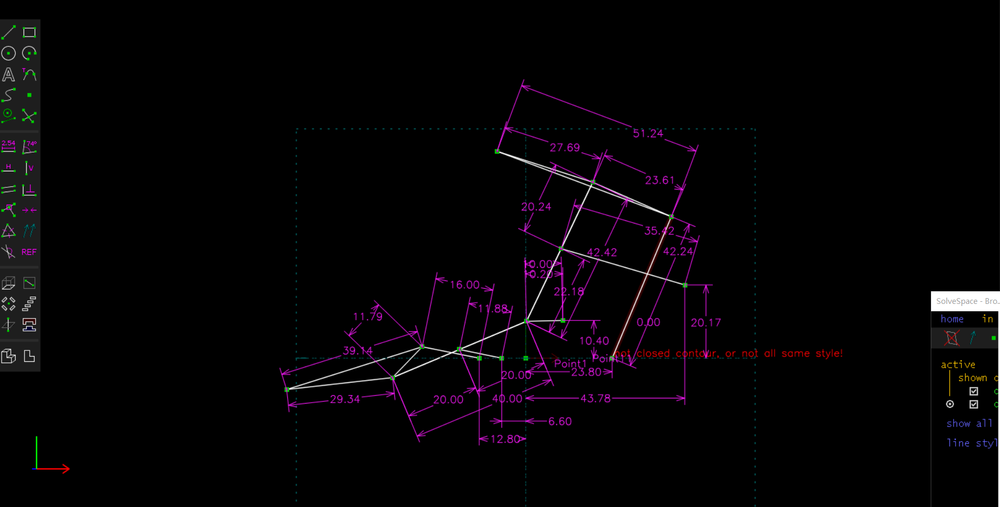
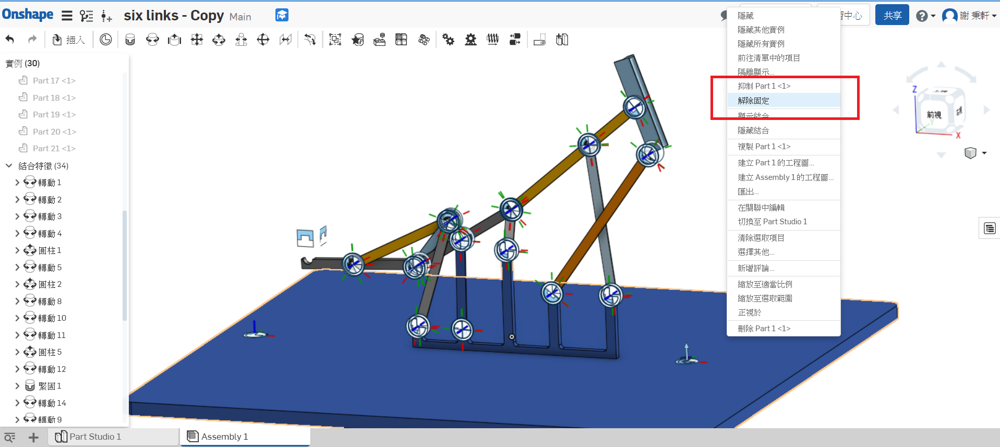
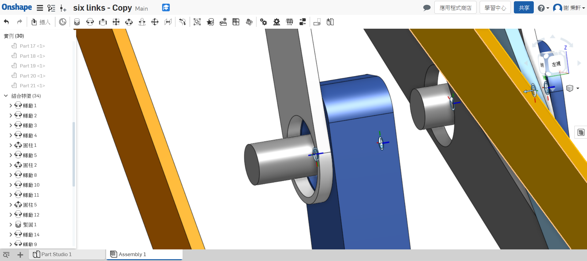
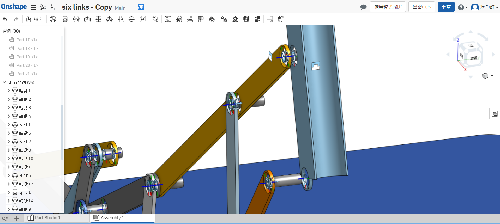
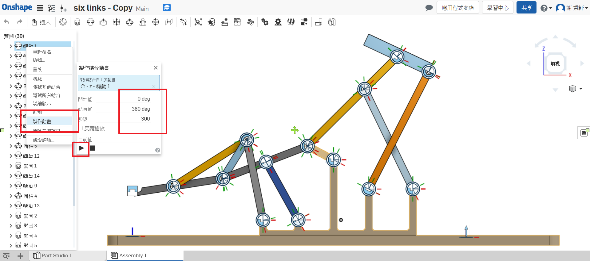
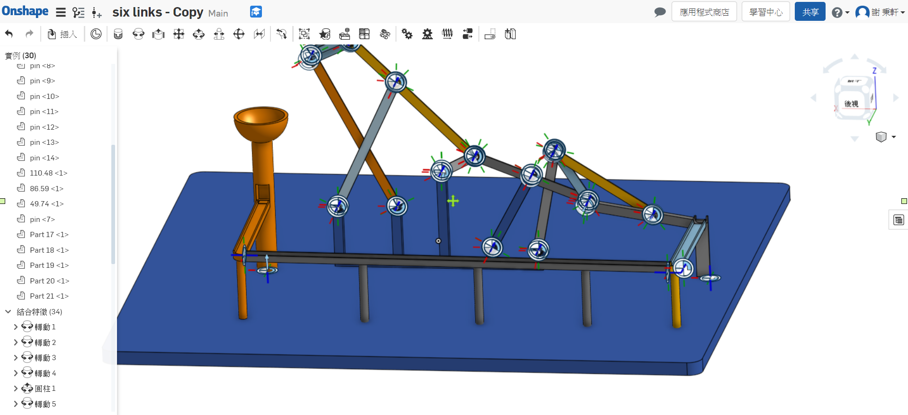
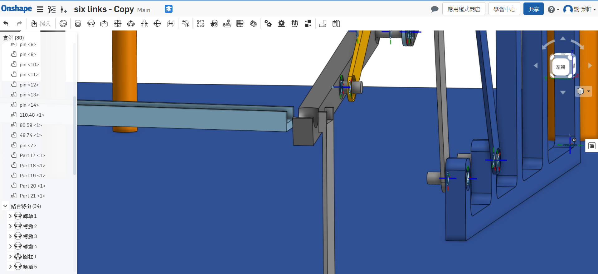
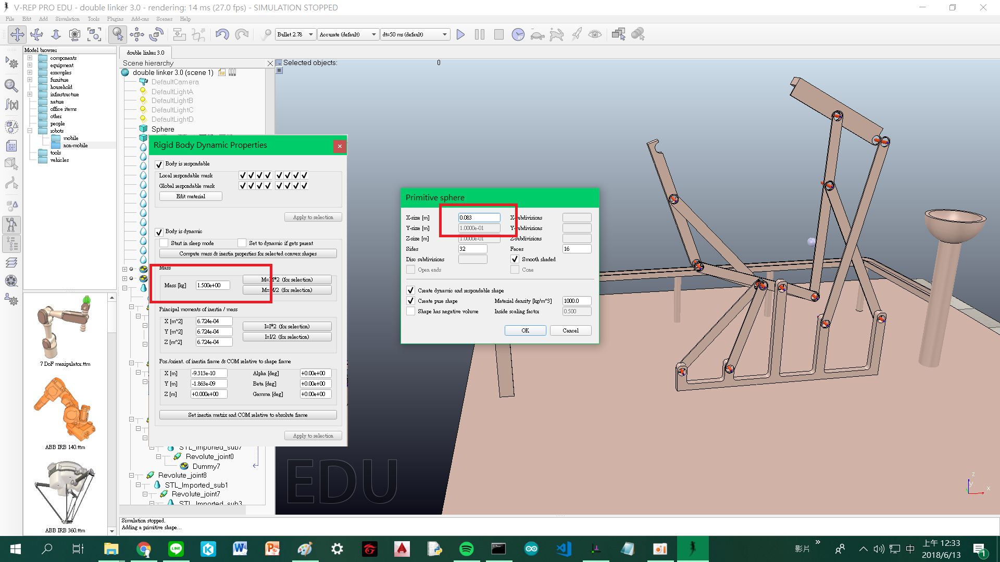

# 第五組兩段式鋼球運動系統

## 目錄

* #### 摘要
* #### 設計步驟與方法
* #### 遇到困難
* #### 心得

## 摘要

本學期的主要工作項目是鋼球運動的模擬，那兩階段提球是一剛開始的題目，後來我有多做了三階段的提球，但是因為後續的處理

組員已經做了，所以我主要這學期是做兩階段式的模擬，以下是我對這個題目的詳細介紹

## 設計步驟與方法

一.先下載Pyslvs:[http://wcmg3.kmol.info/downloads/pyslvs-18.4.0.mscv1900-amd64\_cdw10.7z](http://wcmg3.kmol.info/downloads/pyslvs-18.4.0.mscv1900-amd64_cdw10.7z)

首先運用學長開發的Pyslvs和老師給的六連趕範例，去拉尺寸，因為Pyslvs是一個可以任意更改長度的工具，然後直接模擬，所 以我們可以很輕鬆的輸出我們要的兩段式提球機構，這邊要注意的是球要從第一段運送到第二段之間的距離，這也是我第一個遇到的問題，太小會撞到太大球會掉出來，後來我的解決辦法是用拋的，有效的避開連感之間的碰撞

二.輸出成slvs檔

[模擬2.0.slvs](https://github.com/s40523146/cd2018/blob/gh-pages/w17/triple%20links.stl)

輸出成slvs檔候用solvespace打開得到各個連桿的相對位置和尺寸

三.在onshape把零件都畫出來

鋼珠預設直徑為8.5mm所以接球桿直徑設為9mm

第二階段的平台也是

四.組裝所有零件

組裝前記得要把底盤固定才不會跑來跑去不好組裝

我主要用兩種結合法一種是轉動結合，轉動結合試用於兩面緊緊貼合處，然後記得要留1mm的空隙，不然等到開碰撞檢測就會爆

另一種為圓柱結合用於下面這種因為要避開其他連桿而沒有黏在一起的連桿

全部組合完要可以用模擬動態，不能有任何干涉\([模擬影片](https://youtu.be/d2VEhY6V7rg)\)

最後在每個洞裡，給他一個Pin，方便待會定位

五.輸出成stl檔，用vrep打開

送入Vrep前，記得要再三檢查，因為接下來很麻煩做錯了要重來

這邊因為比較麻煩所以用影片表示，關鍵是Dummy的用法，簡單來說Dummy就是可以扣接兩個不同區的連桿和

joint

[範例影片part1](https://www.youtube.com/watch?v=R-8MzKhpsX0&feature=youtu.be)

[範例影片part2](https://www.youtube.com/watch?v=VAci5aVLD40&feature=youtu.be)

六.軌道設計

軌道我設計的很簡單，一個碗接球，然後順著軌道流到接球點

主要的問題是接球，剛開始真的不知道怎麼接球，想出可不可以靠感測器，但是那時技術還不會所以只好參考老師給的設計

一樣的困難點，求過去不能掉下去，接球桿過來不能打到，如果放太近Vrep模擬會卡卡的經過多次嘗試後距離8是最好的距離

七.最後模擬

#### 球的實際模擬尺寸為8.3mm 重量1.5kg[最後模擬影片](https://www.youtube.com/watch?v=j1VEKvkr0Qs&feature=youtu.be)

#### [模擬檔2.0.ttt](https://github.com/s40523146/cd2018/blob/gh-pages/w17/triple%20links%202.0.ttt)

#### [模擬檔3.0.ttt](https://github.com/s40523146/cd2018/blob/gh-pages/w17/double%20linker%203.0.ttt)

## 遇到問題

第一個遇到的問題是Pyslvs的連桿調整 解決辦法:雖然當下滿頭問號，也是試了幾次後才試出這個必較好的尺寸，讓球可以用拋的

第二個遇到的問題是onshape的組裝，剛開始不會組底盤也沒有固定，組出來的東西都壞掉 解決辦法:一部份一部份組，組完一部份就用滑鼠拉看看主動軸看看能不能正常動

第三個遇到的問題是vrep模擬的樹狀組裝 接決辦法:剛開始不懂Dummy怎麼用，一頭霧水，最後也是系統化組裝一部份一部份試從最下面接近底盤的街上去比較清楚自己在接甚麼，不然很容易亂掉

第四個月到的問題是接球點不知道怎麼設計 ，沒有感測器的純機械真的很難控制 解決辦法:參考[老師的範例](https://www.youtube.com/watch?v=ZAGrFV1jCdk)，搭配自己的尺寸，試出最好的尺寸

## 心得

這個題目可以說是花了我半個多學期的時間做出來，隨著每個禮拜的任務，一步一腳印的做出來，這篇報告就是詳細的說明做出來的過程，很可惜還有一部份我沒有辦法完整說明，那部分就是六連桿的設計，我們沒有足夠的知識自己設計六連桿，做出來的東西不過就是把別人設計好的東西做進一步的包裝，如果真的要說設計，我大概沒什麼學到，不過這套設計流程卻是我這學期學到最重要的東西，未來希望可以往真正的設計邁進

