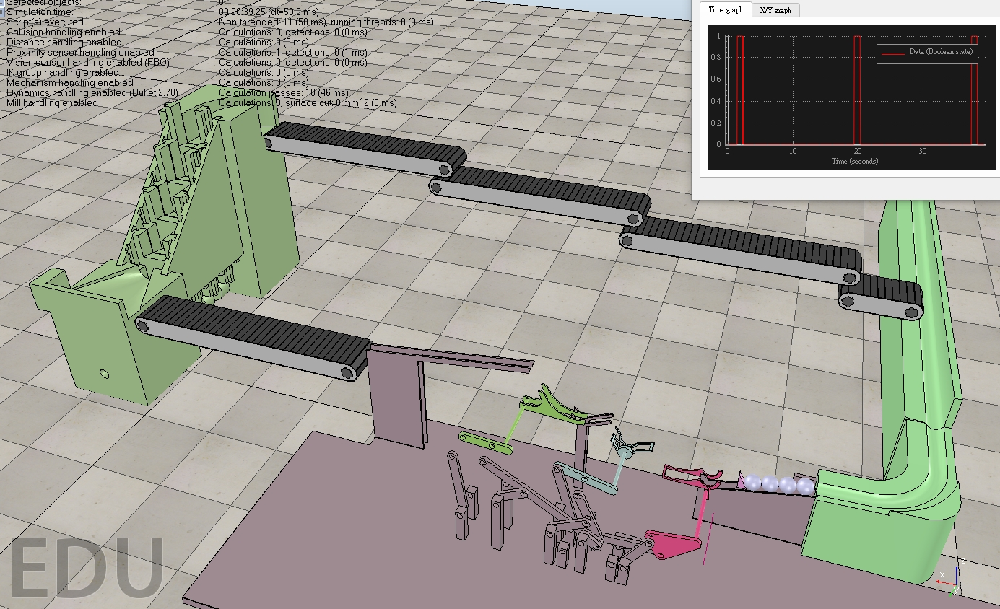
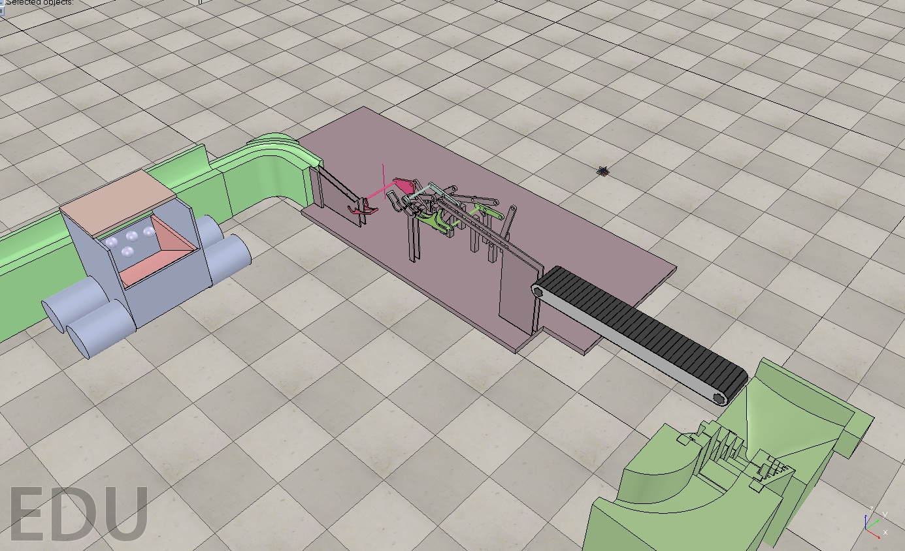
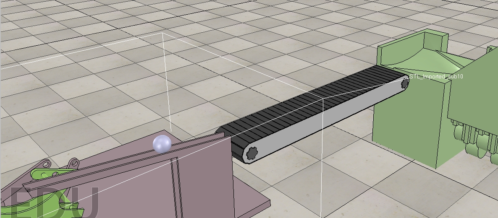
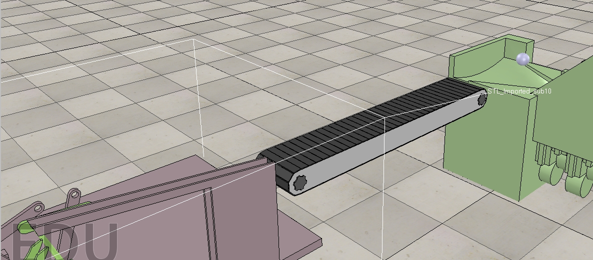
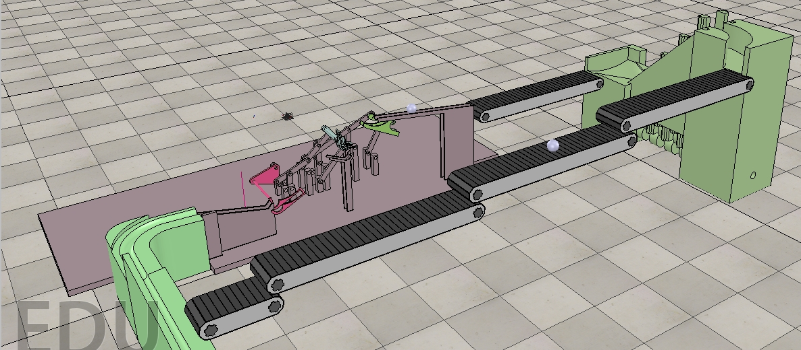
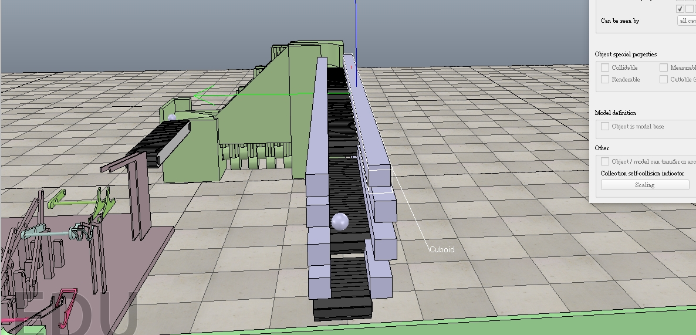
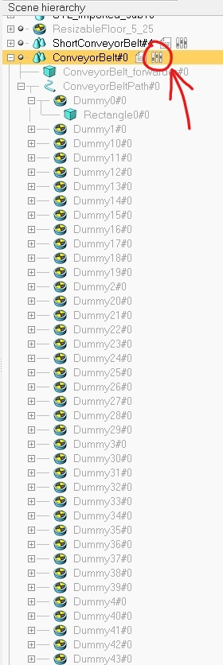
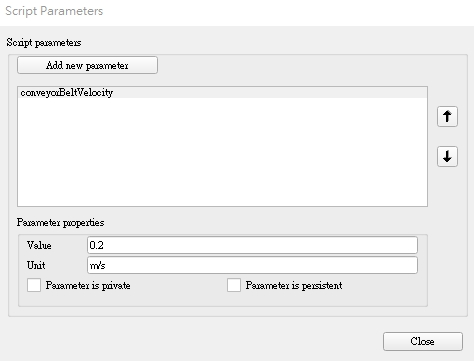
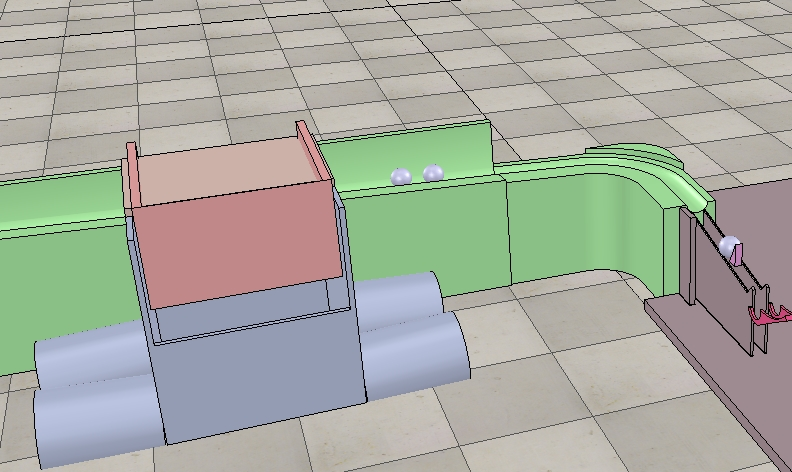
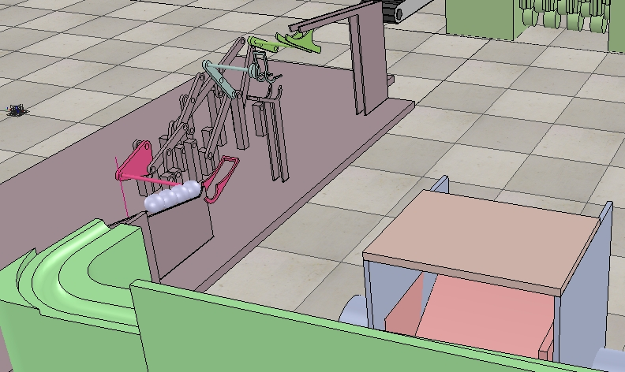

# Mechanism of ball system

期末總成果製作出鋼球循環的系統，能將球來回運行。

# 前言

從開學到現在，我們從接續上學期的凸輪式提球機構到這學期的二段/三段式提球機構，從想法概念利用上課所學的知識模擬出來，從期中到期末這段時間整合上下學期所完成的作業並製作成一套循環系統，而我們最終的成果是將凸輪式提球機構與二段式提球機構設置在兩端，利用輸送帶或是運球車將球來回運送至兩機構。

* #### 輸送帶運球

#### 

##### [.ttt](https://github.com/s40523145/cd2018/blob/gh-pages/%E6%9C%9F%E6%9C%AB%E6%88%90%E6%9E%9C/final%20auto%20ball%20links.ttt)
##### [video](https://www.youtube.com/watch?v=UuaqAfhw1bM&t=6s)

* #### 運球車運球

#### 
##### [.ttt](https://github.com/s40523145/cd2018/blob/gh-pages/%E6%9C%9F%E6%9C%AB%E6%88%90%E6%9E%9C/final%20auto%20ball%20links%202.0.ttt)
##### [video1](https://www.youtube.com/watch?v=uuyVwx3CdPo)
##### [video2](https://www.youtube.com/watch?v=uuyVwx3CdPo)

## \(一\)輸送帶運球

利用V-rep內部輸送帶範例來進行運球的目的。這裡分成兩個輸送帶部分，第一部分是從三段式送往凸輪式，第二部分是凸輪式送往三段式。

#### 第一部分:

由於三段式提球機構尾部是有斜度的軌道所以基本上輸送帶不需要太快，球會迅速通過至凸輪式提球機構，在安裝擋板攔截鋼球。

#### 第二部分:

主要是調整速度不要太快讓球飛走，再來就是在兩側加裝擋板

#### 輸送帶設定:

* 點選程式旁的調控圖形

* [ ] 

* 跳出視窗即可設定速度

* [ ] 

## \(二\)運球車運球

利用範例程式小車子的架構當作範本，結合在自己運球車上，詳細內容再Transport vehicle一篇說明，目前小車子的參數還並未調整好以及還有問題並未解決所以運球車現在無法順利進行搬運，只有將車上的球放置到機構上的功能。而車子下球時三段式機構擋球部分會同時啟動。

## \(四\)檔案連結

1. ##### 輸送帶運球
2. ##### [.ttt](https://github.com/s40523145/cd2018/blob/gh-pages/%E6%9C%9F%E6%9C%AB%E6%88%90%E6%9E%9C/final%20auto%20ball%20links.ttt)
3. ##### [video](https://www.youtube.com/watch?v=UuaqAfhw1bM&t=6s)

### 2.運球車運球

* ##### [.ttt](https://github.com/s40523145/cd2018/blob/gh-pages/%E6%9C%9F%E6%9C%AB%E6%88%90%E6%9E%9C/final%20auto%20ball%20links%202.0.ttt)
* ##### [video1](https://www.youtube.com/watch?v=uuyVwx3CdPo)
* ##### [video2](https://www.youtube.com/watch?v=uuyVwx3CdPo)

