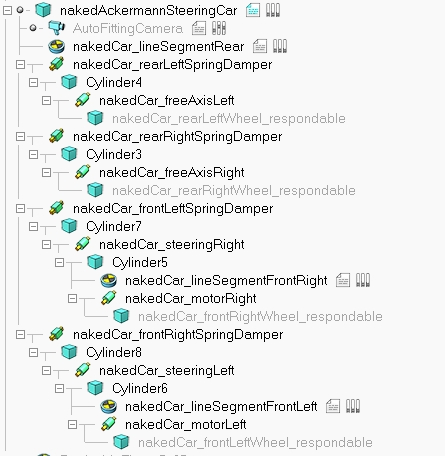
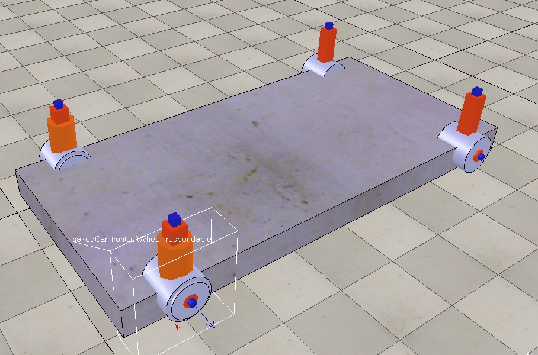
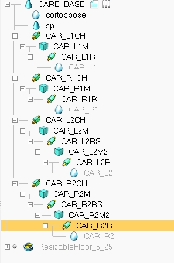
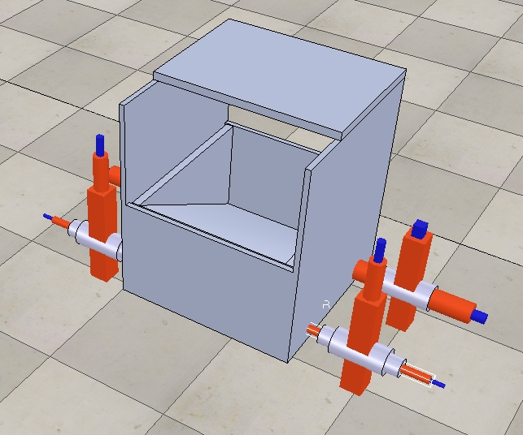
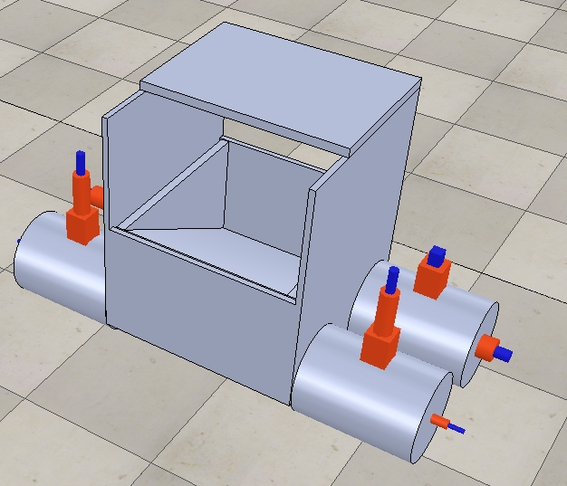
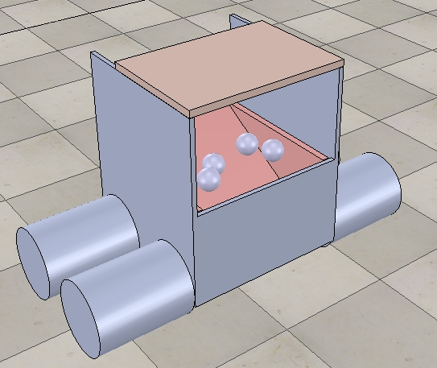
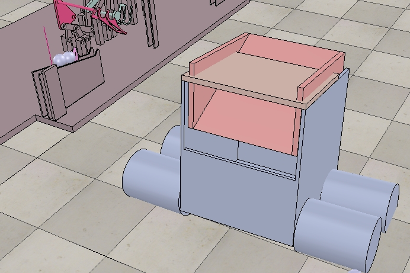

# Transport vehicle 運球車

### 利用範例小車子的結構加上上學期彈珠台，車子只需前進後退不需要左右轉，所以將上下鍵作為控制下球的按鍵，車子設計成內部中空然後有一個可控制的三角形的滑塊，當車子已到達目的地時按上鍵就使滑塊往上讓球由斜面滑出，車子天花板是無遮蔽物的因為球會由此處掉入至車內。

## 相關檔案

* ## [.ttt](https://github.com/s40523145/cd2018/blob/gh-pages/%E6%9C%9F%E6%9C%AB%E6%88%90%E6%9E%9C/Transport%20vehicle.ttt)
* ## [.stl](https://github.com/s40523145/cd2018/blob/gh-pages/%E6%9C%9F%E6%9C%AB%E6%88%90%E6%9E%9C/Transport%20vehicle%20%281%29.stl)
* ## [onshape](https://cad.onshape.com/documents/11f3cea34e6bdae2284581dd/w/4396dac5599cf68dae98f831/e/aaf1d22897c00d116ba719c9)
* ## [video](https://www.youtube.com/watch?v=1pNd9sfPcZM)

## 範例車子組成架構

## 運球車子組成架構

## 問題

由於小車子的架構都是承襲範例小車子，所以範例的設定參數與運球車的參數必定不同，所以在模擬時會無法達到預期的動作，只能慢慢嘗試不同的參數使車子跑起來更平順，或是在車子兩側設置擋板約束車子的行進方向。

