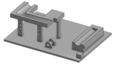
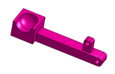
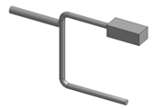
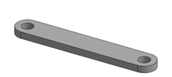
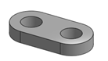
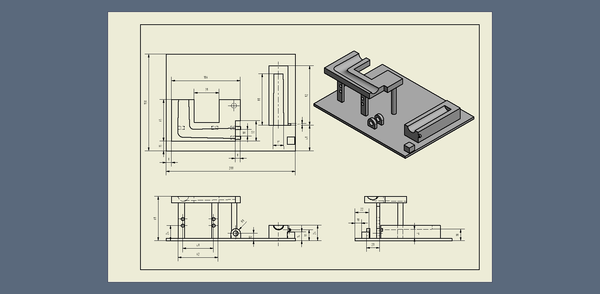
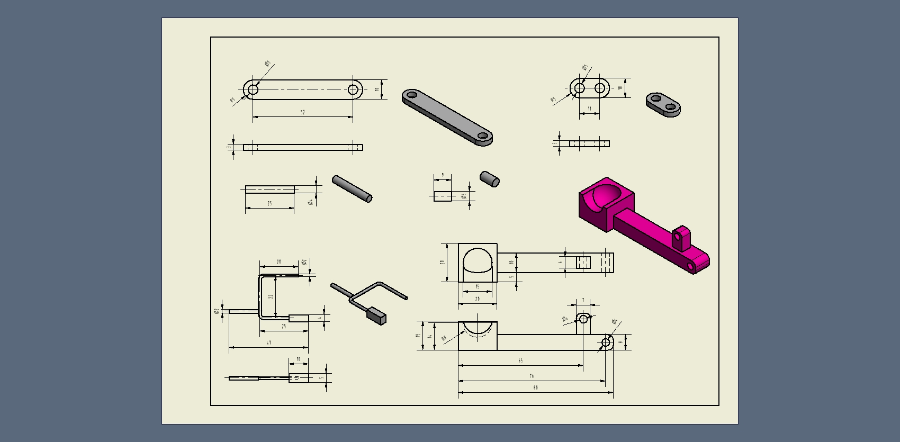

# 鋼球循環運動機構報告

本課程乃延續 2017 Fall電腦輔助設計實習課程內容, 並加入同步與非同步協同機制, 在多元協同模式下完成機械、電子與資訊科技相關內容的產品開發, 電腦輔助設計實習課程以鋼球循環運動系統之開發為主，而協同產品設計實習課程則在鋼球運動系統間再納入鋼球搬運行走機構.

## 機構選擇:

本學期將延續上學期所製作的鋼球循環系統，並納入這學期新加入的鋼球搬運行走機構來完成這學期的作品，因這學期重新分配組員，於是將選擇要使用於本學期的抬求機構，本組成員都來自不同組別於是有了多元的抬球機構選擇，我們將各自的抬球機構報告整理如下分別為:  
機構\(一\):利用四連趕當作抬球往復機構  
機構\(二\):利用凸輪旋轉帶動軌道進行抬球  
機構\(三\):利用垂直軌道左右往復導引讓鋼球沿著頃協軌道往上爬升  
目前經過多方考慮後決定選擇機構\(一\)為本次鋼球循環運動機構主結構，主要原因為機構\(一\)簡單明瞭的設計非常符合本學期抬球機構的宗旨，機構\(二\)較為複雜零件部分較為繁瑣將增加往後程式編寫難易度以及零件繪製的困難，機構\(三\)目前還無法順利完成抬球目的於是不將採用

機構\(一\)組立檔網址:[機構位置](https://github.com/s40523136/cd2018/tree/master/mechanism/first%20generation)

機構\(一\)細部零件材料表

| 主機構零件表 |  |
| :---: | :---: |
| 底板 |  |
| 抬球臂 |  |
| 槓桿 |  |
| 連桿一 |  |
| 連桿二 |  |

機構\(一\)各零件工程圖:

### 面臨問題與考量

由於機構\(一\)面臨出現了很多一開始沒預想到的問題於是我們決定重新設計機構\(一\)

基於以下是我們發現的問題點:

1.機構本體採一體設計3D列印製造困難，於是原始設計底板用木頭導致裝配困難

2.軌道配置不佳導致鋼球運行不順暢

3.擋球機構部分目前無法達到預期效果

## 抬球機構介紹

我們利用機構\(一\)的概念從新製作了新抬球機構克服了先前機構所面臨的問題，我們一樣採用原設計的四連趕機構，但我們軌道部分採用組裝式，在底板上預留定位孔降低裝配上的人為誤差，軌道部分加大了傾斜角度以及讓軌道尺寸加入公差，捨棄原本的擋球機構並以計算鋼球運行週期，調配伺服馬達旋轉速率來達到減少電力以及磨耗損失，相較上一代的設計大幅減少製作上的困難，並且排除了很多模擬上出現的干涉問題以下是新版抬球機構的詳細介紹:

### 機構影片

<iframe width="560" height="315" src="https://www.youtube.com/embed/KgNo0L2eB7U" frameborder="0" allow="autoplay; encrypted-media" allowfullscreen></iframe>

