# 機構\(二\)

## 參考機構\(二\) {#cd9}

### 摘要

本研究的重點在於如何通過繪圖軟體設計出鋼球運動機構 首先我們從網路上尋找到了適合的參考機構 \(marble machine etagen\)，通過小組討論決定後, 組員利用 Solvespace 畫出機構運動的方式計算出連桿的尺寸比例以及每一個階梯小球提升的高度，成功劃出可以讓鋼球上升的機構後我們利用Onshape畫出機構的實體以及每個組員的軌道，最後用V-rep模擬出鋼球運動系統。我們的機構叫做階梯式抬球機構利用馬達作動傳動帶動連桿再透過桿件之間 的干涉使得我們的升降機構上下交互將小球從低處運至高處。

## 壹、前言

#### 一、研究背景與動機

撰寫這份報告的目的在於使用簡報的方式讓別人能夠了解我們這組是如何設計 出機構的以及如何使用本學期所學的工具成功模擬出小鋼球在機構和軌道中的運動狀況在簡報中會有我們這組的製作過程，會介紹我們是從哪裡找尋設計機構的參考和設計過程中所遇到的問題以及解決辦法和最後的結論。

#### 二、報告架構

本報告將按照下列架構來論述；第一章前言；第二章研究目的；第三章說明設計所有有使用到的軟硬體介紹如伺服馬達、3D列印等…各種設備設計運球機構所牽涉到的軟體亦將在此一併介紹；第四章為研究過程及方法，分別對台球機構的製作流程以圖表搭配文字來達到更清楚的呈現；第五章為問題與討論，將過程中所遇到的問題與解決方法，依依呈現在報告中，讓大家能看完報告後，不僅僅能對此專題有更深的了解，也能在家試作時能參考我們的報告，進行問題改善；第六章為結論，我們將製作專題過程中所學的一切詳細報告，也介紹了作品未來的發展性。

#### 貳、研究目的

希望大家閱讀此報告後，對鋼球運動機構的設計與組裝產生興趣，且有更進一步的認知，也可以自行獨立設計與完成心目中理想的鋼球運動機構。也希望藉由本報告，可以把我們所遇過的一些問題及解決方法提供給大家，大家在閱讀後能快速的解決問題及找到正確的解決方法。

本專題研究目的是作為鋼球運動機構應用，實務上可以延伸應用作為進階的產線自動化工具機與各式需使用電器裝置等設備有效的使用。  
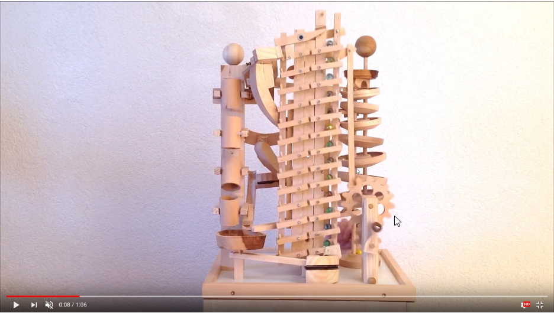

### 參 、研究設備及器材

#### 一、    軟體

以下是本鋼球機構所使用到的軟體及其詳細的介紹。

**\(一\)    SolveSpace**

此程式是目前我們進行機構模擬前期的測試系統，這系統相較其他大型的繪圖軟體來說更佳的容易攜帶，非常適合我們設計機構前期的桿件模擬，會使用此軟體也是因為老師的推薦，過程中我們利用此軟體，將我們的構想轉為機構圖，在經過一次次嘗試確認無誤後，最後才依依將零件放置在機構圖  

**\(二\)    Onshape**

此程式目前製圖設計業中逐漸被重視，可以利用此程式來進行零件繪製、模擬組合、動畫製作、立體圖展示等…多方面的用途，會使用此軟體，也是因為此軟體為老師推薦教學的軟體，這程式主打能全雲端繪圖只要有網路就能繪圖，因此在製作專題的過程中，也能藉由上課所學，套用至機構製作當中，過程中我們利用此軟體，將我們的構想轉為立體圖，在經過一次次嘗試組裝確認無誤後，最後才依依將零件放置成零件圖，再轉成STL檔。  
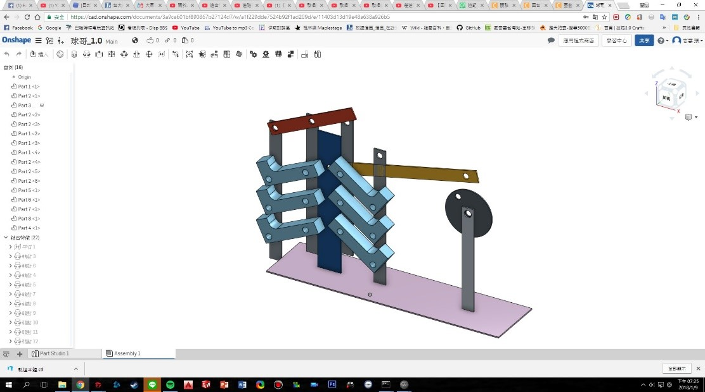

**\(三\)V-rep**

此程式我們主要是用來進行我們所設計的機構實際的運行情況，這程式我們比較陌生所以花了比較多時間來摸索，但這程式很好用能進行鋼球在我們鋼球運動系統上運行的模擬  

**二、3D列印**

抬球機構以及運球軌道，都是由3D列印機製作而成，製作出得成品比起木板，較為美觀且具有未來科技感，能將Onshape立體圖轉檔成STL檔案，載入印表機當中，用ABS線一層層堆疊列成實體。

**三、伺服馬達介紹**

本專題製作報告採用的伺服機為MG996如圖3  
伺服機的動作原理如 圖5 ，輸入PWM控制訊號給控制電路板，控制電路板會依照輸入的PWM訊號所對應之角度與目前馬達角度做比較並驅動DC 馬達政轉或反轉，馬達轉動帶動變速齒輪組轉動，控制電路板的可變電阻旋鈕嵌入變速齒輪下方，變速齒輪轉動使可變電阻駔值大小改變，控制電路板利用可變電阻的分壓得知道目前轉動角度，繼續驅動馬達直到轉動到設定角度才停止，並持續做角度控制。更高階的伺服馬達可直接將主軸角度資料傳出，回授方式不會採用可變電阻分壓方式，會使用更精準的量測方式做回授，例如光學旋轉編碼器。  
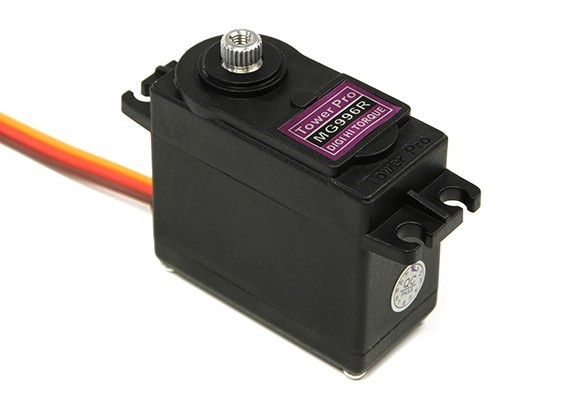  
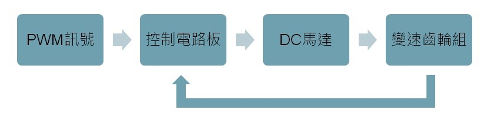

**四、伺服馬達使用程式語言【Ａｒｄｕｉｎｏ】**

Ａｒｄｕｉｎｏ是一種開放式的硬體與軟體，軟體的開發環境可在網路上免費下載，而網路上也有許多Arduino的作品程式可以參考，並依據自身之需求進行修改，且價格並不會太高。其特色如下：  
→ 入門簡單：程式操作並不困難，只需要電學基礎就可輕鬆操作。  
→ 彈性設計：可依自身需求修改、設計出自己所需的程式。  
→ 應用地方多：程式可以應用在馬達控制、遠端遙控等..許多地方。  
→ 購買管道多：許多電子材料行、網購、拍賣網都可購買的到。  
伺服馬達控制模擬  
為了在實體 Arduino Uno 控制板連線操作之前, 可以利用網際 Auduino 控制板與電子元件系統進行模擬, 我們在Autodesk Tinkercad進行模擬  
選擇 Arudino Uno 控制板與 Servo Motor, 然後接上電源與地線, 並將控制訊號接到 Auduino Uno 控制板的 PWM pin 9, 利用 Code Editor 納入下列 Arduino 程式, 再利用 upload and run 將程式編譯後上傳到虛擬的 Arduino Uno 控制板上執行, 就可以模擬 Servo Motor 持續左右各旋轉 180 度. 操畫面如下圖所示:  
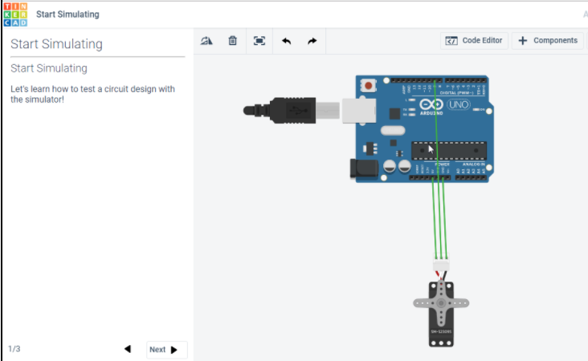  
完成上述以 TinkerCAD 模擬伺服馬達的接線與程式執行之後, 接著操作實體 Arduino 控制板與 Servo Motor 的控制, 首先利用電腦驅動 Arduino 控制板, 然後再利用板子上的脈衝寬度調變 \(PWM, Pulse Width Modulation\) 訊號控制伺服馬達, 之後再利用傳動機構與資訊控制介面, 製作所需的機電資整合系統. 電子電機系統除了可以方便感測各種物理化學量外, 還能夠快速傳遞感測與命令訊號, 而機械系統則透過機構元件的組合, 扮演傳遞功率致動或抵抗外力撞擊與疲勞破壞的角色, 至於資訊系統則用來整合各種資訊, 用更友善的人機介面, 讓使用者更有效能地運用機電資系統產品.

## 肆、研究過程或方法

#### 一、製作流程圖

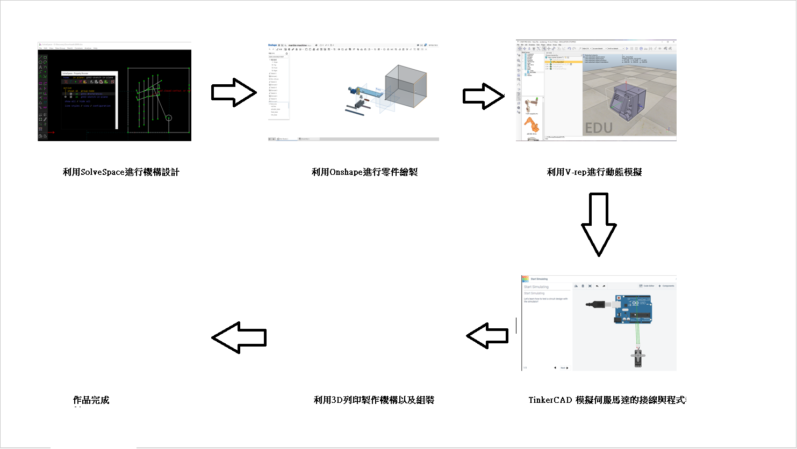  
整個製作流程先設計完整體架構後，再用Oshape畫出零件圖進行組裝確認無誤後，再將零件工作圖轉為STL檔，到 V-rep進行動態模擬，完成後再進行TinkerCAD 模擬伺服馬達的接線與程式，確定無誤後3D列印進行軌道製作，列印完後再進行組裝，最後將程式輸入，訊號線互相連好，就可進行鋼球循環運動了。

#### 二、    製作流程

**\(一\)抬球主機構設計**

首先我們先以SolveSpace進行了我們機構初步的桿件設計，確定桿件如我們預期情況作動後，我們利用Onshape進行了零件的繪製以及外觀的設計，並且確認組裝過程不會發生干涉，確認無誤後進行V-rep的運動模擬。  
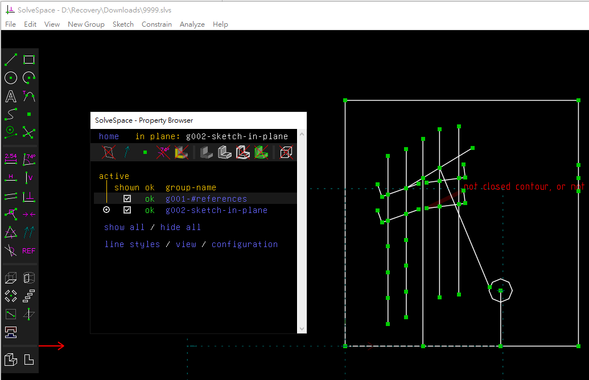  

小組在機構綫結構的模擬上出現了一個難題 就是我們的機構需要在左邊的桿件到達頂端的時候與 中間桿件上的一根柱子做干涉碰撞，要達到這個效果十分的困難。在solvespeace和onshape中都沒有 這個干涉碰撞的選項，導致我們的機構目前都達不到我們理想的效果，沒法實現我們機構的製作。  
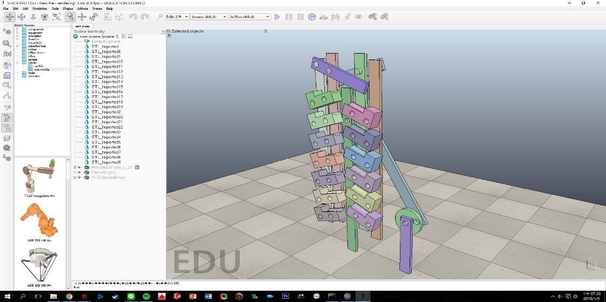

於是我們開始了第二代抬球機構的設計  
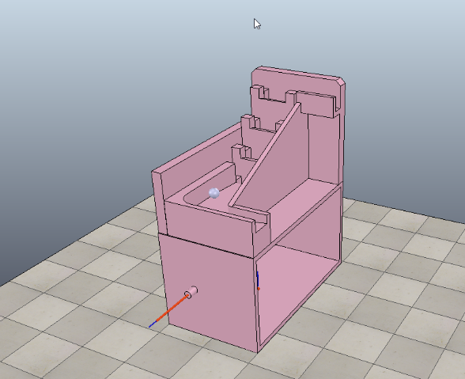

**\(二\)軌道設計**

這部分是各組員繪製自己的軌道圖，利用自己熟悉的繪圖軟體進行軌道的設計和模擬以下是各組員進行軌道模擬的模擬圖  
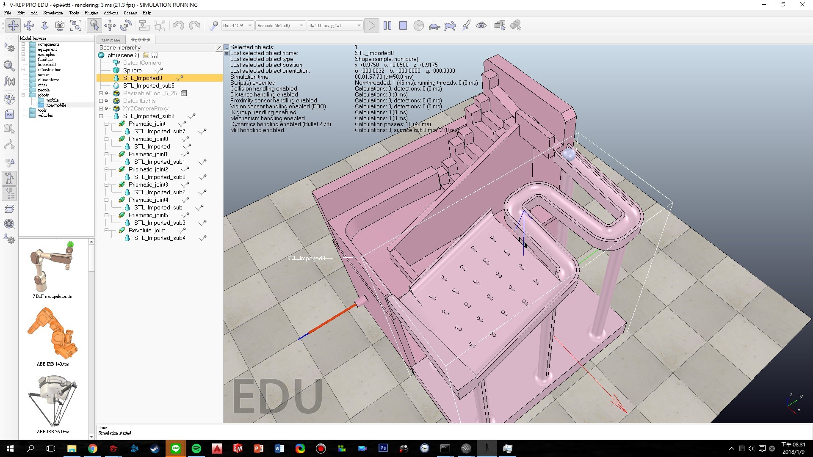  
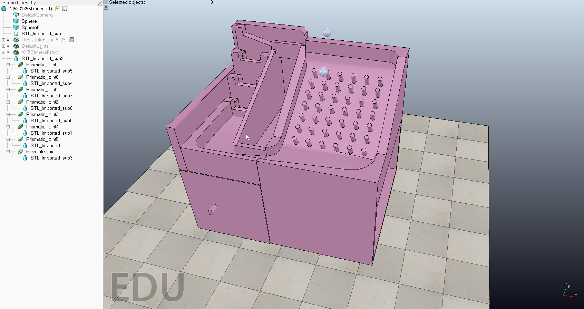  
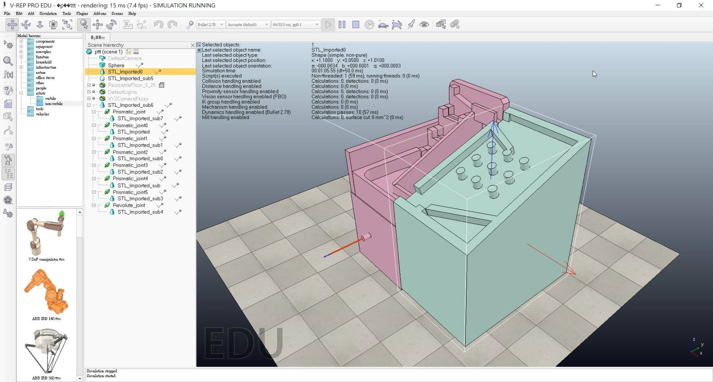  
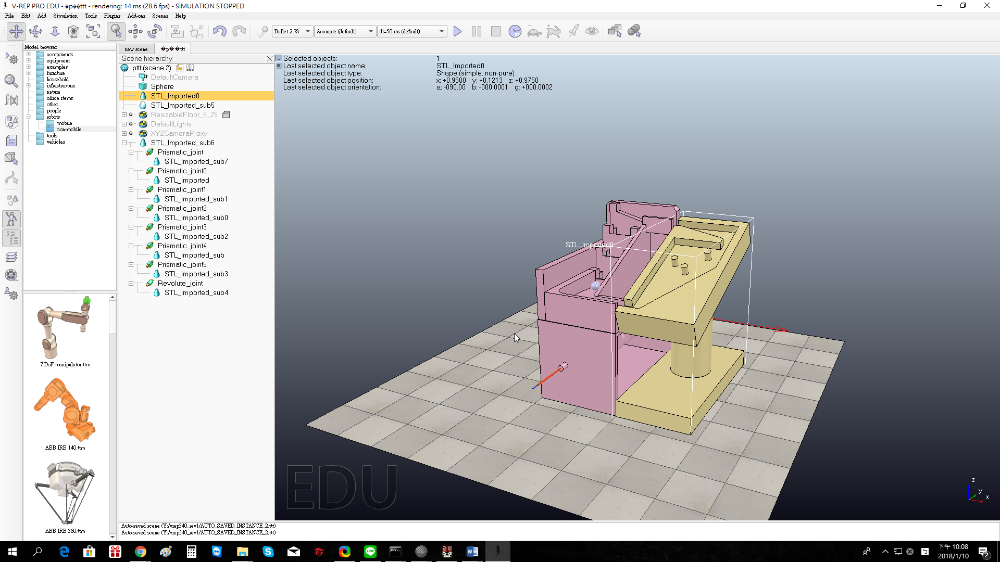  
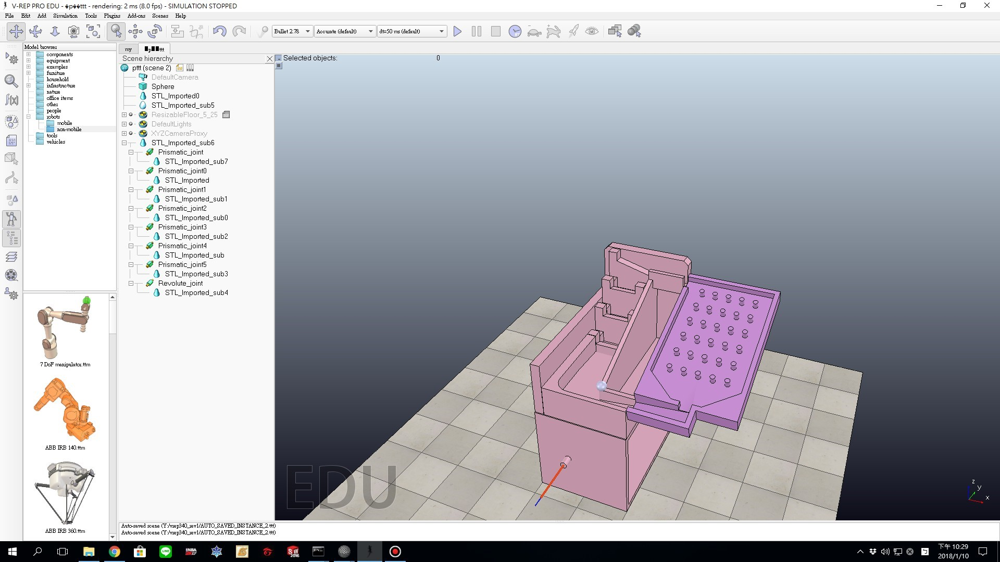

### 伍、問題以及討論

問題主要集中在進行 vrep 模擬的時候，因爲不是特別熟悉這個軟體，它模擬的是 物體實際運行的狀態。所以會有許多實際上的問題。  
1. 工差問題：小組機構在初次設計機構的時候默認所有的零件在組裝的時候都是 重合的所以在模擬的時候 vrep 系統在進行碰撞檢測的時候相鄰的零件便會不正常 的運作（在互相碰撞到處彈）。  
2. 摩擦問題：小組機構一共有 7 個階梯，小組在模擬的時候發現階梯的前 5 塊可 以正常的上下交互運動，當開啓第 6 7 塊階梯的 dynamic 后發現後面兩塊衹是停 留在一個位置，像是卡在後面一樣。  
3. 扭矩問題：在小組機構上模擬的時候，一開始我們衹放一個小球進行模擬的時 候小球可以很流暢的進行運作。可是當放入兩個小球之後，剛運作的時候沒有問 題，在兩個小球一起在第一級階梯上的時候第一級階梯卡住不動了。  
解決方法  
1. 工差問題解決辦法：經過詢問老師過後明白了這個問題。所以改動零件讓他們 之間有 0.2mm 的間隔。  
2. 摩擦問題解決辦法：我們就想可能是我們給的 0.2mm 的間距對於後面兩塊來説 可能有點小。所以我們把後面兩塊的間距單獨增加到 0.3mm。  
3. 扭矩問題解決辦法：我們觀察機構卡住情形。覺得可能是扭力不太夠。所以增 加扭力到 50N。這樣就可以將小球運送上去了。

### 陸、結論

在這次專題製作過程當中，我們更加熟悉了機械設計的流程，從先有構想到手繪草稿再到在軟體中從零件繪畫到組裝，一切確認無誤後，才開始進行加工，從中也了解到設計課程中所學到的數學的重要性，不管在桿件設計、鋼球運動上，數學都佔了很大的一塊，其中，也用到了之前課堂中所學習到的連桿機構，也讓上大學所學的知識與此作品做連結，真正達到了「學以致用」的概念。

從過程中了解熟悉許多軟體，例如: SolveSpace、Onshape、V-rep、TinkerCAD使用等….這些在未來職場上都能是一個很棒的實作經驗，讓我們在切入職場後能更加熟練的使用這些軟體，也能了解這些軟體能做出的效果，就能以這些作為經驗參考，在未來自己去判斷使用，在過程當中，我們也學會了產品協同的重要性，從中也發現了協同的優缺點，對此技術有了更深一層的認識，在未來協同也會運用到越來越多地方，這些實際操作的經驗在未來接觸到時，也不至於太陌生，甚至就能很快切入使用。

在這次專題中，讓我們有機會學習到了不同領域的專業知識，讓許多不同領域的東西與機械設計做連結，不但使我們的作品有了更多不同的可能性與變化性，也讓我們學習到了更多不一樣的專業知識，這些技術跟經驗相信在未來都能為自己帶來很大的幫助，也能隨著自己所學的越多，讓更多不同領域的知識與經驗做接軌，就能創造研發出更多不同的想法與創意，並將這些知識廣泛運用到各個地方。

