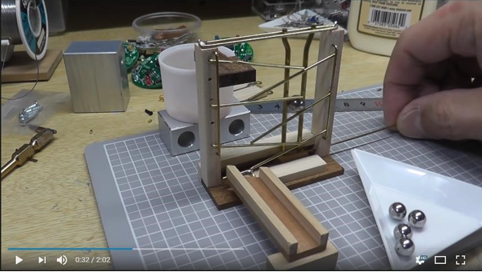
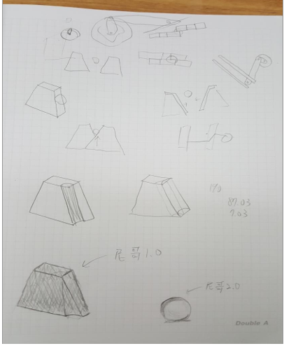
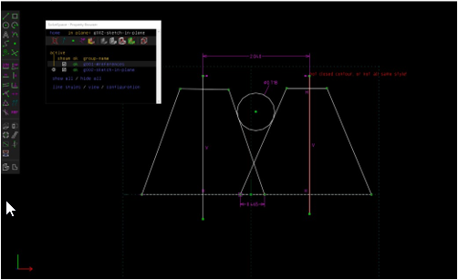
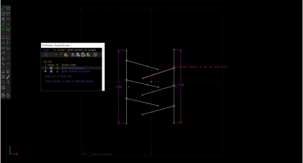
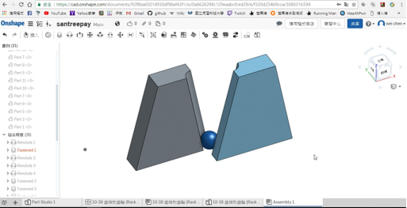
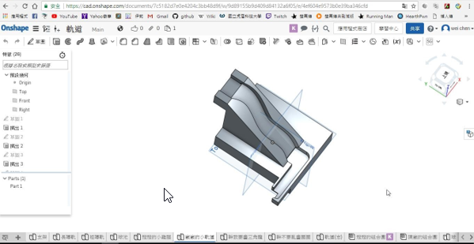
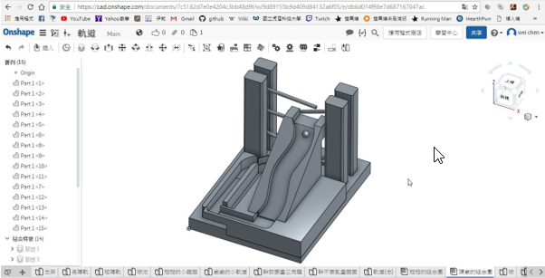

# 機構\(三\)

## 一、摘要

### 這次的主題是要我們設計出一台鋼球運動系統，目標為將一個鋼球經過設計後的軌道及抬球機構，形成一系列循環，另外還要求加入模組化設計，最終成品由3D列印呈現，將會充滿個人風格。一開始先從網路上參考可以使用的範例或是由組員討論想出一個機構，之後利用簡單的繪圖軟體—solvespace畫出連桿、連接點、抬球移動路徑、各式尺寸，再利用網路繪圖程式Onshape進行共享協同，以及我們常用的Solidworks、Inventor實際畫出各個機構與每個組員設計的軌道立體圖，最後在V-rep中載入抬球機構本體，將組員們的軌道一個一個接入進行模擬，在模擬中想必會遇見錯誤，小組組員將其解決便是最後目標。

## 二、前言

### 此作品是利用簡單的機構做出可運行的鋼球系統，我們會介紹如何利用機構原理做出內文中的抬球機構、簡單繪圖軟體繪出鋼球系統。 在網路平台上，只要搜尋「Marble machine」便能找到許多有關抬球機構的資訊，在這個表現機構學、設計學、生活科技學以及個人創意的作品中，我們將找出它淺在的創作意義，把看似簡單好玩的幾個方塊改造成具體表達的專業知識。

## 三、設計

### 我們這組參考以下圖片裡的機構來製作機構系統

### 利用手繪.slovespace.onshape.來繪製機構圖

### 最後繪製軌道, 組合機構

