# 機構\(一\)

## 摘要

報告動機：

製作小鋼球提球機構，組員製作各自的小鋼球運送軌道，

適用在小組的機構中，小鋼球提球機構必須能放置在郵局

BOX2【23\*18\*19\(cm\)】的箱子中。

報告重點：

小組中五位成員各自製作個人小鋼球運輸軌道，必須適

用在小組的鋼球提球機構，並且尺寸符合規範。

組員各自的影片介紹。

關鍵字：

提球機構、Onshape、V-rep

第一章 前言

經過小組成員的討論後，先決定做出共用的提球機構，

各成員再製作各自的運輸軌道，並且調整至每個軌道都可以

替換，並且功能正常，大小也符合規範。

使用 Github 建立小組的協同倉儲，進行多人分工，以達

到整合的目的，組員之間可以利用各自的時間，完成各自的

工作，並上傳到 Github 上，使組員之間能夠在任何地方看到

組員上傳後的負責項目。

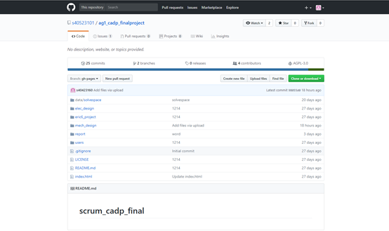

第二章 機構介紹

2.1機構設計

機構必須要能放入郵局BOX2的紙箱中【23\*18\*19\(cm\)】，鋼球大小直徑為9mm，並且參考老師提供的影片，組員之間互相討論，選擇一組機構當作參考，組員之間開始分工。

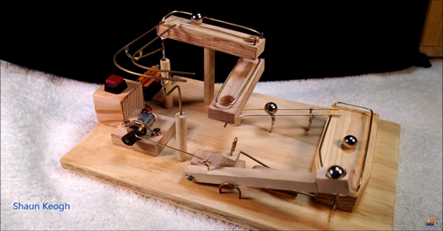

圖2-1 參考影片 提球

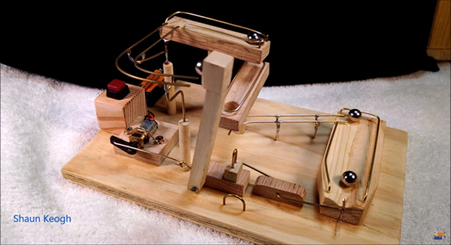

圖2-2 參考影片 放球

在solvespace中繪製四連桿機構，並且模擬轉動情形

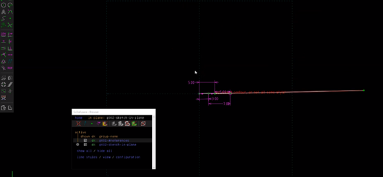

圖2-3 solvespace 模擬1

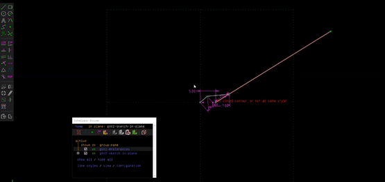

圖2-4 solvespace 模擬2

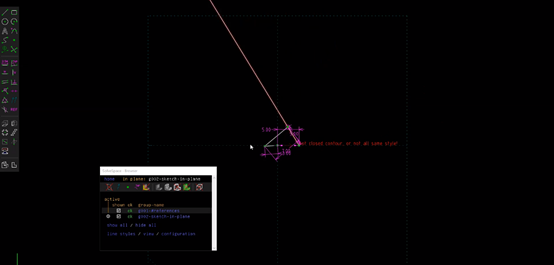

圖2-5 solvespace 模擬3

在擋球端的部份，我們採用槓桿原理的方式來製作，使其在不受任何外力作用下，重端會輕觸於底板，輕端則會懸浮於空中並且擋住出球口，但在抬球臂放下時將輕端往下壓，重端會往上抬，做到槓桿原理，使球可以自然滾出到抬球臂上的凹槽，完成抬球運動。

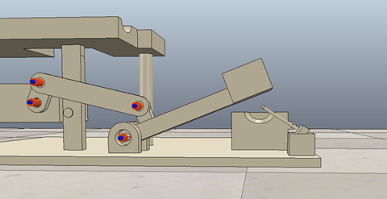

圖2-6 擋球槓桿模擬-1

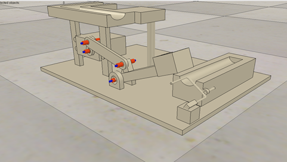

圖2-7 擋球槓桿模擬-2

2.2模擬遇到的困難

在V-rep中模擬，有時會遇到在斜面中，但是球卻往返方向滾動，或者球在原地，而不是往低處滾動，導致模擬出現問題，及抬球臂無法預期的將球送至上軌道，而是把球拍走或是在空中滑落，造成模擬時出現無法預期的結果。

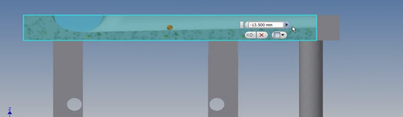

圖2-12 上軌道斜面

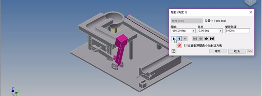

圖2-13 inventor 模擬馬達轉動1

圖2-14 inventor 模擬馬達轉動2

2.3 主機構零件圖

| 主機構零件表 |  |
| :---: | :---: |
| 底板 |  |
| 抬球臂 |  |
| 槓桿 |  |
| 連桿一 |  |
| 連桿二 |  |

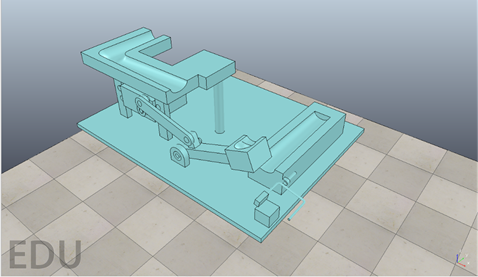

圖2-11組合完成圖

2.4 3D列印完實際組裝

因為學校3D列印機無法印出1mm左右的槓桿，所以在實際組裝中，我們使用鐵絲凹出擋球的槓桿，以及使用熱溶膠當作重端，底板則是用木板來代替，以及軌道的斜面則是用鐵絲來凹出的斜面來取替，在接合部份我們使用熱溶膠當作固定的方式，連接的部分則是用螺絲和螺帽墊上華司當作旋轉接頭。

實際做動影片：[https://www.youtube.com/watch?v=VuySdgoiAL8](https://www.youtube.com/watch?v=VuySdgoiAL8)

圖2-19 教授參與實際組裝與討論

| 圖2-20焊接軌道 | 2-21微調軌道位子 |
| :--- | :--- |
| 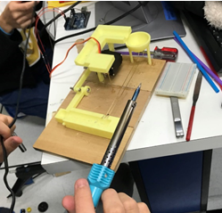 | 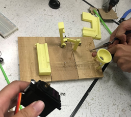 |
| 圖2-23修剪軌道毛邊處 | 圖2-24完成 |
| 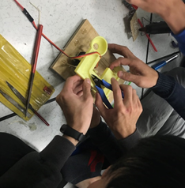 | 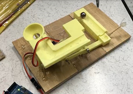 |

設計後的機-構大小為20\*15\*6.5\(CM\)，合乎郵局BOX2的大小規範。

並且使用3D印表機將零件印出來，但是礙於斜面及底板，不適用於3D印表機，最後以鐵絲及木板取代。

抬球機構有實際組裝完成，並且利用Arudino Uno控制板完成鋼球循換動作。

組員有設計出屬於自己的軌道，及完成自己的影片。

## **測量出本組完成一個循環為6秒**

討論與建議

問題一：當初設計時有尺寸標錯，倒置3D列印後，孔的尺寸大於對於相對應的孔的尺寸。

解決一：3D列印後，組裝時軸用螺絲代替，所以只需要墊上墊片就可以解決問題。

問題二：完成設計後，老師提醒，擔心抬球臂把球從低處送往高處時，球會從凹槽直接掉出。

解決二：把凹槽加深，使球在80度時，一樣可以把球穩穩地停在凹槽中。

問題三：實際列印後組裝位置定位問題。

解決三：因為不是使用一體成形的方式做3D列印，所以抬球機構位置組裝後都必須一一做調整。

問題四：彈珠在3D列印後的軌道滾動不順暢。

解決四：因為3D列印半圓形軌道精度不高，所以必須使用銼刀將軌道銼至平整圓滑。

參考

[https://www.youtube.com/watch?v=JcjSIvs-lEk](https://www.youtube.com/watch?v=JcjSIvs-lEk)

[https://mde1a1.kmol.info/2017fall/wiki?name=cadpw10-w12](https://mde1a1.kmol.info/2017fall/wiki?name=cadpw10-w12)

[https://vimeo.com/247266935](https://vimeo.com/247266935)

[https://vimeo.com/249998334](https://vimeo.com/249998334)

[https://vimeo.com/249998383](https://vimeo.com/249998383)

[https://mde1a1.kmol.info/2017fall/wiki?name=cadpw13-w15](https://mde1a1.kmol.info/2017fall/wiki?name=cadpw13-w15)

