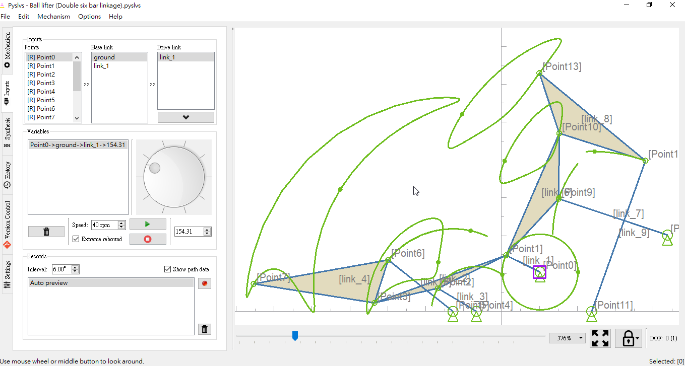
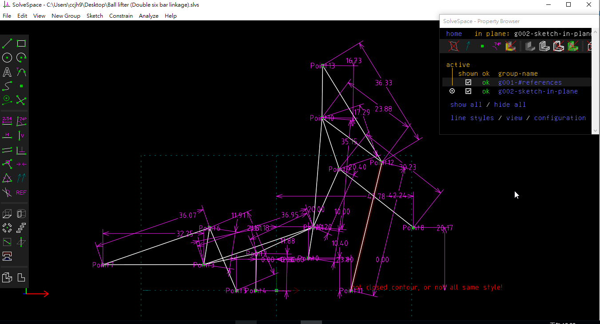
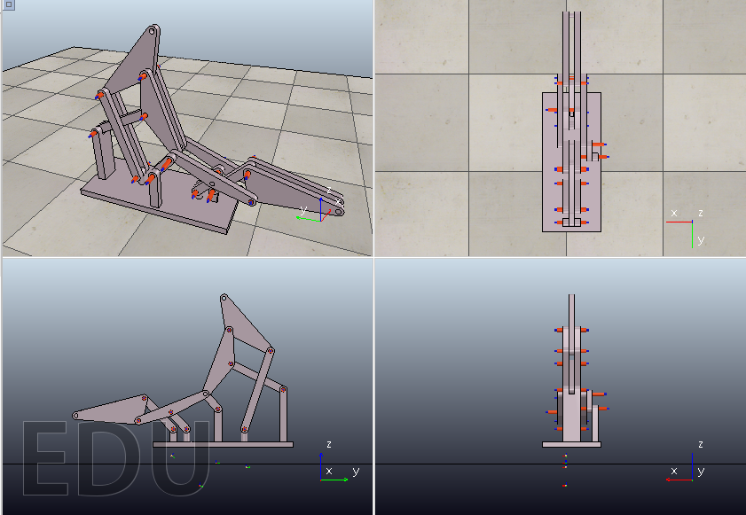

# 10W

## 進度回報:這週進行兩段式六連桿提球機構設計與模擬

**我們利用了老師上課推薦的程式Pyslvs，進行機構桿件的分析與運算，再將桿件模擬圖輸出成2D的Solvespace草圖方便進行接下來3D作圖需要的尺寸，完成3D建模後將兩段式六連桿提球機構放入V-rep中進行運動分析模擬，查看運行過程中是否出現干涉配合，目前還在設計如何將兩段式六連桿提球機構加入目前我們這組現有的鋼球循環運動機構中，讓球成功送到目前既有的軌道模組循環運行至少兩次的模擬影片**

### 利用pyslvs進行機構桿件的分析與運算:

### 將pyslvs模擬完之結果輸出成2D solvespace圖檔:

### 將組立完成之3D模組放入V-rep進行動態模擬:

### **兩段式六連桿提球機構V-rep模擬影片:**

<iframe src=\\\"https://www.youtube.com/embed/qbxidGlr-u4?rel=0&amp;showinfo=0\\\" style=\\\"border: 0; top: 0; left: 0; width: 100%; height: 100%; position: absolute;\\\" allowfullscreen scrolling=\\\"no\\\"></iframe>

### **相關檔案連結:**

### [**兩段式六連桿提球機構.stl**](https://github.com/s40523136/cd2018/blob/master/mechanism/Two%20stage%20six%20link%20lifting%20mechanism/body.stl)

### [**兩段式六連桿提球機構.ttt**](https://github.com/s40523136/cd2018/blob/master/mechanism/Two%20stage%20six%20link%20lifting%20mechanism/Ball%20lifter.ttt)

### [**兩段式六連桿提球機構.slvs**](https://github.com/s40523136/cd2018/blob/master/mechanism/Two%20stage%20six%20link%20lifting%20mechanism/Ball%20lifter.slvs)

