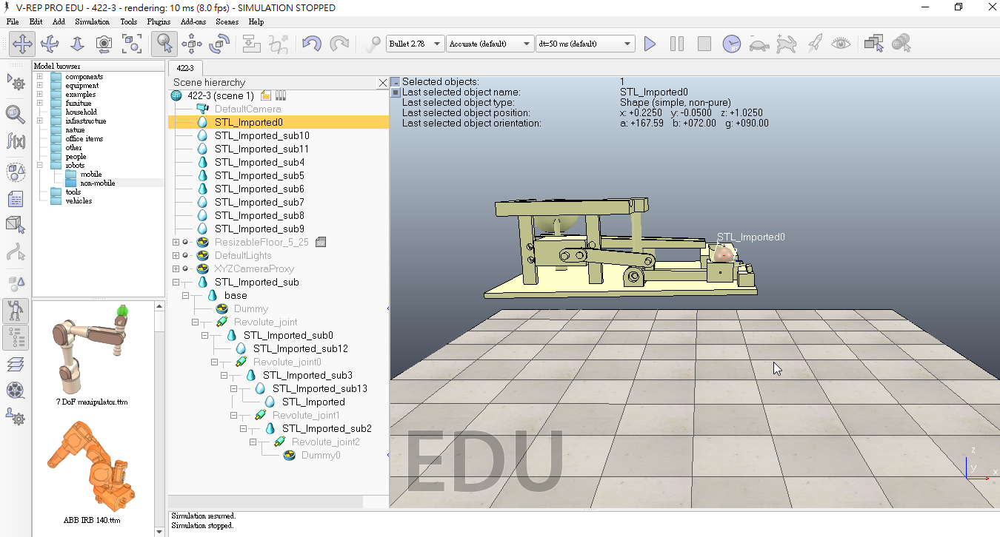
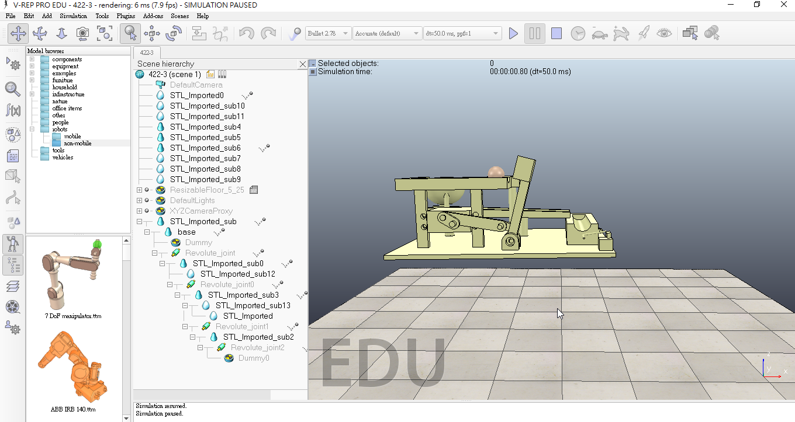
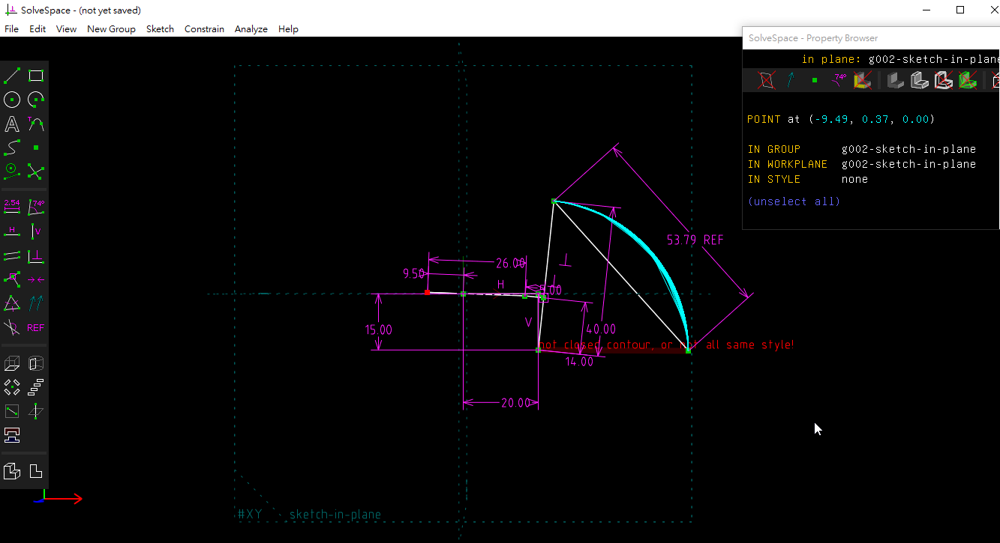

# 期中報告

## V-rep模擬分析

### 1.V-rep模擬最低點的時候

### 2.V-rep模擬最高點的時候:

### 3.slovespave模擬位移高度:

### 4.球的速率分析\(lim 球-&gt;勺子\):

## 問題:

### 假設球的質量0.001kg 地心引力常數9.8 高度0.15m 初始速率5m/s 求落下後速率

## 解答:

### 運用mgh+1/2mv^2=1/2mv^2，可得0.001x9.8x0.15+1/2x0.001x5^2=1/2x0.001xV^2

### 5.模擬此機構循環一次約為6秒，所以我們希望抬球臂可以在球循環一次後回到原點接到球。

### ttt 檔案連結 : [V-rep 機構模擬檔](https://github.com/s40523136/cd2018/blob/master/vrep/666.ttt)

### 6.鋼球運動系統所需工具及材料表:

| 名稱 | 數量 | 材料 | 備註 |
| :--- | :--- | :--- | :--- |
| 底板 | 1 | ABS |  |
| 抬球臂 | 1 | ABS |  |
| 槓桿 | 1 | ABS |  |
| 連桿1 | 1 | ABS |  |
| 連桿2 | 1 | ABS |  |
| 鋼球 | 1 |  | 15mm |
| MG996R 伺服馬達 | 1 |  |  |
| Arduino UNO 控制板 | 1 |  |  |
| 鐵絲 | 1 |  |  |
| 電線 | 6 |  |  |
| 十字頭螺栓 | 7 |  | M4X6 |
| 六角螺帽 | 7 |  | M4 |
| 木板 | 3 |  | 200mmX50mm |

### 7.零件工程圖:

  

### 8.抬球機構相關零件檔案:[零件檔案](https://github.com/s40523101/cd2018/blob/master/電腦輔助設計/)　（２０１５ｉｎｖｅｒｔｏｒ）

### 9.如何進行協同設計:

### 我們採取分工合作的方式來進行協同產品，我們將鋼球運動系統的零件及分析圖放入github倉儲中進行協同管理，並以gitbook來編寫整理每周的進度，並回報目前所遇到的問題加以討論解決方案。

### 10.期中自評分數:

## 40523101: 72

## 40523122: 80

## 40523132: 80

## 40523136: 80

