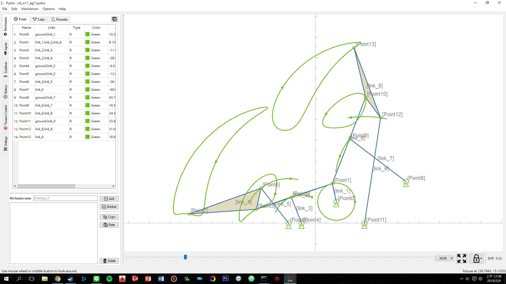
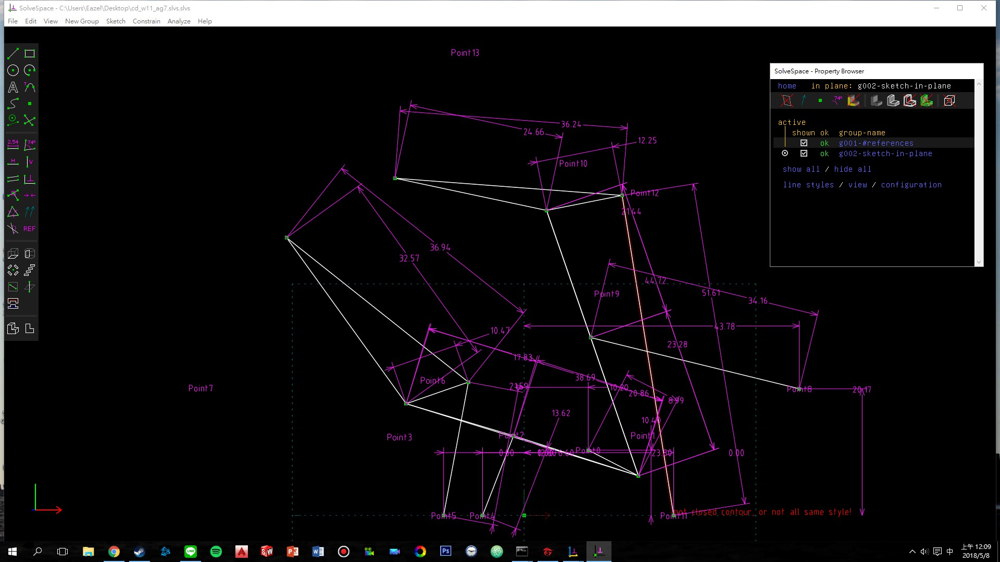
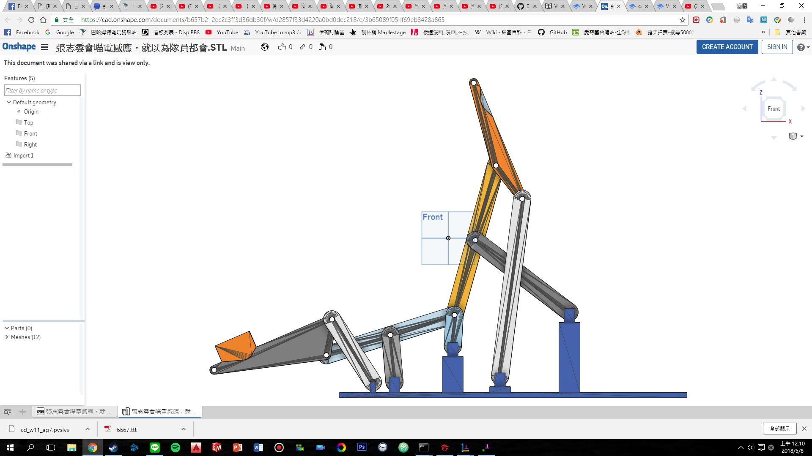
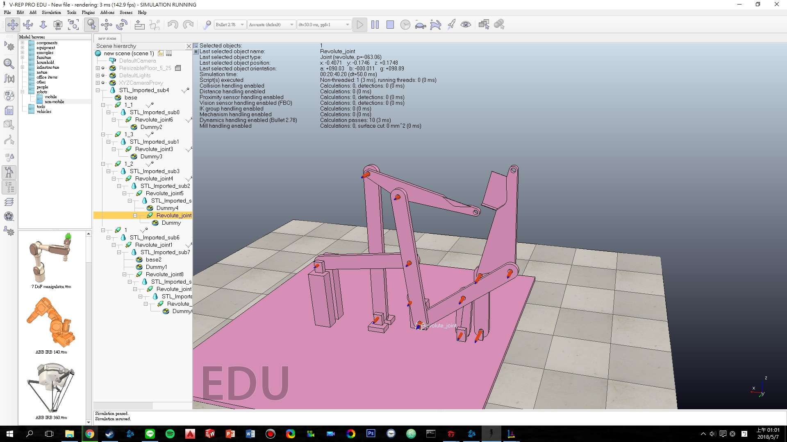

# Ball lifter - Double six bar linkage 設計與模擬

* 下載 Pyslvs:
[http://wcmg3.kmol.info/downloads/pyslvs-18.4.0.mscv1900-amd64\_cdw10.7z](http://wcmg3.kmol.info/downloads/pyslvs-18.4.0.mscv1900-amd64_cdw10.7z)
* 請各組在 W11 上課之前完成 Pyslvs 套件中之 ball lifter 機構的 Solvespace 零件組立與 V-rep 提球模擬
* 各組請在各組倉儲中繳交 cd\_w11\_ag1.slvs 零件組立檔、cd\_w11\_ag1.pyslvs 機構模擬檔與 cd\_w11\_ag1.ttt 提球模擬檔
* 各組在 W11 上課前, 必須拍攝利用此一雙階段提球機構, 將球送到各組目前既有的軌道模組循環運行至少兩次的模擬影片

以甲班第一組為例, W11 上課前必須繳交 cd\_w11\_ag1.slvs, cd\_w11\_ag1.pyslvs, cd\_w11\_ag1.ttt 與 Youtube 上的模擬影片.

---

#### [連桿提球機構模擬影片](https://www.youtube.com/watch?v=Jr8FawGxITc)

在這次的課程進度中，老師介紹了V-rep中[Dummy](http://www.coppeliarobotics.com/helpFiles/en/dummyPropertiesDialog.htm)的組立功能，而Dummy是能將物件下設置一個虛擬屬性，而再依照所需功能設置為連結參考或是路徑參考，為了讓我們再更加熟悉Dummy的使用，這周的進度是將一組雙六連桿從設計、尺寸、組立以及模擬完成，在這方面前面都過程基本上都沒有問題，但在模擬上面的機構相互關係就頗為苦手，但和同學討論後再做許多測試，總算是完成本周的進度練習了。

* ###### 先用老師推薦的[Pyslvs](https://github.com/KmolYuan/python-solvespace)程式進行雙六連桿的運動路徑分析，優化路徑並使運球動作順暢。
* ###### 
* #### [Pyslvs 機構設計模擬檔](https://github.com/s40523125/cd2018/blob/master/Folder/Ball%20lifter%20\(Double%20six%20bar%20linkage\)/cd\_w11\_ag7.pyslvs)
* ###### 確定好路徑後再進行尺寸的微調和設計桿件的配置。
* ###### 
* #### [slvs 機構設計模擬檔](https://github.com/s40523125/cd2018/blob/master/Folder/Ball%20lifter%20(Double%20six%20bar%20linkage)/cd_w11_ag7.slvs.slvs)
* ###### 再依照所確定的尺寸及配置繪製出立體圖並且裝配，完成後轉檔為STL檔。
* ###### 
* #### [連桿提球機構零件組立檔](https://cad.onshape.com/documents/b657b212ec2c3ff3d36db30f/w/d2857f33d4220a0bd0dec218/e/3b65089f051f69eb8428a865)
* ###### 將零件檔輸入至V-rep中連結機構間的相互關係，其中最為困難的就是建立Dummy的連結關係。
* 
* #### [V-rep提球動作模擬檔](https://github.com/s40523125/cd2018/blob/master/Folder/Ball%20lifter%20\(Double%20six%20bar%20linkage\)/cd\_w11\_ag7.ttt)
