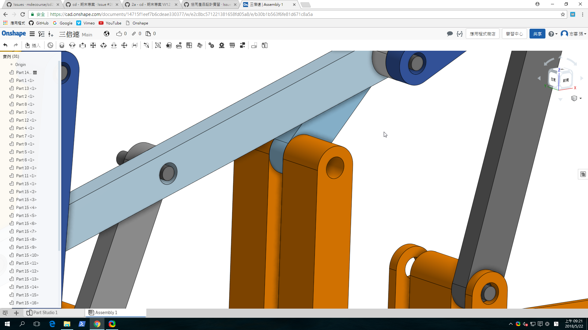
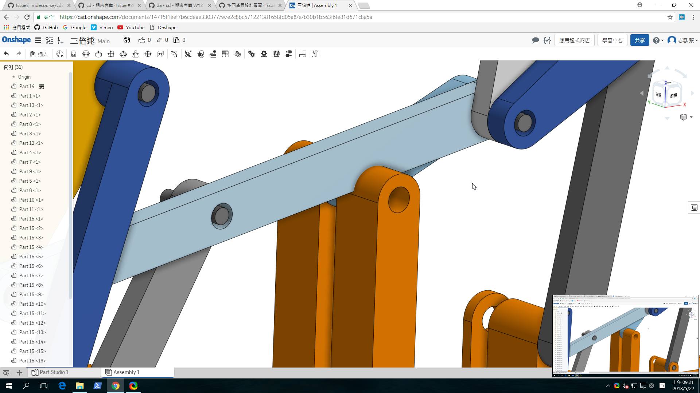
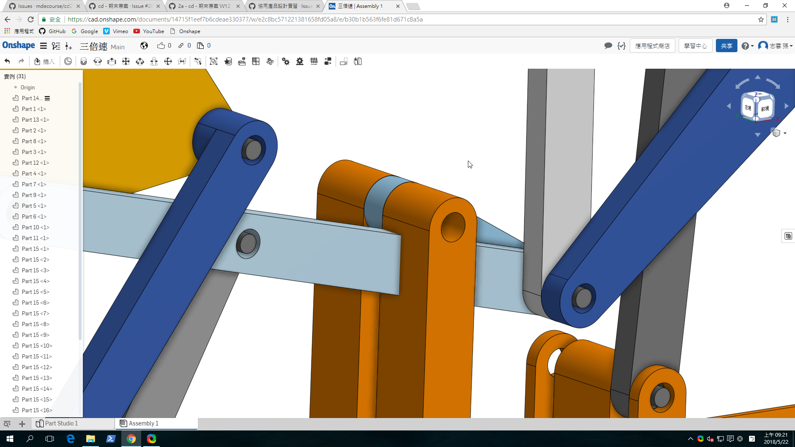
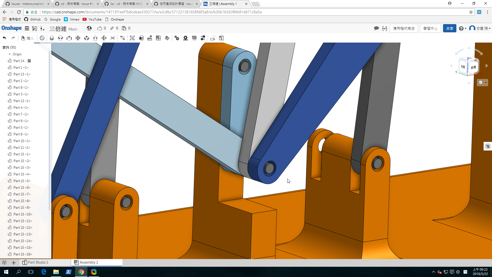

# ag7 Ball lifter - Triple six bar linkage 設計與模擬

請各學員利用 Onshape, 自行設計一個三段式頂球機構所需的零組件, 然後輸入 V-rep 後, 進行機構動態模擬, 完成後請拍攝影片, 上傳至以學號登錄的 Youtube 帳號後, 在以下 comment 中回報.

---

#### [三段式六連桿提球機構模擬](https://www.youtube.com/watch?v=s5YY3JLiyPY)
#### [三段式六連桿提球機構Slvs](https://github.com/s40523125/cd2018/blob/master/Folder/Ball%20lifter%20(Triple%20six%20bar%20linkage)/triple_lifter.slvs)
#### [三段式六連桿提球機構Pyslvs](https://github.com/s40523125/cd2018/blob/master/Folder/Ball%20lifter%20(Triple%20six%20bar%20linkage)/triple_lifter.pyslvs)
#### [機構零件及組立檔](https://cad.onshape.com/documents/14715f1eef7b6cdeae330377/w/e2c8bc571221381658fd05a8/e/b30b1b563f6fe81d671c8a5a)

#### 運轉干涉檢查

一開始底座的連接點是採用兩端對稱的設計，但發現會造成曲柄運轉的干涉碰撞，故採用單邊連接的設計，以解決曲柄和底座的碰撞問題。

###### 曲柄和底座連接點碰撞過程

###### 解決問題後結果

