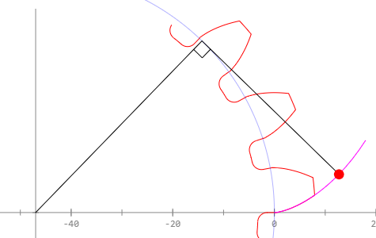
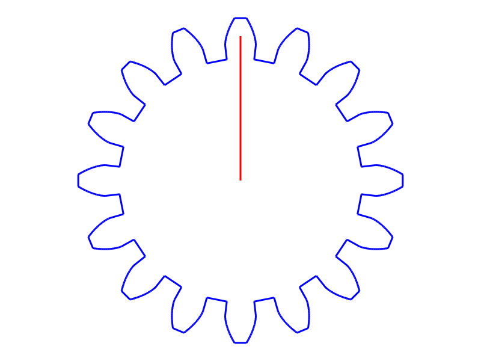
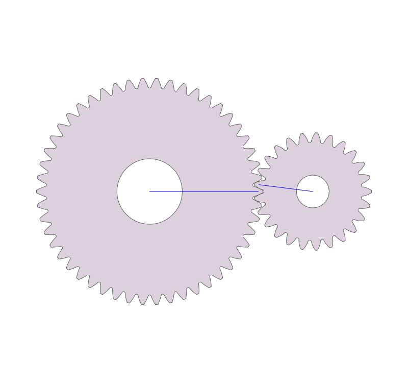
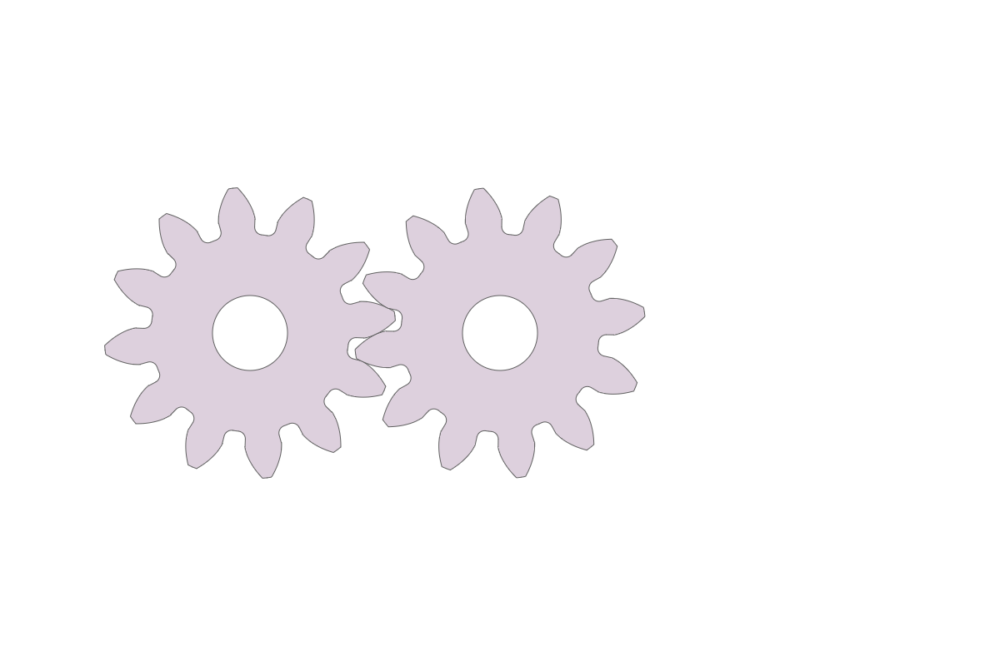

# 第十二周分組任務回報
請各組員在各自的 Github Pages 中繪製一個自選齒數的漸開線正齒輪輪廓外型.
完成單一齒輪輪廓繪圖後, 請繪製一組 50t 與 25t 的齒輪嚙合靜態輪廓圖.
完成兩齒嚙合靜態繪圖後, 請嘗試轉為動態繪圖.
完成上述任務後, 請在下列 comments 回報繪圖連結

---

[漸開線正齒輪輪廓外型](https://s40523126.github.io/2017springwcm_hw/blog/jian-kai-xian-zheng-chi-lun-lun-kuo-wai-xing.html)

[50t 與 25t 的齒輪嚙合靜態輪廓圖](https://s40523126.github.io/2017springwcm_hw/blog/50t-yu-25t-de-chi-lun-nie-he-jing-tai-lun-kuo-tu.html)

[12t與12t兩齒嚙合動態繪圖](https://s40523126.github.io/2017springwcm_hw/blog/12tyu-12tliang-chi-nie-he-dong-tai-hui-tu.html)

[繪製齒輪教學網站](https://www.arc.id.au/GearDrawing.html)
