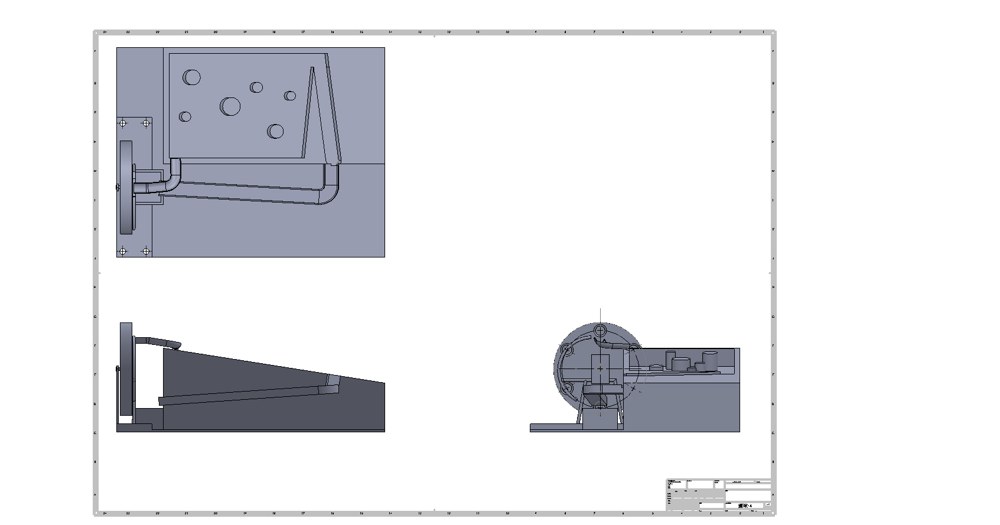

## 鋼球運動系統

## 鋼球軌道三視圖

[零件檔案連結](https://github.com/s40523121/cd2018/tree/blog/STL/Midterm)

[V-REP模擬檔連結](https://github.com/s40523121/cd2018/tree/blog/Vrep/Midterm)

此圖檔主要是利用旋轉軸帶動飛輪來使鋼球達到用送效果，飛輪的每個圓孔都是使用錐形孔，
使鋼球能夠順利的從孔中出來，而不會卡在洞內，飛輪左側有個環形鋼條，主要是避免鋼球
在運送過程中提前滾出，當鋼球到達頂點後，使鋼球滾出飛輪利用斜面軌道使鋼球滾至彈珠檯，
再由彈珠台的出口滾至單條軌道，最後再回到飛輪中。
